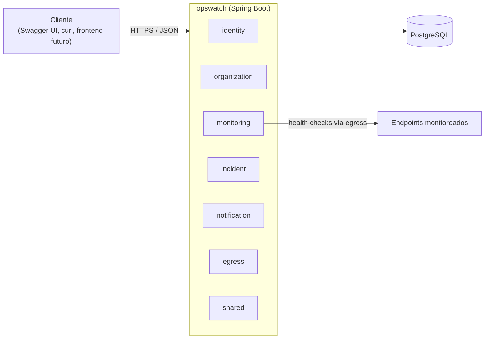

# OpsWatch

> Nombre provisional.

OpsWatch es una plataforma SaaS para vigilar la disponibilidad de APIs y servicios HTTP. Registra endpoints, los comprueba periódicamente, mide su latencia, detecta caídas y recuperaciones, abre incidentes y avisa a quien corresponda.

Es un proyecto de portafolio de backend con **Java y Spring Boot**. La arquitectura empieza como un **monolito modular** y solo evoluciona hacia servicios independientes cuando las mediciones lo justifican.

---

## Estado actual

**v0.2.0 publicada** (Proyectos y monitores): sobre la identidad y las organizaciones de la v0.1.0, proyectos y monitores HTTP configurables con su cuota, la URL validada contra SSRF al guardar, headers cifrados y de solo escritura, pausa, reanudación y borrado. Todavía no comprueba nada: cada monitor queda programado, pero el motor de checks llega con la v0.3.0.

| Qué | Estado |
|---|---|
| Arquitectura, ADR, modelo de dominio, seguridad, estrategia de pruebas, roadmap | **Implemented** (documentación) |
| Repositorio: `main` protegida, milestones, etiquetas, backlog en GitHub Issues | **Implemented** |
| Esqueleto Spring Boot con Java 25 y Maven Wrapper (OW-002) | **Implemented** |
| Módulos, errores, logging, seguridad base, PostgreSQL, Flyway, infraestructura de tests y Docker (OW-003 a OW-009) | **Implemented** |
| CI: build, secretos, imagen y Trivy, con checks obligatorios en `main` (OW-010) | **Implemented** |
| Registro de usuarios (OW-012) | **Implemented** |
| Login con access token JWT RS256 y `GET /api/v1/me` (OW-013) | **Implemented** |
| Refresh token en cookie con rotación, detección de reutilización y logout (OW-014) | **Implemented** |
| Rate limiting de login, registro y refresh, con la IP real solo desde el proxy de confianza (OW-015) | **Implemented** |
| Perfil: editar el nombre y cambiar la contraseña, que cierra todas las sesiones (OW-045) | **Implemented** |
| Organizaciones con `AccessControl`, roles en código, cuota por usuario, `ETag` e `If-Match` (OW-016) | **Implemented** |
| Miembros y roles con la invariante del último `OWNER` (OW-017) | **Implemented** |
| Matriz de autorización endpoint × rol probada en cada build, con test de completitud (OW-018) | **Implemented** |
| Event Publication Registry de Spring Modulith, con archivo y purga (OW-034) | **Implemented** |
| Proyectos con cuota, nombre único y borrado con su organización (OW-019) | **Implemented** |
| `TargetPolicy`: validación SSRF de las URL al guardar, con resolución DNS acotada (OW-020) | **Implemented** |
| Monitores: crear, listar con filtros, resumen por estado y edición, con cuota de 50 por organización (OW-021) | **Implemented** |
| Headers de monitor cifrados con AES-256-GCM y de solo escritura (OW-022) | **Implemented** |
| Pausa, reanudación, borrado y limpieza de monitores al borrar su proyecto (OW-044) | **Implemented** |
| Motor de checks: claim con `SKIP LOCKED` sin duplicados entre instancias, virtual threads con semáforo, cliente HTTP endurecido contra SSRF, registro de resultados y estado del monitor (OW-024 a OW-027) | **Implemented** |
| Historial de checks por cursor y estadísticas de 24 h, 7 d y 30 d: uptime, percentiles y fallos por causa (OW-028) | **Implemented** |
| Retención: purga diaria en lotes de los checks de más de 30 días y de los de monitores borrados, con su estado (OW-029) | **Implemented** |
| Métricas del motor en `/actuator/prometheus` (solo en el puerto de management): lag, duración, claim, checks en vuelo, vencidos, saturación, bloqueos SSRF y retención (OW-030) | **Implemented** |
| Resto de funcionalidades de producto | Planned |

**Qué se hace ahora:** el milestone [v0.3.0 — Motor de monitoreo](https://github.com/RicardoOrd/opswatch/milestone/4). Todas sus issues están hechas, con la [medición informal](docs/performance/results/2026-10-05-medicion-informal-motor.md) de 100 y 1 000 monitores: falta la release. Siguientes pasos en el [roadmap](docs/roadmap/roadmap.md#foco-actual).

---

## Qué problema resuelve

Un equipo que opera varias APIs necesita enterarse de que una ha dejado de responder, o responde lento, antes de que se enteren sus usuarios. Además necesita un historial para calcular la disponibilidad y un registro de incidentes que diga cuándo empezó cada uno, quién lo reconoció y cuándo se cerró.

OpsWatch cubre ese ciclo para varias organizaciones, aisladas entre sí.

Ejemplo:

- Organización **CharityLink**
  - Proyecto **Production**: `Authentication API`, `Donations API`, `Payments API`, `Notifications API`
  - Proyecto **Staging**

Cada monitor hace algo como `GET https://api.example.com/health` cada 60 segundos. Cada monitor configura su intervalo, timeout, método HTTP, códigos de estado esperados, headers opcionales y si está activo o pausado.

---

## Características

| Característica | Estado | Fase |
|---|---|---|
| Registro de usuarios, login y access token JWT | **Implemented** | 1 |
| Refresh token con rotación y logout | **Implemented** | 1 |
| Organizaciones con roles por organización (`OWNER`, `ADMIN`, `MEMBER`, `VIEWER`) y control de acceso | **Implemented** | 1 |
| Gestión de miembros y roles, con al menos un `OWNER` siempre | **Implemented** | 1 |
| Proyectos dentro de cada organización | **Implemented** | 2 |
| Monitores HTTP/HTTPS configurables, con headers cifrados, pausa y reanudación | **Implemented** | 2 |
| Motor de health checks periódicos con protección contra SSRF | **Implemented** | 3 |
| Historial de checks, uptime y percentiles de latencia | **Implemented** | 3 |
| Incidentes automáticos con reconocimiento (acknowledge) y resolución | Planned | 4 |
| Notificaciones por email y por webhook firmado con HMAC | Planned | 4 |
| Despliegue público en un VPS con CI/CD | Planned | 6 |
| Métricas en Prometheus, dashboards en Grafana y benchmarks reproducibles | Planned | 7 |
| Actualizaciones en tiempo real y páginas de estado públicas | Planned | 8 |
| Escalado basado en evidencia (cache, rollups, particionado) | Planned, condicionada | 9 |
| Monitoring como servicio independiente | Planned, condicionada a benchmarks | 10 |
| Broker de eventos y servicios de Notifications y Analytics | Planned, condicionada | 11–12 |

**Condicionada** significa que la fase solo se ejecuta si las métricas demuestran que hace falta. Los criterios están en [Evolución de la arquitectura](docs/architecture/evolution.md).

---

## Arquitectura

V1 es un **único backend Spring Boot** sobre **PostgreSQL**. Está dividido en módulos de dominio cuyos límites verifica Spring Modulith en cada build.



| Módulo | Responsabilidad |
|---|---|
| `identity` | Usuarios, credenciales, login y tokens |
| `organization` | Organizaciones, membresías, roles, permisos y proyectos |
| `monitoring` | Configuración de monitores, programación y ejecución de checks, historial y uptime |
| `incident` | Ciclo de vida de incidentes |
| `notification` | Canales de notificación y entrega con reintentos |
| `egress` | Cliente HTTP saliente protegido contra SSRF |
| `shared` | Formato de errores, paginación, `Clock` y cifrado de secretos. Sin lógica de negocio |

Más detalle en [Visión general](docs/architecture/overview.md) y [Módulos](docs/architecture/modules.md).

---

## Stack

**Stack actual:** el esqueleto compila y pasa `./mvnw verify` con Java 25 (Temurin 25.0.4), Spring Boot 4.1.1 y Spring Modulith 2.1.1. Arranca contra PostgreSQL 18 con Flyway, todavía sin migraciones. Lo demás de la tabla está planificado.

### V1 (planificado, fases 0 a 6)

| Tecnología | Por qué está | Decisión |
|---|---|---|
| Java 25 (LTS) | Records, sealed types y virtual threads. Desde el JDK 24, un `synchronized` ya no fija el virtual thread a su hilo portador (JEP 491) | [ADR-007](docs/adr/ADR-007-http-client-and-concurrency.md) |
| Spring Boot 4.1.x (4.1.1) | Base de la aplicación. Línea estable con soporte gratuito hasta el 31-07-2027; la 4.0 lo pierde el 31-12-2026 | — |
| Spring Modulith | Límites de módulo verificados y eventos internos con registro de publicación | [ADR-003](docs/adr/ADR-003-spring-modulith.md) |
| Spring Security + OAuth2 Resource Server | Validación estándar de JWT sin filtros escritos a mano | [ADR-004](docs/adr/ADR-004-security-strategy.md) |
| Spring Data JPA / Hibernate | Persistencia del modelo de dominio | — |
| PostgreSQL 18 | Integridad relacional, índices parciales, `SKIP LOCKED`, BRIN y `uuidv7()` | [ADR-002](docs/adr/ADR-002-postgresql.md) |
| Flyway | Migraciones versionadas | [Migraciones](docs/database/migrations.md) |
| Apache HttpClient 5 | Cliente de los checks: controla la resolución DNS, que es lo que exige la protección contra SSRF | [ADR-007](docs/adr/ADR-007-http-client-and-concurrency.md) |
| JUnit 5, Mockito, AssertJ, Testcontainers, WireMock | Pruebas contra PostgreSQL real y contra endpoints simulados | [Testing](docs/testing/testing-strategy.md) |
| Docker, Docker Compose | Entorno local y despliegue | [Docker](docs/devops/docker.md) |
| GitHub Actions | CI/CD | [CI/CD](docs/devops/ci-cd.md) |
| springdoc-openapi | Documentación OpenAPI generada desde el código | [Guía de API](docs/api/api-guidelines.md) |

### Futuro, condicionado a evidencia (V2 a V5)

Fuera de V1 a propósito. Ninguna de estas piezas entra sin que se cumpla su disparador medible:

| Tecnología | Dónde se decide |
|---|---|
| Prometheus, Grafana, OpenTelemetry | Fase 7 ([observabilidad](docs/devops/observability.md)): entran para medir, sin disparador |
| Redis | [ADR-009](docs/adr/ADR-009-redis.md), propuesto |
| SSE o WebSocket | [ADR-013](docs/adr/ADR-013-realtime-transport.md), propuesto |
| Monitoring como microservicio | [ADR-011](docs/adr/ADR-011-monitoring-extraction.md), propuesto |
| Kafka o RabbitMQ | [ADR-010](docs/adr/ADR-010-event-broker.md), propuesto |
| Servicios de Notifications y Analytics | [ADR-012](docs/adr/ADR-012-notifications-analytics-extraction.md), propuesto |
| Kubernetes, API gateway, TSDB, OpenSearch, service mesh | [Decisiones abiertas](docs/architecture/open-decisions.md) |
| WebFlux | Descartado para V1 en [ADR-007](docs/adr/ADR-007-http-client-and-concurrency.md); se reconsidera solo con benchmarks |

---

## Cómo ejecutarlo

Requisitos: JDK 25, Docker con Compose v2 y Bash (en Windows, Git Bash).

```bash
bash scripts/dev-keys.sh                  # crea .env y las claves de desarrollo en secrets/; no sobrescribe nada
docker compose up -d --wait postgres      # PostgreSQL 18 en 127.0.0.1:5432
./mvnw spring-boot:run -Dspring-boot.run.profiles=local
```

Comprobación:

```bash
curl localhost:8081/actuator/health/readiness   # {"status":"UP"}
curl -i localhost:8080/api/v1/anything           # 401 en application/problem+json, con X-Request-Id
curl -i localhost:8080/api/v1/auth/register -H 'Content-Type: application/json' \
  -d '{"email":"ana@example.com","displayName":"Ana","password":"correct horse battery"}'   # 201; repetido, 409
curl -i localhost:8080/api/v1/auth/login -H 'Content-Type: application/json' \
  -d '{"email":"ana@example.com","password":"correct horse battery"}'                      # 200 con accessToken
curl -i localhost:8080/api/v1/me -H "Authorization: Bearer <accessToken>"                  # 200
```

Desde el IDE: `OpsWatchApplication` con el perfil `local` y la raíz del repositorio como directorio de trabajo, que es de donde se leen `.env` y `secrets/`.

Si el arranque falla con `Could not resolve placeholder 'jwt-dev-private.pem'`, falta la clave de firma de los access tokens: `bash scripts/dev-keys.sh` la crea en `secrets/`.

Si el arranque falla con `password authentication failed for user "opswatch"`, falta `.env` o su contraseña no es la del volumen, que PostgreSQL fija al crearlo. Para empezar de cero: `docker compose down -v` (**borra los datos locales**).

Tests: `./mvnw test` ejecuta los unitarios, sin Docker. `./mvnw verify` añade los de integración con Testcontainers.

Todo en contenedores, sin JDK en la máquina (después de `bash scripts/dev-keys.sh`):

```bash
docker compose --profile app up -d --build --wait   # PostgreSQL y la aplicación, los dos healthy
docker compose --profile app down                   # parar; down -v borra también los datos
```

---

## Testing

La estrategia pone el peso en tres sitios: tests unitarios de la lógica de dominio (máquina de estados del monitor, reglas de incidentes, clasificación de IP para SSRF, matriz de permisos), tests de integración contra **PostgreSQL real con Testcontainers** (sin H2) y tests de seguridad que prueban el aislamiento entre organizaciones endpoint por endpoint.

Detalle en [Estrategia de testing](docs/testing/testing-strategy.md).

---

## Seguridad

Tres riesgos guían el diseño:

1. **SSRF.** OpsWatch hace peticiones a URLs que escriben los usuarios. Se valida la URL al guardarla y se fija la IP resuelta en el momento de conectar, lo que corta el DNS rebinding. Cada redirect se vuelve a validar y se bloquean los rangos privados, loopback, link-local y los endpoints de metadata de los proveedores cloud. Ver [Protección SSRF](docs/security/ssrf-protection.md).
2. **Aislamiento multi-tenant.** Los roles pertenecen a la membresía, no al usuario. Cada recurso resuelve su organización en el servidor y quien no es miembro recibe `404`. Ver [Modelo de autorización](docs/security/authorization-model.md).
3. **Credenciales.** El access token dura 15 minutos. El refresh token es opaco, rota en cada uso y detecta reutilización. Las contraseñas se guardan con bcrypt y los headers secretos de los monitores se cifran con AES-GCM. Ver [Arquitectura de seguridad](docs/security/security-architecture.md) y [Threat model](docs/security/threat-model.md).

---

## Roadmap

| Fase | Contenido | Versión |
|---|---|---|
| 0 | Fundaciones (Sprint 0) | — |
| 1 | Identity y organizaciones | 0.1.0 |
| 2 | Proyectos y monitores | 0.2.0 |
| 3 | Motor de monitoreo | 0.3.0 |
| 4 | Incidentes y notificaciones | 0.4.0 |
| 5 | Endurecimiento de seguridad | 0.5.0 |
| 6 | Despliegue y CD | **1.0.0 (V1)** |
| 7 | Observabilidad y benchmarks base | V2 |
| 8 | Tiempo real y páginas de estado | V2 |
| 9 | Escalado basado en evidencia | V2 |
| 10 | Extracción de Monitoring (si los datos lo justifican) | V3 |
| 11 | Broker de eventos (si los datos lo justifican) | V4 |
| 12 | Servicios de Notifications y Analytics (si los datos lo justifican) | V5 |

Detalle en [Roadmap](docs/roadmap/roadmap.md).

---

## Arquitectura futura

```text
V1  Monolito modular
 ↓  (métricas del motor, lag de scheduling, carga de la base de datos)
V2  Async + cache + observabilidad
 ↓  (el motor necesita escalar o aislarse, y los benchmarks lo demuestran)
V3  Monitoring extraído como servicio Spring Boot
 ↓  (varios consumidores de eventos, fan-out, replay)
V4  Arquitectura dirigida por eventos
 ↓
V5  Servicios adicionales Spring Boot (Notifications, Analytics)
```

Cada flecha tiene criterios medibles. Si los datos no los cumplen, la siguiente etapa no se ejecuta, y ese resultado también queda documentado. Ver [Evolución](docs/architecture/evolution.md).

---

## Decisiones importantes

| ADR | Decisión | Estado |
|---|---|---|
| [001](docs/adr/ADR-001-modular-monolith.md) | Monolito modular para V1 | Aceptado |
| [002](docs/adr/ADR-002-postgresql.md) | PostgreSQL como base de datos principal | Aceptado |
| [003](docs/adr/ADR-003-spring-modulith.md) | Spring Modulith para los límites de módulo | Aceptado |
| [004](docs/adr/ADR-004-security-strategy.md) | JWT de corta duración, refresh token opaco rotado y RBAC por organización | Aceptado |
| [005](docs/adr/ADR-005-internal-events.md) | Eventos internos: síncronos para invariantes, asíncronos para efectos | Aceptado |
| [006](docs/adr/ADR-006-check-scheduling.md) | Programación de checks sobre PostgreSQL con `SKIP LOCKED` | Aceptado |
| [007](docs/adr/ADR-007-http-client-and-concurrency.md) | Apache HttpClient 5 bloqueante sobre virtual threads | Aceptado |
| [008](docs/adr/ADR-008-check-results-storage.md) | Resultados de checks en una sola tabla con retención | Aceptado |
| [009](docs/adr/ADR-009-redis.md) | Redis | Propuesto, no adoptado |
| [010](docs/adr/ADR-010-event-broker.md) | Kafka frente a RabbitMQ | Propuesto |
| [011](docs/adr/ADR-011-monitoring-extraction.md) | Extracción de Monitoring | Propuesto |
| [012](docs/adr/ADR-012-notifications-analytics-extraction.md) | Extracción de Notifications y Analytics | Propuesto |
| [013](docs/adr/ADR-013-realtime-transport.md) | SSE frente a WebSocket | Propuesto |

---

## Documentación

El índice completo, con un orden de lectura sugerido, está en [docs/README.md](docs/README.md).

## Capturas

Pendientes. Se añadirán cuando existan dashboards (Fase 7) o interfaz (Fase 8).

## Licencia

Por definir.

## Autor

Ricardo · [@RicardoOrd](https://github.com/RicardoOrd)
