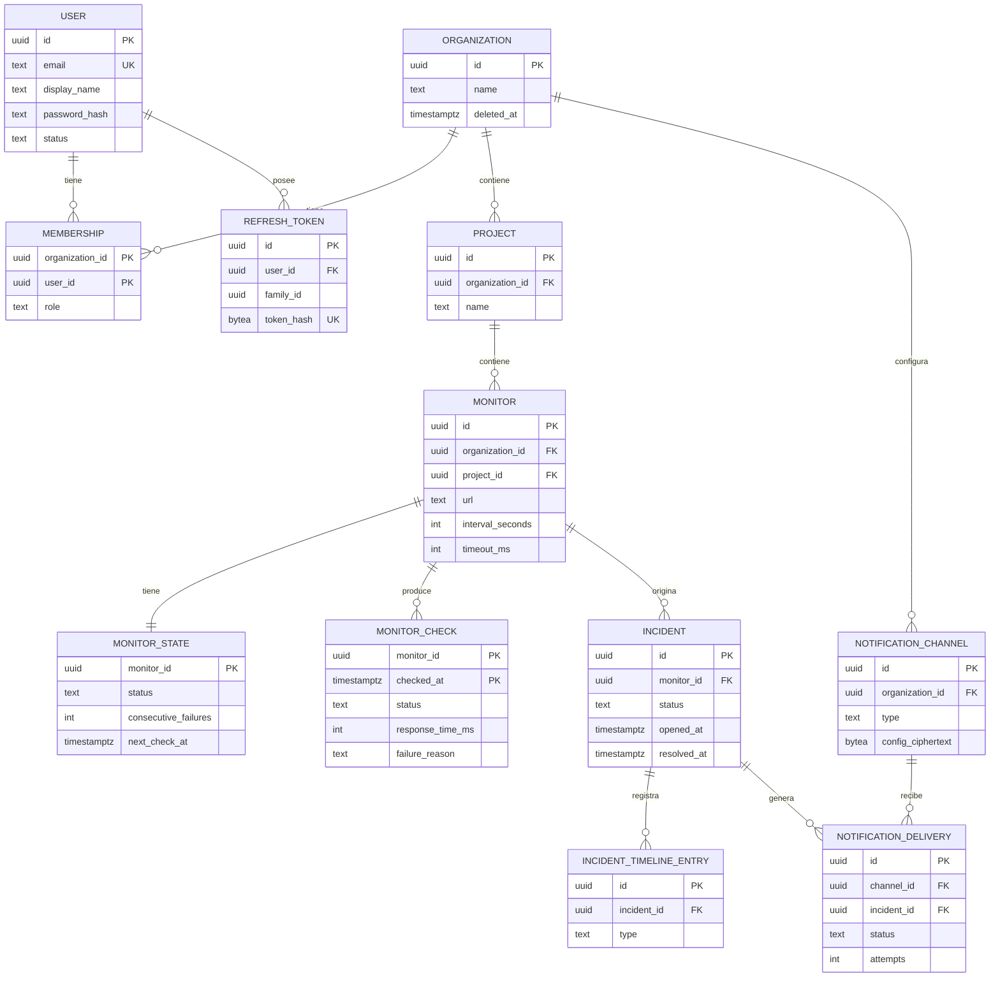
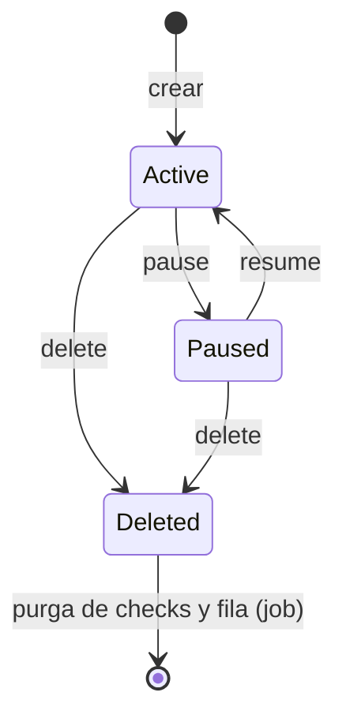
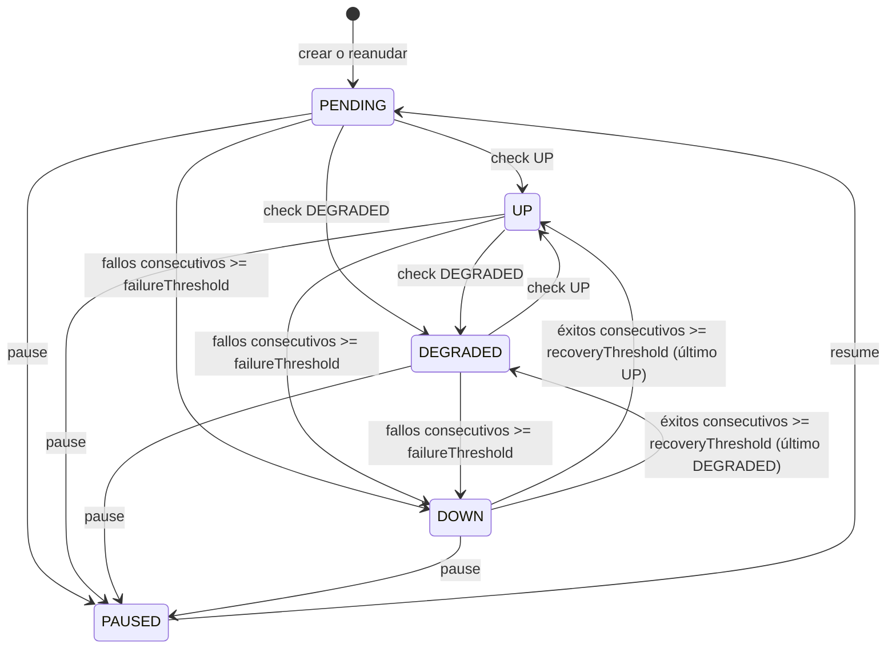

# Modelo de dominio

Estado: diseño inicial · Última revisión: 2026-10-02

Este documento define las entidades, su responsabilidad, campos, reglas y ciclo de vida. El DDL preliminar está en [Diseño de base de datos](../database/database-design.md). Los límites configurables (cuotas, rangos, TTL) están en el [catálogo de propiedades](../devops/environments.md#catálogo-de-propiedades).

## 1. Glosario

| Término | Significado |
|---|---|
| **Organization** | Tenant. Unidad de aislamiento de datos y de facturación futura |
| **Membership** | Relación entre un usuario y una organización, con un **rol**. Un usuario puede tener roles distintos en organizaciones distintas |
| **Role** | `OWNER`, `ADMIN`, `MEMBER` o `VIEWER`. Se traduce a un conjunto de **permisos** |
| **Project** | Agrupación de monitores dentro de una organización (por ejemplo, *Production* y *Staging*) |
| **Monitor** | Configuración de una comprobación periódica sobre una URL |
| **Check** (`MonitorCheck`) | Una ejecución de un monitor en un instante dado, con su resultado |
| **Check status** | Resultado de **un** check: `UP`, `DEGRADED` o `DOWN` |
| **Failure reason** | Causa de un check `DOWN`: `TIMEOUT`, `DNS_FAILURE`, etc. |
| **Monitor status** | Estado **agregado** del monitor, deducido de checks consecutivos: `PENDING`, `UP`, `DEGRADED`, `DOWN` o `PAUSED` |
| **Failure threshold** | Checks fallidos consecutivos necesarios para pasar a `DOWN` |
| **Recovery threshold** | Checks exitosos consecutivos necesarios para salir de `DOWN` |
| **Incident** | Periodo en que un monitor estuvo `DOWN`, con su ciclo de vida (`OPEN`, `ACKNOWLEDGED`, `RESOLVED`) |
| **Timeline entry** | Entrada del historial de un incidente (abierto, reconocido, resuelto) |
| **Domain event** | Hecho publicado por un módulo para que otros reaccionen (`MonitorWentDown`). No confundir con un timeline entry |
| **Notification channel** | Destino de notificaciones de una organización (email o webhook) |
| **Notification delivery** | Un envío concreto de una notificación a un canal, con sus reintentos |
| **Uptime** | Porcentaje de checks exitosos (`UP` o `DEGRADED`) sobre el total en una ventana |
| **Lag de scheduling** | Diferencia entre el instante programado de un check y el instante en que empieza de verdad |

### Por qué `TIMEOUT` no es un estado

La especificación inicial listaba `UP`, `DOWN`, `DEGRADED` y `TIMEOUT` como resultados. `TIMEOUT` se modela como **causa** de un check `DOWN` (`failure_reason = TIMEOUT`) y no como un estado aparte:

- Para decidir si el servicio está disponible, un timeout y un connection refused significan lo mismo: no respondió.
- Un cuarto estado multiplicaría las transiciones de la máquina de estados sin cambiar ninguna decisión.
- La información no se pierde: `failure_reason` distingue timeout, DNS, TLS, código inesperado y los demás casos, y se puede filtrar y agregar por ella.

### Por qué `IncidentTimelineEntry` y no `IncidentEvent`

"Evento" ya significa *domain event* (`IncidentOpened`). Llamar `IncidentEvent` a una fila del historial provocaría confusiones en código y conversación ("¿el evento se publica o se guarda?"). El historial es un **timeline**.

## 2. Mapa de entidades

## 3. Convenciones comunes

- **Identificadores:** `UUID` versión 7, generados en la aplicación al construir la entidad (`IdGenerator`, en `shared`). Son ordenables por tiempo, lo que evita la fragmentación de índices de UUIDv4, y no revelan cuántos registros hay. La excepción es `monitor_checks`, que usa una clave compuesta natural. Justificación en [Diseño de base de datos](../database/database-design.md#3-uuid-o-bigint).
- **Tiempo:** `Instant` en Java y `timestamptz` en PostgreSQL, siempre en UTC. El instante actual sale de un `Clock` inyectado, no de `Instant.now()`, para que los tests controlen el tiempo.
- **Auditoría mínima:** `created_at` y `updated_at` en todas las entidades mutables. `created_by`, `acknowledged_by` y `resolved_by` donde el actor importa.
- **Bloqueo optimista:** `version` (`@Version`) en las entidades que editan personas. Es un `Long` nulo hasta el primer guardado: con el id ya asignado, es lo que le dice a Spring Data que la entidad es nueva.
- **Borrado:** lógico (`deleted_at`) solo en `Organization`, `Project` y `Monitor`, porque tienen historial que debe sobrevivir. Físico en el resto.
- **Enums:** se guardan como `text` con `CHECK`. Se mapean con `@Enumerated(EnumType.STRING)`.

## 4. Módulo `identity`

### User

**Responsabilidad:** identidad de una persona y sus credenciales.

| Campo | Tipo Java | Tipo SQL | Restricciones |
|---|---|---|---|
| `id` | `UUID` | `uuid` | PK, UUIDv7 |
| `email` | `String` | `text` | Obligatorio, único, normalizado a minúsculas, solo ASCII imprimible, máximo 254 caracteres |
| `displayName` | `String` | `text` | Obligatorio, de 1 a 100 caracteres, sin caracteres de control ni de formato bidireccional |
| `passwordHash` | `String` | `text` | Obligatorio. Formato `{bcrypt}$2a$12$…` (`DelegatingPasswordEncoder`) |
| `status` | `UserStatus` | `text` | `ACTIVE` o `DISABLED` |
| `emailVerifiedAt` | `Instant` | `timestamptz` | Nulo hasta que llegue la verificación de email (Fase 5) |
| `createdAt`, `updatedAt` | `Instant` | `timestamptz` | Obligatorios |
| `version` | `Long` | `bigint` | Bloqueo optimista |

**Reglas:**
- El email se normaliza (trim y minúsculas) antes de validar la unicidad.
- La contraseña tiene entre 12 caracteres y 72 bytes UTF-8. El tope viene de bcrypt ([seguridad](../security/security-architecture.md#contraseñas)).
- `passwordHash` nunca sale del módulo, ni en DTOs ni en logs.
- Un usuario `DISABLED` no puede hacer login ni refresh. Sus refresh tokens se revocan al deshabilitarlo.

**Ciclo de vida:** registrado (`ACTIVE`) → `DISABLED`, por acción administrativa futura. El borrado de cuenta queda para después de V1: borra las membresías y pone a nulo las referencias de autoría.

### RefreshToken

**Responsabilidad:** permitir renovar el access token sin volver a pedir la contraseña, con rotación y detección de reutilización.

| Campo | Tipo SQL | Restricciones |
|---|---|---|
| `id` | `uuid` | PK |
| `user_id` | `uuid` | FK → `users`, `ON DELETE CASCADE` |
| `family_id` | `uuid` | Agrupa la cadena de rotaciones que nace en un login |
| `token_hash` | `bytea` | SHA-256 del token (32 bytes aleatorios). Único. El token en claro nunca se guarda |
| `issued_at`, `expires_at` | `timestamptz` | `expires_at = issued_at + 14 días` |
| `family_expires_at` | `timestamptz` | Tope absoluto de la familia: login + 30 días |
| `revoked_at` | `timestamptz` | Nulo mientras está activo |
| `revocation_reason` | `text` | `ROTATED`, `LOGOUT`, `REUSE_DETECTED`, `PASSWORD_CHANGED` o `USER_DISABLED` |
| `replaced_by_id` | `uuid` | Token que lo sustituyó al rotar |

**Reglas:**
- Cada refresh revoca el token presentado (`ROTATED`) y emite otro de la misma familia.
- Si llega un token ya rotado, se asume robo: se revoca **toda la familia** (`REUSE_DETECTED`) y se registra un evento de seguridad.
- Cambiar la contraseña revoca todas las familias del usuario.
- Un job purga los tokens vencidos hace más de 7 días.

## 5. Módulo `organization`

### Organization

**Responsabilidad:** tenant. Todo dato de negocio pertenece a una organización.

| Campo | Tipo SQL | Restricciones |
|---|---|---|
| `id` | `uuid` | PK |
| `name` | `text` | De 1 a 100 caracteres. No tiene que ser único |
| `created_at`, `updated_at` | `timestamptz` | |
| `deleted_at` | `timestamptz` | Borrado lógico |
| `version` | `bigint` | |

**Reglas:**
- Quien la crea queda como `OWNER` en la misma transacción.
- Un usuario puede ser `OWNER` de como mucho `opswatch.limits.organizations-per-user` organizaciones no borradas. Se comprueba al crear una, serializado por usuario para que las creaciones simultáneas no superen el límite.
- Borrarla es borrado lógico: borra sus proyectos en la misma transacción (lo que publica `ProjectDeleted` por cada uno), publica `OrganizationDeleted` y deja de aparecer en todas las consultas. La purga física a los 30 días se deja para después de V1.

**Ciclo de vida:** creada → activa → borrada (lógicamente) → purgada (futuro).

### Membership

**Responsabilidad:** qué rol tiene un usuario en una organización.

| Campo | Tipo SQL | Restricciones |
|---|---|---|
| `organization_id` | `uuid` | PK compuesta, FK |
| `user_id` | `uuid` | PK compuesta, FK, `ON DELETE CASCADE` |
| `role` | `text` | `OWNER`, `ADMIN`, `MEMBER` o `VIEWER` |
| `created_at`, `updated_at` | `timestamptz` | |
| `version` | `bigint` | |

**Índices:** PK `(organization_id, user_id)`, más `(user_id)` para listar "mis organizaciones".

**Reglas:**
- **Siempre hay al menos un `OWNER`.** Cualquier cambio que pueda dejar la organización sin dueño (degradar, expulsar o abandonar) toma antes un bloqueo `SELECT … FOR UPDATE` sobre la fila de `organizations`. Así, dos `OWNER` que se degradan el uno al otro a la vez no pueden dejarla huérfana.
- Solo un `OWNER` asigna o retira los roles `OWNER` y `ADMIN`.
- Un `ADMIN` gestiona `MEMBER` y `VIEWER`: los añade, les cambia el rol entre esos dos y los expulsa.
- Cualquier miembro puede abandonar la organización, salvo el último `OWNER`. Por lo mismo, puede bajarse su propio rol sin permiso de gestión; subírselo, nunca.
- Máximo `opswatch.limits.members-per-organization` miembros.
- V1 añade miembros que ya tienen cuenta, buscándolos por email. Las invitaciones por email llegan en la Fase 5 ([riesgo documentado](../security/threat-model.md)).

La matriz completa de permisos está en [Modelo de autorización](../security/authorization-model.md).

### Project

**Responsabilidad:** agrupar monitores dentro de una organización.

| Campo | Tipo SQL | Restricciones |
|---|---|---|
| `id` | `uuid` | PK |
| `organization_id` | `uuid` | FK |
| `name` | `text` | De 1 a 100 caracteres, único por organización sin distinguir mayúsculas (entre los no borrados) |
| `description` | `text` | Opcional, máximo 500 caracteres |
| `created_at`, `updated_at`, `deleted_at` | `timestamptz` | |
| `version` | `bigint` | |

**Índices:** único `(organization_id, lower(name)) WHERE deleted_at IS NULL`, único `(id, organization_id)` (soporte de la FK compuesta de `monitors`) e `(organization_id) WHERE deleted_at IS NULL`.

**Reglas:**
- Máximo `opswatch.limits.projects-per-organization` proyectos no borrados por organización. Se comprueba al crear uno, serializado por organización.
- `name` y `description` siguen las reglas de caracteres del nombre de la organización.
- Borrarlo publica `ProjectDeleted`, y `monitoring` borra lógicamente sus monitores de forma asíncrona.
- Un monitor solo se crea con su proyecto bloqueado (`ProjectDirectory.lockActive`, `FOR SHARE`): sin eso, un monitor creado mientras se borra el proyecto podría quedar vivo después de la limpieza.

## 6. Módulo `monitoring`

La configuración (`Monitor`) y el estado de ejecución (`MonitorState`) están en **tablas separadas** porque se escriben con patrones opuestos:

- **Configuración:** la editan personas, pocas veces, con bloqueo optimista.
- **Estado:** lo escribe el motor en cada check, muchas veces por minuto.

En una sola fila, cada check incrementaría `version` y casi toda edición humana fallaría con un conflicto. Separadas, cada una tiene la estrategia de concurrencia adecuada.

### Monitor

**Responsabilidad:** qué comprobar, cada cuánto y qué se considera correcto.

| Campo | Tipo Java | Tipo SQL | Restricciones y valor por defecto |
|---|---|---|---|
| `id` | `UUID` | `uuid` | PK |
| `organizationId` | `UUID` | `uuid` | Denormalizado para autorizar en un solo salto. Coherencia garantizada por FK compuesta con `projects` |
| `projectId` | `UUID` | `uuid` | FK compuesta `(project_id, organization_id)` |
| `name` | `String` | `text` | De 1 a 100 caracteres, único por proyecto (entre los no borrados) |
| `url` | `URI` | `text` | Máximo 2048 caracteres. Tiene que pasar `TargetPolicy` ([SSRF](../security/ssrf-protection.md)) |
| `httpMethod` | `ProbeMethod` | `text` | `GET` (por defecto) o `HEAD` |
| `expectedStatusMin` / `expectedStatusMax` | `int` | `smallint` | Rango de 100 a 599, `min ≤ max`. Por defecto 200–299 |
| `intervalSeconds` | `int` | `integer` | De 30 a 3600. Por defecto 60 |
| `timeoutMs` | `int` | `integer` | De 1000 a 30000, y menor que `intervalSeconds × 1000`. Por defecto 10000 |
| `degradedThresholdMs` | `Integer` | `integer` | Opcional, de 1 a `timeoutMs`. Si la respuesta es correcta pero más lenta, el check es `DEGRADED` |
| `followRedirects` | `boolean` | `boolean` | Por defecto `true`. Máximo 5 saltos |
| `failureThreshold` | `int` | `smallint` | De 1 a 10. Por defecto 3 |
| `recoveryThreshold` | `int` | `smallint` | De 1 a 10. Por defecto 2 |
| `requestHeaders` | `byte[]` | `bytea` | Máximo 10 headers, cifrados con AES-256-GCM (OW-022). Los valores nunca se devuelven por la API |
| `createdBy` | `UUID` | `uuid` | FK → `users`, `ON DELETE SET NULL` |
| `createdAt`, `updatedAt`, `deletedAt` | `Instant` | `timestamptz` | |
| `version` | `Long` | `bigint` | |

**Reglas:**
- No hay campo `enabled`: si un monitor está pausado lo dice `MonitorState.status = PAUSED`, la única fuente. Dos campos para lo mismo podrían contradecirse.
- Máximo `opswatch.limits.monitors-per-organization` monitores no borrados (pausados incluidos) por organización. Se comprueba al crear uno, serializado por organización.
- Las invariantes se comprueban sobre el estado resultante de cada cambio, no solo sobre los campos que llegan.
- La URL se valida al crear y al editar: sintaxis, esquema, puerto y resolución DNS actual. La validación de seguridad definitiva ocurre en cada conexión.
- Los nombres de header no pueden estar en la lista de bloqueados (`Host`, `Content-Length`, `Connection`, `Transfer-Encoding`, `Proxy-*`, `Cookie` y los de metadata cloud; ver [SSRF](../security/ssrf-protection.md#capa-4-restricciones-de-la-petición)). Nombres y valores no pueden contener `CR` ni `LF`.
- Cambiar `intervalSeconds` reprograma `next_check_at`, salvo si el monitor está pausado. Cambiar la URL no reinicia el estado: los siguientes checks lo corrigen de forma natural.
- Los headers se cifran con el id del monitor en el dato asociado, de forma explícita en el servicio y no con un `AttributeConverter`, que al leer no conoce el id ([cifrado](../security/security-architecture.md#cifrado-de-datos-sensibles-en-la-base-de-datos)).

**Ciclo de vida:**

### MonitorState

**Responsabilidad:** estado de ejecución del monitor. Solo lo escribe `monitoring` (el motor y las acciones de pausa, reanudación y borrado), siempre con la fila bloqueada (`SELECT … FOR UPDATE`).

| Campo | Tipo SQL | Notas |
|---|---|---|
| `monitor_id` | `uuid` | PK y FK → `monitors` |
| `status` | `text` | `PENDING`, `UP`, `DEGRADED`, `DOWN` o `PAUSED` |
| `status_changed_at` | `timestamptz` | Instante de la última transición |
| `consecutive_failures` | `integer` | Se pone a cero con cada éxito |
| `consecutive_successes` | `integer` | Se pone a cero con cada fallo |
| `last_checked_at` | `timestamptz` | |
| `last_check_status` | `text` | `UP`, `DEGRADED` o `DOWN` |
| `last_http_status` | `smallint` | |
| `last_response_time_ms` | `integer` | |
| `last_failure_reason` | `text` | |
| `next_check_at` | `timestamptz` | **Nulo significa no programado** (pausado o borrado) |
| `updated_at` | `timestamptz` | |

**Índice clave:** `(next_check_at) WHERE next_check_at IS NOT NULL`. Es el índice que usa el scheduler ([motor](monitoring-engine.md#algoritmo-de-programación)).

**Máquina de estados del monitor:**

| Estado actual | Resultado del check | Condición | Nuevo estado | Evento |
|---|---|---|---|---|
| `PENDING`, `UP` o `DEGRADED` | `UP` | — | `UP` | — |
| `PENDING`, `UP` o `DEGRADED` | `DEGRADED` | — | `DEGRADED` | — |
| `PENDING`, `UP` o `DEGRADED` | `DOWN` | `consecutive_failures < failure_threshold` | sin cambio | — |
| `PENDING`, `UP` o `DEGRADED` | `DOWN` | `consecutive_failures ≥ failure_threshold` | `DOWN` | `MonitorWentDown` |
| `DOWN` | `DOWN` | — | `DOWN` | — |
| `DOWN` | `UP` o `DEGRADED` | `consecutive_successes < recovery_threshold` | `DOWN` | — |
| `DOWN` | `UP` o `DEGRADED` | `consecutive_successes ≥ recovery_threshold` | `UP` o `DEGRADED` | `MonitorRecovered` |
| cualquiera | pause | — | `PAUSED` | `MonitorPaused` |
| `PAUSED` | resultado de un check que ya estaba en vuelo | — | `PAUSED` | — (el check se guarda y el estado no cambia) |

Notas:
- `UP` ↔ `DEGRADED` cambia de inmediato y no genera incidentes. La degradación se ve en el dashboard pero no despierta a nadie en V1.
- Un monitor nuevo que falla sus primeros checks pasa de `PENDING` a `DOWN` y abre un incidente. Es intencional: una URL mal escrita es un problema que el usuario tiene que ver.
- La comparación usa `≥`: si se baja el umbral mientras el monitor está fallando, la transición ocurre en el siguiente check.
- Esta lógica es una función pura (`StateTransition.apply(state, outcome, thresholds)`), probada con tests unitarios exhaustivos.

### MonitorCheck

**Responsabilidad:** registro inmutable de una ejecución.

| Campo | Tipo SQL | Notas |
|---|---|---|
| `monitor_id` | `uuid` | PK compuesta, FK → `monitors` |
| `checked_at` | `timestamptz` | PK compuesta. Instante en que empezó el check |
| `status` | `text` | `UP`, `DEGRADED` o `DOWN` |
| `http_status` | `smallint` | Nulo si no hubo respuesta |
| `response_time_ms` | `integer` | Tiempo hasta recibir los headers de la respuesta final. Nulo si no hubo respuesta |
| `failure_reason` | `text` | Nulo si el check fue `UP` o `DEGRADED` |
| `error_detail` | `text` | Máximo 255 caracteres, genérico, sin datos del cuerpo de la respuesta |

**Índices:** PK `(monitor_id, checked_at)`, que sirve para "los últimos checks de un monitor" y para las ventanas de uptime, y BRIN sobre `checked_at` para la retención.

**Reglas:** solo se inserta (append-only). Nunca se actualiza. Se purga según la [política de retención](../database/data-retention.md).

**`FailureReason`:**

| Valor | Cuándo |
|---|---|
| `TIMEOUT` | No hubo respuesta completa de headers antes de `timeoutMs` |
| `DNS_FAILURE` | El nombre no resolvió |
| `CONNECTION_FAILED` | Conexión rechazada, sin ruta, reseteada |
| `TLS_FAILURE` | Handshake fallido, certificado inválido o caducado, nombre no coincide |
| `UNEXPECTED_STATUS` | Hubo respuesta, pero con un código fuera del rango esperado |
| `TOO_MANY_REDIRECTS` | Más de 5 redirects, o un bucle |
| `TARGET_BLOCKED` | El destino, o un redirect, resolvió a una IP bloqueada por la política SSRF |
| `PROTOCOL_ERROR` | Respuesta HTTP malformada, headers demasiado grandes, `Location` inválido |

Un error **interno** de OpsWatch (un bug, la base de datos caída al guardar) **no** es un check `DOWN`. Se registra como métrica y en el log, sin tocar el estado del monitor. Culpar al servicio monitoreado de un fallo propio abriría incidentes falsos.

## 7. Módulo `incident`

### Incident

**Responsabilidad:** representar un periodo de caída con su ciclo de vida humano (reconocer y resolver).

| Campo | Tipo SQL | Notas |
|---|---|---|
| `id` | `uuid` | PK |
| `organization_id` | `uuid` | FK. Denormalizado para autorizar y listar |
| `project_id` | `uuid` | FK compuesta con `organization_id` |
| `monitor_id` | `uuid` | FK → `monitors` |
| `monitor_name` | `text` | Copia del nombre al abrir. El historial se lee bien aunque el monitor se renombre o se borre |
| `status` | `text` | `OPEN`, `ACKNOWLEDGED` o `RESOLVED` |
| `cause` | `text` | `FailureReason` del check que provocó la transición |
| `cause_http_status` | `smallint` | Si aplica |
| `opened_at` | `timestamptz` | Instante de la transición a `DOWN` |
| `acknowledged_at`, `acknowledged_by` | `timestamptz`, `uuid` | |
| `resolved_at`, `resolved_by` | `timestamptz`, `uuid` | `resolved_by` es el usuario que pausó o borró el monitor. Es nulo en la recuperación automática |
| `resolution` | `text` | `AUTO_RECOVERED`, `MONITOR_PAUSED` o `MONITOR_DELETED`. No hay resolución manual en V1 ([por qué](incident-lifecycle.md#por-qué-no-hay-resolución-manual-r6)) |
| `created_at`, `updated_at` | `timestamptz` | |
| `version` | `bigint` | |

**Índices:**
- Único parcial `(monitor_id) WHERE status <> 'RESOLVED'`. **Como mucho un incidente activo por monitor**, garantizado por la base de datos.
- `(organization_id, opened_at DESC)` y `(monitor_id, opened_at DESC)`.

**Reglas, estados y casos límite:** en [Ciclo de vida de incidentes](incident-lifecycle.md).

### IncidentTimelineEntry

| Campo | Tipo SQL | Notas |
|---|---|---|
| `id` | `uuid` | PK |
| `incident_id` | `uuid` | FK |
| `type` | `text` | `OPENED`, `ACKNOWLEDGED` o `RESOLVED` |
| `actor_user_id` | `uuid` | Nulo si el actor es el sistema |
| `occurred_at` | `timestamptz` | |
| `note` | `text` | Opcional, máximo 500 caracteres. El acknowledge acepta una nota |

**Índice:** `(incident_id, occurred_at)`.

## 8. Módulo `notification`

### NotificationChannel

| Campo | Tipo SQL | Notas |
|---|---|---|
| `id` | `uuid` | PK |
| `organization_id` | `uuid` | FK |
| `project_id` | `uuid` | Opcional. Nulo significa que el canal recibe los incidentes de todos los proyectos. FK compuesta con `organization_id` |
| `name` | `text` | De 1 a 100 caracteres |
| `type` | `text` | `EMAIL` o `WEBHOOK` |
| `config_ciphertext` | `bytea` | JSON cifrado. EMAIL: `{"recipients": [...]}` (máximo 10). WEBHOOK: `{"url": "...", "signingSecret": "..."}` |
| `enabled` | `boolean` | |
| `created_at`, `updated_at` | `timestamptz` | |
| `version` | `bigint` | |

**Reglas:**
- Máximo `opswatch.limits.channels-per-organization` canales.
- La URL de un webhook pasa `TargetPolicy` y **tiene que ser `https`**.
- El secreto de firma lo genera el servidor (32 bytes), se muestra una sola vez al crear el canal y se puede rotar.
- Hay un endpoint que envía una notificación de prueba.

### NotificationDelivery

| Campo | Tipo SQL | Notas |
|---|---|---|
| `id` | `uuid` | PK |
| `channel_id` | `uuid` | FK, `ON DELETE CASCADE` |
| `incident_id` | `uuid` | FK |
| `event_type` | `text` | `INCIDENT_OPENED` o `INCIDENT_RESOLVED` |
| `status` | `text` | `PENDING`, `SENT` o `FAILED` |
| `attempts` | `integer` | |
| `next_attempt_at` | `timestamptz` | |
| `last_attempt_at` | `timestamptz` | |
| `last_error` | `text` | Máximo 255 caracteres |
| `created_at`, `sent_at` | `timestamptz` | |

**Índices:** único `(channel_id, incident_id, event_type)`, que da la idempotencia ante eventos duplicados, y parcial `(next_attempt_at) WHERE status = 'PENDING'`.

**Reglas:** como mucho 6 intentos, con backoff de 0 s, 30 s, 2 min, 10 min, 30 min y 1 h. Después, `FAILED`.

## 9. Entidades evaluadas y aplazadas

| Entidad | Para qué | Etapa | Por qué no ahora |
|---|---|---|---|
| `AlertRule` | Condiciones de aviso más ricas que "incidente → todos los canales": avisar solo si la caída dura más de N minutos, escalado, horarios | Fase 9 o posterior, si hay demanda | En V1 la regla es implícita y cubre el caso principal. Un motor de reglas sin casos reales es abstracción prematura |
| `MaintenanceWindow` | No abrir incidentes y excluir del uptime durante un mantenimiento planificado | Fase 8 | Afecta al cálculo del uptime y a las páginas de estado, que llegan en esa fase |
| `StatusPage` | Página pública de una organización con slug propio | Fase 8 | Exige lectura anónima, cache y consideraciones de privacidad |
| `StatusPageComponent` | Qué monitores aparecen en una página de estado y con qué nombre público | Fase 8 | Depende de `StatusPage` |
| `Invitation` | Invitar por email a alguien sin cuenta | Fase 5 | Necesita la infraestructura de email (Fase 4) y la verificación de email |
| `AuditLogEntry` | Registro de acciones sensibles (roles, borrados, cambios de canales) | Fase 5 | Se diseña junto con el endurecimiento de seguridad |
| `MonitorCheckRollup` | Agregados por hora para el uptime de ventanas largas | Fase 9, si los benchmarks lo piden | Con 30 días de datos crudos y la PK adecuada, las consultas de V1 son baratas ([retención](../database/data-retention.md)) |
| `ApiKey` | Acceso programático por organización | Después de V1 | Con JWT basta para la API de V1 |
