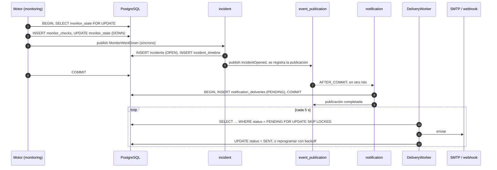

# Eventos internos

Estado: diseño inicial · Última revisión: 2026-10-02 · Decisión: [ADR-005](../adr/ADR-005-internal-events.md)

## 1. Para qué hay eventos

Sirven para que un módulo reaccione a lo que pasa en otro **sin que el que publica sepa quién escucha**. El caso que motiva el diseño es este:

```text
Evitar:   MonitoringService → IncidentRepository
Preferir: MonitoringService → publica MonitorWentDown → incident abre el incidente
```

Con la llamada directa, `monitoring` dependería de `incident`. Cada consumidor nuevo (notificaciones, analytics, tiempo real) obligaría a modificar el motor. Con eventos, la dependencia se invierte: `incident` depende del contrato de `monitoring`, y `monitoring` sigue siendo independiente y extraíble.

Los eventos de V1 son **eventos de aplicación de Spring** dentro de un solo proceso. No se diseñan pensando en Kafka. Sí siguen algunas reglas baratas (payload autocontenido, ids en lugar de entidades, nombres en pasado) que facilitarán distribuirlos si algún día hace falta.

## 2. Catálogo

Todos los eventos son `record` inmutables en el paquete raíz del módulo que los publica, que es su API pública.

### `monitoring`

```java
public record MonitorWentDown(
        UUID monitorId,
        UUID organizationId,
        UUID projectId,
        String monitorName,
        Instant occurredAt,          // instante de la transición a DOWN: el inicio del check que la provoca
        FailureReason cause,         // causa del último check fallido
        @Nullable Integer httpStatus,
        int consecutiveFailures) {}

public record MonitorRecovered(
        UUID monitorId,
        UUID organizationId,
        UUID projectId,
        String monitorName,
        Instant occurredAt,
        Instant downSince) {}

public record MonitorPaused(UUID monitorId, UUID organizationId, UUID projectId, Instant occurredAt, UUID pausedBy) {}

public record MonitorDeleted(UUID monitorId, UUID organizationId, UUID projectId, Instant occurredAt, UUID deletedBy) {}
```

`FailureReason` se expone en el paquete raíz de `monitoring` porque aparece en la firma de un evento público.

### `incident`

```java
public record IncidentOpened(
        UUID incidentId, UUID organizationId, UUID projectId, UUID monitorId,
        String monitorName, Instant openedAt, String cause, @Nullable Integer httpStatus) {}

public record IncidentAcknowledged(
        UUID incidentId, UUID organizationId, UUID projectId, UUID monitorId,
        Instant acknowledgedAt, UUID acknowledgedBy) {}

public record IncidentResolved(
        UUID incidentId, UUID organizationId, UUID projectId, UUID monitorId,
        String monitorName, Instant openedAt, Instant resolvedAt, Resolution resolution) {}
```

### `organization`

```java
public record ProjectDeleted(UUID projectId, UUID organizationId, Instant occurredAt, UUID deletedBy) {}

public record OrganizationDeleted(UUID organizationId, Instant occurredAt) {}
```

### Nombres

- En **pasado** y en lenguaje de dominio: `MonitorWentDown`, no `MonitorDownEvent` ni `NotifyIncident`.
- `IncidentOpened` en lugar de `IncidentCreated`, porque un incidente se abre y se resuelve, no se crea y se borra.
- La especificación inicial mencionaba `NotificationRequested`. En V1 no existe: `notification` reacciona directamente a los eventos de incidentes. Un evento que es en realidad una orden ("haz X") solo tiene sentido cuando haya varios productores de notificaciones distintos de los incidentes.

### Eventos que **no** existen en V1

`MonitorCheckCompleted` (uno por check) no se publica en V1 porque nadie lo consume. Cuando lo necesiten el tiempo real (Fase 8) o analytics, se publicará **sin** el registro persistente: con 10 000 monitores a 60 s serían unas 167 filas por segundo en `event_publication`, un costo que no se justifica para información que se puede reconstruir desde `monitor_checks`.

## 3. Publicadores y listeners

| Evento | Publica | Escucha | Modo | Motivo |
|---|---|---|---|---|
| `MonitorWentDown` | `monitoring` | `incident` | **Síncrono, misma transacción** | Invariante: estado `DOWN` ⇔ incidente activo |
| `MonitorRecovered` | `monitoring` | `incident` | **Síncrono, misma transacción** | Ídem |
| `MonitorPaused` | `monitoring` | `incident` | **Síncrono, misma transacción** | Resolver el incidente activo al pausar. Se publica desde OW-044; su listener llega con OW-032 |
| `MonitorDeleted` | `monitoring` | `incident` | **Síncrono, misma transacción** | Ídem al borrar, también cuando lo borra la limpieza de un proyecto. Se publica desde OW-044; su listener llega con OW-032 |
| `IncidentOpened` | `incident` | `notification` | **Asíncrono, después del commit, con registro** | Efecto lateral con I/O externo y reintentos |
| `IncidentResolved` | `incident` | `notification` | **Asíncrono, después del commit, con registro** | Ídem |
| `IncidentAcknowledged` | `incident` | — (Fase 8: tiempo real) | — | Se publica ya por consistencia del catálogo |
| `ProjectDeleted` | `organization` | `monitoring` | **Asíncrono, después del commit, con registro** | Limpieza que puede tardar y no tiene que bloquear la petición. Borra cada monitor por el mismo camino que `DELETE`, así que cada uno publica su `MonitorDeleted` con el `deletedBy` del proyecto (OW-044) |
| `OrganizationDeleted` | `organization` | — (nadie en V1) | — | Los proyectos de la organización no se borran escuchándolo: `OrganizationService` llama a `ProjectService` en la misma transacción (OW-019). Dentro de un módulo, un evento solo añadiría indirección |

## 4. Semántica transaccional

### Síncrono en la misma transacción: `monitoring` → `incident`

```java
// incident/application/MonitorEventsListener.java
@Component
class MonitorEventsListener {

    @EventListener            // se ejecuta dentro de la transacción del publicador
    void on(MonitorWentDown event) {
        incidents.openIfNoneActive(event);   // idempotente gracias al índice único parcial
    }

    @EventListener
    void on(MonitorRecovered event) {
        incidents.resolveActive(event.monitorId(), Resolution.AUTO_RECOVERED, event.occurredAt());
    }
}
```

**Por qué síncrono:** la regla "un monitor `DOWN` tiene exactamente un incidente activo" involucra datos de dos módulos. En la misma transacción es trivialmente correcta:

- **Orden garantizado.** Las transiciones de un monitor se serializan porque la transacción del resultado bloquea su fila de `monitor_state`. Un `MonitorRecovered` nunca se procesa antes que el `MonitorWentDown` que lo precede.
- **Atomicidad.** O se guardan el check, el nuevo estado y el incidente, o no se guarda nada.
- **Sin ventanas de inconsistencia** entre el estado del monitor y el incidente.

**Costo:**
- Si la lógica de `incident` falla, se revierte también el resultado del check. Ese check se pierde (queda en la métrica de errores) y **el siguiente check vuelve a evaluar la transición**, porque los contadores tampoco se guardaron. El sistema converge solo.
- Hay acoplamiento **en tiempo de ejecución** (misma transacción), aunque no en el código (`monitoring` no importa nada de `incident`).
- Este modo **no sobrevive a la extracción de Monitoring**. Separados en dos procesos, la comunicación pasa a ser asíncrona y el orden y la idempotencia hay que resolverlos de forma explícita. Es un costo conocido de la Etapa 3 ([evolución](evolution.md#etapa-3-monitoring-extraído)).

### Asíncrono después del commit, con registro: `incident` → `notification`

```java
// notification/application/IncidentEventsListener.java
@Component
class IncidentEventsListener {

    @ApplicationModuleListener   // @Async + @Transactional(REQUIRES_NEW) + @TransactionalEventListener(AFTER_COMMIT)
    void on(IncidentOpened event) {
        deliveries.scheduleFor(event);   // crea una NotificationDelivery PENDING por canal aplicable
    }
}
```

**Por qué asíncrono:**
- Enviar un email o un webhook es I/O externo, lento y falible. Dentro de la transacción del check, bloquearía una conexión a la base de datos durante segundos y un SMTP caído revertiría incidentes.
- Solo debe notificarse lo que **se confirmó**: si la transacción que abre el incidente hace rollback, no se avisa de un incidente que no existe. Eso es lo que da `AFTER_COMMIT`.

**Garantía:** Spring Modulith guarda la publicación en `event_publication` **dentro de la transacción del publicador** (patrón transactional outbox). Si la aplicación cae entre el commit y la ejecución del listener, la publicación sigue pendiente y se vuelve a enviar al reiniciar (`spring.modulith.events.republish-outstanding-events-on-restart=true`). El primer listener que lo usa es el de `ProjectDeleted` en `monitoring` (OW-044):

- **Listener:** `ProjectDeletedListener` llama a `MonitorService.deleteAllOf`. Esta lista los ids de los monitores no borrados del proyecto y borra cada uno por el camino de `DELETE`: bloquea su estado, lo lee bloqueado, lo borra y publica su `MonitorDeleted` con el `deletedBy` del proyecto.
- **Idempotente:** un `ProjectDeleted` repetido no encuentra nada que borrar.
- **Pruebas:** `ProjectCleanupRestartIT` lo comprueba con dos contextos, dejando en el primero la publicación pendiente como la dejaría una caída. `MonitoringModuleIT` lo comprueba con `@ApplicationModuleTest` y `Scenario`.
- **Cuidado al renombrar:** la clase o el método del listener forman su `listener_id`, y renombrarlos con publicaciones pendientes las deja `FAILED`.

**Registro (OW-034):** JDBC (`spring-modulith-starter-jdbc`), con el esquema v2 de Spring Modulith 2.1.1 en la migración `V4__modulith_create_event_publication` (`spring.modulith.events.jdbc.schema-initialization.enabled=false`: Flyway es el dueño del esquema, y una versión de Spring Modulith que lo cambie necesita una migración nueva). Con `spring.modulith.events.completion-mode=archive`, una publicación completada pasa a `event_publication_archive` en lugar de borrarse: queda rastro de qué se entregó durante `opswatch.retention.event-publications` (7 días).

- **Purga:** `EventPublicationPurgeJob` (en `shared.events`, con el cron de retención) llama a `CompletedEventPublications.deletePublicationsOlderThan`. En modo `archive`, Spring Modulith 2.1.1 lo ejecuta contra `event_publication_archive` y solo sobre filas completadas (comprobado en su código). Ningún proceso borra de `event_publication`: lo que hay ahí es trabajo pendiente y no caduca. `EventPublicationPurgeJobIT` lo comprueba con una publicación pendiente de hace un año que sobrevive a la purga.
- **Vigilancia:** `IncompleteEventPublicationsMonitor` cuenta las pendientes cada `opswatch.events.incomplete-check-interval` (30 s), publica el gauge `opswatch_event_publications_incomplete` y escribe un `WARN` (`event.action=event_publications.overdue`) mientras alguna lleve más de `opswatch.events.incomplete-alert-after` (15 min). Cuenta y fechas, nunca el payload.
- **Reenvío al arrancar:** reenvía **todas** las pendientes, también las que otra instancia tenga en vuelo y las de un listener que ya no existe. Estas últimas Spring Modulith las deja como `FAILED` y lo registra como error: renombrar o borrar un listener con publicaciones pendientes exige migrarlas o completarlas antes.

La entrega es **at-least-once**, así que el listener tiene que ser idempotente:

- `notification_deliveries` tiene la clave única `(channel_id, incident_id, event_type)`, y un evento duplicado no crea entregas nuevas.
- El envío real lo hace el `DeliveryWorker`, que reintenta con backoff. El listener solo encola trabajo en la base de datos.

## 5. Cuándo usar cada tipo de listener

| Tipo | Úsalo cuando | No lo uses cuando |
|---|---|---|
| `@EventListener` (síncrono, misma transacción) | Hay una invariante entre módulos que debe cumplirse de forma atómica y el listener es rápido y sin I/O externo | El listener hace I/O externo o puede tardar |
| `@TransactionalEventListener(phase = BEFORE_COMMIT)` | Igual que el anterior, pero el listener debe ver todos los cambios de la transacción antes de confirmarla | Casi nunca hace falta en este proyecto |
| `@ApplicationModuleListener` (asíncrono, `AFTER_COMMIT`, registro) | Efectos laterales, integración externa, trabajo que puede reintentarse o limpieza no urgente | Se necesita el resultado del listener en la misma petición |
| `@TransactionalEventListener(AFTER_COMMIT)` **sin** registro | Casi nunca. Si el proceso cae después del commit, el evento se pierde sin dejar rastro | — |

## 6. Problemas de consistencia y cómo se tratan

| Problema | Dónde puede ocurrir | Tratamiento |
|---|---|---|
| **Duplicados** | Listeners asíncronos: reintentos del registro, reinicios | Idempotencia con claves únicas (`notification_deliveries`) y operaciones del tipo "abrir si no hay uno activo" |
| **Desorden** | Listeners asíncronos concurrentes | En V1 la cadena crítica (monitor ↔ incidente) es síncrona. Las notificaciones incluyen su instante (`openedAt` y `resolvedAt`), y el receptor ve dos mensajes con fecha aunque lleguen desordenados |
| **Evento perdido** | Caída entre el commit y el listener | Event Publication Registry (outbox) |
| **Listener que falla siempre** | Bug o dato imposible | La publicación queda incompleta y visible en `event_publication`. Métrica y alerta sobre las publicaciones incompletas más antiguas que N minutos |
| **Doble escritura** (guardar y publicar fuera de la transacción) | — | No existe: la publicación se registra en la misma transacción que el cambio |
| **Crecimiento de `event_publication`** | Publicaciones completadas acumuladas | Modo de finalización `archive`: las completadas pasan a `event_publication_archive`, y un job purga del archivo las de más de 7 días. Las pendientes nunca se purgan; se vigilan con la métrica `opswatch_event_publications_incomplete` |

## 7. Flujo de eventos



## 8. Evolución hacia eventos distribuidos

Lo que se hace ya, porque cuesta poco:

- Payload autocontenido. `monitorName` viaja en el evento para que el consumidor no tenga que volver a preguntar.
- Solo ids y tipos simples, nunca entidades JPA.
- Nombres estables en pasado.
- Idempotencia en los consumidores asíncronos.

Lo que **no** se hace en V1:

- No hay un campo de versión de esquema en cada evento: el compilador protege los contratos dentro de un proceso.
- No hay serialización a JSON ni Avro, ni registro de esquemas.
- No hay partition keys ni metadatos de broker.

Cuándo y cómo cambiaría (Etapa 3 y Etapa 4):

1. **Externalización.** Spring Modulith puede publicar hacia un broker los eventos marcados con `@Externalized`, a partir del mismo registro (outbox). Se añaden el envelope (`eventId`, `eventType`, `schemaVersion`, `occurredAt`, `producer`) y la serialización JSON.
2. **Orden por monitor.** Al perder la transacción compartida, los eventos del monitor necesitan un número de secuencia (`transitionSeq`, que se guardaría en `monitor_state`) y el consumidor ignora los que llegan con una secuencia menor que la última aplicada. Con un broker, la clave de partición o de routing sería `monitorId`.
3. **Contratos versionados.** Cambios aditivos compatibles y un tipo nuevo de evento para los cambios incompatibles ([versionado](../development/versioning.md#eventos)).

La elección de broker está en [ADR-010](../adr/ADR-010-event-broker.md).
