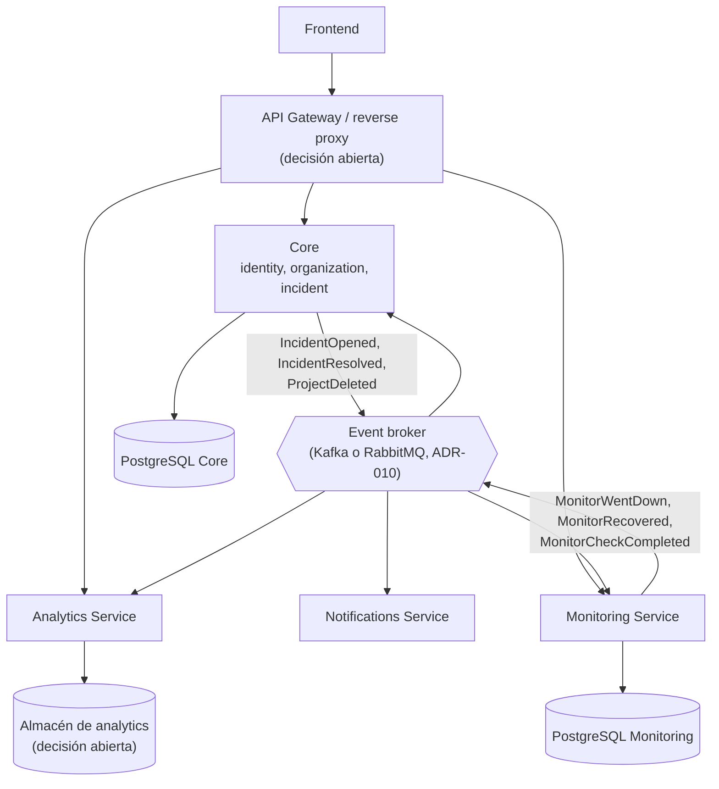

# Evolución de la arquitectura

Estado: diseño inicial · Última revisión: 2026-09-28

Es una de las historias centrales del proyecto: **la arquitectura cambia cuando los datos lo exigen, no cuando una tecnología está de moda.** Cada etapa tiene un disparador medible y un plan de vuelta atrás.

```text
V1  Monolito modular                         Fases 0–6
 ↓
V2  Async + cache + observabilidad           Fases 7–9
 ↓
V3  Monitoring extraído                      Fase 10
 ↓
V4  Arquitectura dirigida por eventos        Fase 11
 ↓
V5  Servicios adicionales Spring Boot        Fase 12
```

**Regla general.** Si al llegar a una etapa los datos no cumplen su disparador, la etapa **no se ejecuta**. El resultado de la medición se documenta en `docs/performance/results/` y en el ADR correspondiente. "Medí y la extracción no se justificaba en esta escala" es una conclusión válida y defendible en una entrevista.

## Etapa 1: monolito modular (V1)

**Estado:** planificada, Fases 0 a 6.

- Un proceso Spring Boot y un PostgreSQL.
- Siete módulos con límites verificados ([módulos](modules.md)).
- Eventos internos: síncronos para las invariantes y asíncronos con registro para los efectos ([eventos](events.md)).
- Motor de checks con virtual threads y scheduling sobre PostgreSQL ([motor](monitoring-engine.md)).
- Métricas básicas con Micrometer desde la Fase 3. **Hace falta medir desde el principio**: sin métricas, las etapas siguientes no tienen evidencia.

**Salida:** V1 desplegada (1.0.0) y un [baseline de benchmarks](../performance/benchmark-plan.md) medido en la Fase 7.

## Etapa 2: async, cache y observabilidad (V2)

**Estado:** Fases 7 a 9. Ninguna tecnología de esta lista se introduce "porque toca". Cada una tiene su disparador:

| Tecnología | Problema que resolvería | Medición que la justifica | Alternativas antes de adoptarla |
|---|---|---|---|
| Prometheus + Grafana | Ver las métricas en el tiempo y comparar benchmarks | Siempre en la Fase 7: los benchmarks lo necesitan | Leer `/actuator/prometheus` a mano (no escala) |
| OpenTelemetry (trazas) | Seguir una petición por varios componentes | Con un solo proceso aporta poco. Se introduce en la Fase 7 con muestreo bajo para practicar, y se vuelve imprescindible en la Etapa 3 | Logs con `requestId` (ya existen en V1) |
| Workers asíncronos y colas en memoria | Desacoplar trabajo lento de la petición HTTP | Endpoints con p95 > 500 ms por trabajo que no necesita respuesta inmediata | Ya existe el patrón de la tabla como cola (entregas y checks) |
| Ajuste de thread pools | Saturación de algún pool de plataforma (Tomcat, `@Async`) | Hilos ocupados de forma sostenida > 80 % o colas crecientes | Virtual threads en Tomcat (`spring.threads.virtual.enabled`) |
| Redis | Ver [ADR-009](../adr/ADR-009-redis.md): rate limiting con varias instancias, cache de autorización o de estado, fan-out del tiempo real | Más de una instancia de la aplicación, o p95 de la consulta de membresía > 5 ms y significativo en el total, o carga de lectura del dashboard sobre PostgreSQL > 30 % de la CPU de la base de datos | Caffeine en memoria (una instancia), `LISTEN/NOTIFY` de PostgreSQL, índices y consultas mejores |
| Rollups por hora | Uptime de ventanas largas y dashboards con muchos monitores | p95 de `GET /api/v1/monitors/{id}/stats?window=30d` > 200 ms, o necesidad de ventanas mayores que la retención cruda | Índices, consultas por ventana, cache en memoria |
| Particionado de `monitor_checks` | Retención barata (`DROP PARTITION`) y vacuum manejable | Más de ~100 M filas, o una purga diaria de más de 10 min, o autovacuum incapaz de seguir el ritmo | Purga en lotes más frecuente, ajuste de autovacuum |
| WebSocket o SSE | Actualizaciones en tiempo real en el dashboard (Fase 8) | Es una funcionalidad, no una optimización. La elección técnica va en [ADR-013](../adr/ADR-013-realtime-transport.md) | Polling cada 15 a 30 s |

### Etapa 2b: separación por rol, sin nuevo servicio

Antes de extraer Monitoring hay un paso intermedio que cuesta mucho menos: **la misma imagen, desplegada con dos roles.**

```text
opswatch-api     (opswatch.monitoring.engine.enabled=false)  ×N  → sirve la API
opswatch-worker  (opswatch.monitoring.engine.enabled=true)   ×M  → ejecuta checks
```

- `SKIP LOCKED` ya permite varias instancias del motor sin coordinación extra.
- La API y el motor escalan por separado y un pico de checks no ralentiza la API.
- No hay código nuevo, contratos nuevos ni datos que migrar.

**Qué no resuelve:** los dos roles comparten base de datos, versión de despliegue (cada release reinicia los dos) y superficie de código. El worker lleva dentro los siete módulos y acceso a todas las tablas, lo que no es ideal para el componente que hace peticiones a URLs arbitrarias. Esos límites son los que pueden justificar la Etapa 3.

## Etapa 3: Monitoring extraído

**Estado:** Fase 10, **condicionada**. Decisión en [ADR-011](../adr/ADR-011-monitoring-extraction.md).

### Cómo detectar el momento

La extracción se justifica si, **después** de optimizar (índices, inserciones en lote, pool de conexiones), de escalar verticalmente hasta 4 vCPU y de aplicar la separación por rol (2b), se cumple **al menos uno** de estos criterios, medidos según el [plan de benchmarks](../performance/benchmark-plan.md):

| # | Criterio | Umbral |
|---|---|---|
| C1 | **Contención en la base de datos.** Las escrituras de checks degradan las consultas de la API aunque las instancias estén separadas | p95 de las consultas de la API > 2 × su baseline con el motor a carga objetivo, atribuible a `monitor_checks` (WAL, E/S, locks, vacuum) según `pg_stat_statements` |
| C2 | **El motor no sostiene la carga objetivo** con los recursos de un worker del monolito | Lag de scheduling p95 > 5 s (o > 10 % del intervalo) durante ≥ 15 min con CPU < 70 %, lo que apunta a una limitación de diseño y no de hardware |
| C3 | **Huella de recursos.** Cada worker del monolito consume muchos más recursos que los que necesita el motor | Memoria RSS del worker > 2 × la de un prototipo solo con el motor para la misma carga, multiplicada por el número de workers necesarios |
| C4 | **Acoplamiento de despliegue.** Los despliegues de la API interrumpen los checks de forma medible | Huecos de checks > 1 intervalo en más del 1 % de los monitores por despliegue |

A favor, pero **no suficiente por sí sola**: aislar la red del componente que hace peticiones a URLs de usuarios (reducir el alcance de un SSRF que atravesara todas las capas).

Si ningún criterio se cumple a la carga máxima razonable (10 000 monitores a 30 s), se documenta que la extracción no se justifica en esa escala y la Fase 10 se cierra sin ejecutarse.

### Qué se queda en Core y qué migra

| Se queda en Core | Migra a Monitoring Service |
|---|---|
| `identity`, `organization` (incluidos los proyectos y `AccessControl`), `incident`, `notification` | `monitoring` completo: configuración de monitores, estado, checks, motor, uptime y retención |
| `egress` (lo sigue usando `notification` para los webhooks) | Una **copia** de `egress`, o una librería compartida versionada si el código diverge poco |
| `shared` | Lo necesario de `shared`: formato de errores y `Clock` |

Monitoring se lleva **su configuración** además del motor, porque la configuración y el estado forman un solo contexto con reglas conjuntas (el intervalo afecta a `next_check_at`; la pausa afecta al estado). Partir el módulo por la mitad (configuración en Core y motor fuera) crearía una sincronización constante entre los dos servicios.

### Comunicación inicial

| Flujo | V3 inicial | Por qué |
|---|---|---|
| Frontend o cliente → endpoints de monitores | Reverse proxy por ruta: `/api/v1/monitors/**` y `/api/v1/projects/*/monitors/**` van a Monitoring | Sin gateway nuevo. Caddy ya enruta por ruta |
| Monitoring → Core: eventos del monitor (`MonitorWentDown`, …) | **Outbox en Monitoring y POST con reintentos** a un endpoint interno de Core (`/internal/v1/monitor-events`), idempotente por `eventId` y ordenado por `transitionSeq` | Sin broker. Si hay un solo consumidor, un broker no aporta nada todavía |
| Core → Monitoring: `ProjectDeleted` | Ídem, en sentido contrario | |
| Autorización en Monitoring | Validación del JWT con la clave pública de Core (JWKS) más la **membresía** del usuario | Ver abajo |
| Core consulta datos de monitores (`MonitorDirectory`) | HTTP con `RestClient` o HTTP Interface Clients, con timeouts y cache corta | El contrato ya existe como interfaz en el monolito |

Opciones para que Monitoring conozca las membresías:

1. Preguntar a Core en cada petición (`/internal/v1/access-checks`), con cache de unos segundos. Simple, pero añade latencia y dependencia en tiempo de ejecución.
2. Proyección local de las membresías alimentada por eventos de Core. Monitoring decide solo, con consistencia eventual en los cambios de rol.
3. Roles en el JWT. **Descartada:** reintroduce roles obsoletos durante todo el TTL del token.

La elección entre 1 y 2 se hace en ADR-011 con datos de latencia.

### Estrategia de datos

1. **Esquema propio en la misma instancia de PostgreSQL:** las tablas de `monitoring` pasan a un esquema `monitoring`, con un historial de Flyway propio.
2. **Se eliminan las FK entre módulos** que apuntan a tablas de Monitoring o salen de ellas (`incidents.monitor_id → monitors`, `monitors.project_id → projects`) y se sustituyen por validación en la aplicación y consistencia eventual. Están listadas en el [diseño de base de datos](../database/database-design.md#8-claves-foráneas-entre-módulos).
3. **Base de datos separada** solo si el criterio C1 lo exige. Con una base de datos propia, las copias de seguridad y la restauración son por servicio.
4. Para arrancar el historial del servicio nuevo se usa `baselineVersion` en Flyway, sin reescribir migraciones antiguas ([migraciones](../database/migrations.md#microservicios)).

### Pasos de la extracción (strangler)

1. **Preparar dentro del monolito:** `verify()` en verde, ningún acceso a tablas ajenas, `transitionSeq` en `monitor_state`, eventos con envelope serializable y outbox con el registro de Spring Modulith.
2. Pasar el listener `monitoring` → `incident` de síncrono a **asíncrono con registro**, todavía dentro del monolito, más la idempotencia y el orden por `transitionSeq`. **Se mide el efecto en la correctitud** (incidentes duplicados o perdidos) antes de separar procesos.
3. Mover las tablas al esquema `monitoring`.
4. Crear el servicio (nuevo proyecto Spring Boot) con el código del módulo. Compartir una base de datos con dos procesos es un estado de transición, no un destino.
5. **Canary por shards de monitores:** el servicio procesa los monitores con `hash(monitor_id) % 10 == 0` y el motor del monolito excluye ese shard. Se compara con el resto el lag, los fallos y los incidentes.
6. Ampliar los shards hasta el 100 % y desactivar el motor del monolito (`engine.enabled=false`).
7. Enrutar la API de monitores al servicio. Retirar el código del módulo del monolito.

### Riesgos, compatibilidad y rollout

| Riesgo | Mitigación |
|---|---|
| Incidentes duplicados o perdidos al pasar a asíncrono | Paso 2 medido en el monolito, idempotencia, `transitionSeq` y tests de desorden |
| Dos motores ejecutando el mismo monitor durante la transición | Los shards son disjuntos por configuración, y el claim con `SKIP LOCKED` sobre la misma tabla sigue impidiendo duplicados mientras se comparte la base de datos |
| Contratos rotos entre versiones | Endpoints internos versionados (`/internal/v1`) y eventos con `schemaVersion` y cambios aditivos |
| Vuelta atrás | Hasta el paso 6, reactivar `engine.enabled=true` en el monolito y quitar el shard al servicio. Después del paso 7, volver a enrutar al monolito mientras el código siga existiendo (se retira en una release posterior) |
| Más superficie operacional | Trazas distribuidas (OpenTelemetry) **antes** del paso 4 y un dashboard por servicio |

## Etapa 4: dirigida por eventos

**Estado:** Fase 11, **condicionada**. Decisión en [ADR-010](../adr/ADR-010-event-broker.md).

**Disparadores:**
- Más de un consumidor de los mismos eventos entre procesos (Core, Notifications, Analytics) y el fan-out por HTTP empieza a duplicar lógica de reintentos.
- Necesidad de **replay**: recalcular analytics o SLA desde el histórico de eventos.
- El outbox con POST acumula retrasos o reintentos visibles en las métricas.

**Qué cambia:** los eventos se publican a un broker desde el outbox (externalización de Spring Modulith), los consumidores usan consumer groups o colas y hay un contrato de eventos versionado.

## Etapa 5: servicios adicionales

**Estado:** Fase 12, **condicionada**. Decisión en [ADR-012](../adr/ADR-012-notifications-analytics-extraction.md).

- **Notifications:** se extrae si la entrega externa (volumen, proveedores, límites de tasa de terceros) necesita escalar o desplegarse aparte, o si sus fallos afectan a Core.
- **Analytics:** solo existe si hay necesidades de cálculo (SLA, informes, agregados largos) que no caben bien en PostgreSQL transaccional. Primero sería un **módulo** dentro de Core y solo después, con evidencia, un servicio.

Todos los servicios siguen siendo **Java + Spring Boot**.

## Arquitectura final aproximada

Es una dirección, **no un compromiso**. No condiciona el diseño de V1.



Despliegue futuro previsto: sigue siendo Docker Compose en uno o dos VPS mientras no haya más de un host que orquestar. Kubernetes es una [decisión abierta](open-decisions.md) con su propio disparador.
