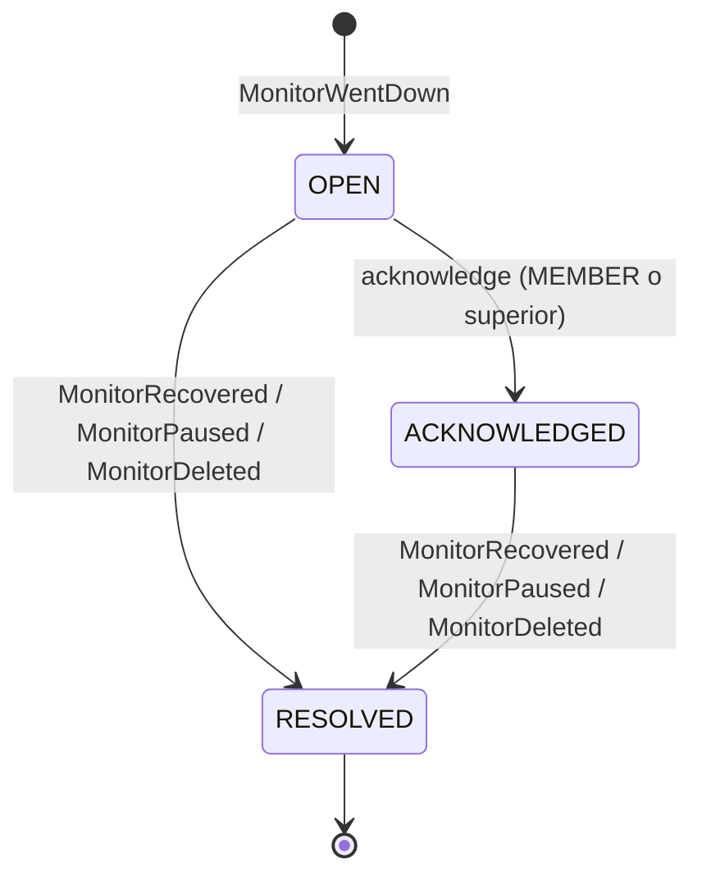

# Ciclo de vida de incidentes

Estado: diseño inicial · Última revisión: 2026-10-05

## 1. Qué es un incidente

Un incidente representa **un periodo continuo en que un monitor estuvo `DOWN`**. Empieza con la transición a `DOWN` y termina con la recuperación o con la pausa o el borrado del monitor.

Lo que hay que evitar es que "un fallo = un incidente nuevo". Un solo check fallido no abre nada, y una caída de dos horas es **un** incidente, no 120.

## 2. Reglas de apertura y cierre

| # | Regla |
|---|---|
| R1 | Un incidente se abre **solo** cuando el monitor pasa a `DOWN`, es decir, tras `failureThreshold` checks fallidos consecutivos (3 por defecto) |
| R2 | Como mucho hay **un incidente activo** (`OPEN` o `ACKNOWLEDGED`) por monitor. Lo garantiza la base de datos con un índice único parcial |
| R3 | Mientras el monitor sigue `DOWN`, los checks fallidos no abren ni modifican incidentes |
| R4 | El incidente se resuelve automáticamente (`AUTO_RECOVERED`) cuando el monitor sale de `DOWN`, tras `recoveryThreshold` checks exitosos consecutivos (2 por defecto) |
| R5 | Pausar el monitor resuelve el incidente activo (`MONITOR_PAUSED`). Borrarlo, también (`MONITOR_DELETED`) |
| R6 | **No hay resolución manual en V1.** Un incidente refleja la realidad del monitor: se resuelve cuando el monitor se recupera, se pausa o se borra |
| R7 | Acknowledge solo se permite sobre un incidente `OPEN`, y acepta una nota opcional. No cambia el estado del monitor, solo indica que alguien se está ocupando |
| R8 | Un incidente `RESOLVED` es inmutable. Si el monitor vuelve a caer, se abre un incidente **nuevo** |
| R9 | `DEGRADED` no abre incidentes en V1 |

### Por qué no hay resolución manual (R6)

Mientras un incidente está activo, el monitor está `DOWN`: sigue así durante toda la ventana de recuperación, hasta acumular `recoveryThreshold` éxitos. Si se pudiera resolver a mano, el monitor quedaría caído sin incidente activo. Como los incidentes se abren con la **transición** a `DOWN` (R1) y el monitor ya está en `DOWN`, no se abriría otro hasta que se recuperara y volviera a caer. Una caída real quedaría sin registro.

Para dejar de ver un monitor roto, se **pausa**. Eso resuelve el incidente con la causa correcta (`MONITOR_PAUSED`) y deja constancia de quién lo hizo.

Alternativa aplazada: una "resolución con reevaluación", que cierra el incidente y a la vez pone el estado del monitor en `PENDING`. Si el servicio sigue fallando, tras `failureThreshold` checks se abriría un incidente nuevo. Es correcta, pero obliga a `incident` a dar órdenes a `monitoring` dentro de la transacción. Se hará si en la práctica hace falta.

## 3. Estados

| Transición | Disparador | Actor en el timeline | Evento publicado |
|---|---|---|---|
| — → `OPEN` | `MonitorWentDown` | sistema | `IncidentOpened` |
| `OPEN` → `ACKNOWLEDGED` | `POST /api/v1/incidents/{id}/acknowledge` | usuario | `IncidentAcknowledged` |
| `OPEN` o `ACKNOWLEDGED` → `RESOLVED` | `MonitorRecovered` | sistema | `IncidentResolved` (`AUTO_RECOVERED`) |
| `OPEN` o `ACKNOWLEDGED` → `RESOLVED` | `MonitorPaused` | usuario que pausó | `IncidentResolved` (`MONITOR_PAUSED`) |
| `OPEN` o `ACKNOWLEDGED` → `RESOLVED` | `MonitorDeleted` | usuario que borró | `IncidentResolved` (`MONITOR_DELETED`) |

### ¿Bastan `OPEN`, `ACKNOWLEDGED` y `RESOLVED`?

Para V1, sí. Se evaluaron estas alternativas:

| Alternativa | Decisión |
|---|---|
| Estados de comunicación pública (`INVESTIGATING`, `IDENTIFIED`, `MONITORING`), al estilo de las páginas de estado | **No son estados del ciclo de vida**, son mensajes para el público. Llegarán con las páginas de estado (Fase 8) como *actualizaciones públicas* del incidente, sin tocar esta máquina de estados |
| `REOPENED`: si el monitor vuelve a caer pocos minutos después de resolverse, reabrir el mismo incidente | Aplazado. Reduce el ruido cuando un servicio oscila (flapping), pero complica la definición de duración y de uptime. `recoveryThreshold` ya amortigua el problema. Se reconsidera si los datos muestran muchos incidentes cortos consecutivos en el mismo monitor |
| `MUTED` o `SNOOZED` | Aplazado. Pausar el monitor cubre el caso en V1 |
| Severidad (`SEV1`–`SEV3`) | Aplazado. Sin reglas de alerta (`AlertRule`), la severidad no cambiaría ningún comportamiento |

## 4. Relación entre el estado del monitor y el incidente

La invariante que se protege es esta: **`monitor_state.status = DOWN` ⇔ existe un incidente activo para el monitor**. Hay una excepción: el intervalo de recuperación con `recoveryThreshold > 1`, en el que el monitor sigue `DOWN` mientras acumula éxitos y el incidente sigue activo. Es coherente.

Cómo se garantiza:

1. `monitoring` cambia el estado y publica `MonitorWentDown` o `MonitorRecovered` **dentro de la misma transacción** ([eventos](events.md)).
2. El listener de `incident` abre o resuelve el incidente **en esa misma transacción**.
3. El índice único parcial `ux_incidents_one_active_per_monitor` impide que haya dos activos aunque existiera un bug o una carrera.
4. La apertura es idempotente: "abrir si no hay uno activo".

## 5. Notificaciones

| Transición | ¿Notifica en V1? |
|---|---|
| Apertura | Sí, a los canales de la organización cuyo proyecto coincide o que no tienen proyecto |
| Acknowledge | No |
| Resolución | Sí, a los mismos canales. Incluye la duración y la causa de la resolución |

No hay recordatorios periódicos ni escalado en V1. Llegarán con `AlertRule` si hacen falta.

## 6. Concurrencia y casos límite

| Caso | Qué pasa |
|---|---|
| Acknowledge del usuario y resolución automática a la vez | Las dos leen el incidente activo con `FOR UPDATE` y se serializan; la resolución toma antes la fila de `monitor_state`, así que el orden de bloqueos es siempre estado del monitor → incidente y no hay deadlock. Si gana la recuperación, el acknowledge encuentra el incidente `RESOLVED` y da `409 business-rule-violation`; si gana el acknowledge, la recuperación espera y resuelve el incidente `ACKNOWLEDGED`. El check nunca se pierde. Con `@Version`, perder la carrera revertiría el check entero, porque `CheckResultRecorder` no lanza (decisión de Ricardo del 2026-10-05, OW-033) |
| Acknowledge sobre un incidente `RESOLVED` o ya `ACKNOWLEDGED` | `409 business-rule-violation` |
| Alguien quiere cerrar un incidente de un monitor que sigue caído | Tiene que pausar el monitor (R6) |
| Se pausa el monitor con un check en vuelo | La pausa resuelve el incidente. El check en vuelo guarda su resultado y no cambia nada ([motor](monitoring-engine.md#pausa-reanudación-borrado-y-edición)) |
| Se borra el proyecto | `ProjectDeleted` → `monitoring` borra los monitores → `MonitorDeleted` → el incidente se resuelve con `MONITOR_DELETED` |
| Se baja el `failureThreshold` mientras el monitor falla | El siguiente fallo compara con `≥` contra el nuevo umbral y, si lo alcanza, abre el incidente |
| Se sube el `recoveryThreshold` durante la recuperación | Se necesitan más éxitos. Correcto |
| La aplicación se reinicia con un incidente abierto | No pasa nada especial: el estado vive en la base de datos |
| El destino oscila `UP`, `DOWN`, `UP`, `DOWN` en cada check | Con `failureThreshold = 3` nunca llega a `DOWN`: no abre incidentes, pero el uptime baja. Es la señal para revisar el servicio o los umbrales |
| Se borra al usuario que hizo el acknowledge | `acknowledged_by` pasa a nulo (`ON DELETE SET NULL`). El timeline conserva el tipo y la fecha |

## 7. Ejemplo de timeline

Monitor `Payments API`, intervalo de 60 s, `failureThreshold = 3`, `recoveryThreshold = 2`:

| Hora (UTC) | Check | Estado del monitor | Incidente |
|---|---|---|---|
| 10:00 | UP | UP | — |
| 10:01 | DOWN (TIMEOUT) | UP (1 fallo) | — |
| 10:02 | DOWN (TIMEOUT) | UP (2 fallos) | — |
| 10:03 | DOWN (TIMEOUT) | **DOWN** | **OPEN**, `opened_at = 10:03` |
| 10:05 | DOWN (CONNECTION_FAILED) | DOWN | OPEN |
| 10:06 | — | DOWN | **ACKNOWLEDGED** por Ana |
| 10:12 | UP | DOWN (1 éxito) | ACKNOWLEDGED |
| 10:13 | UP | **UP** | **RESOLVED** (`AUTO_RECOVERED`), duración de 10 min |

La duración del incidente va de `opened_at` a `resolved_at`. En el ejemplo, la caída real empezó hacia las 10:01. La diferencia es el costo de confirmar (`failureThreshold`) y se documenta en la API para que nadie la confunda con un error.
