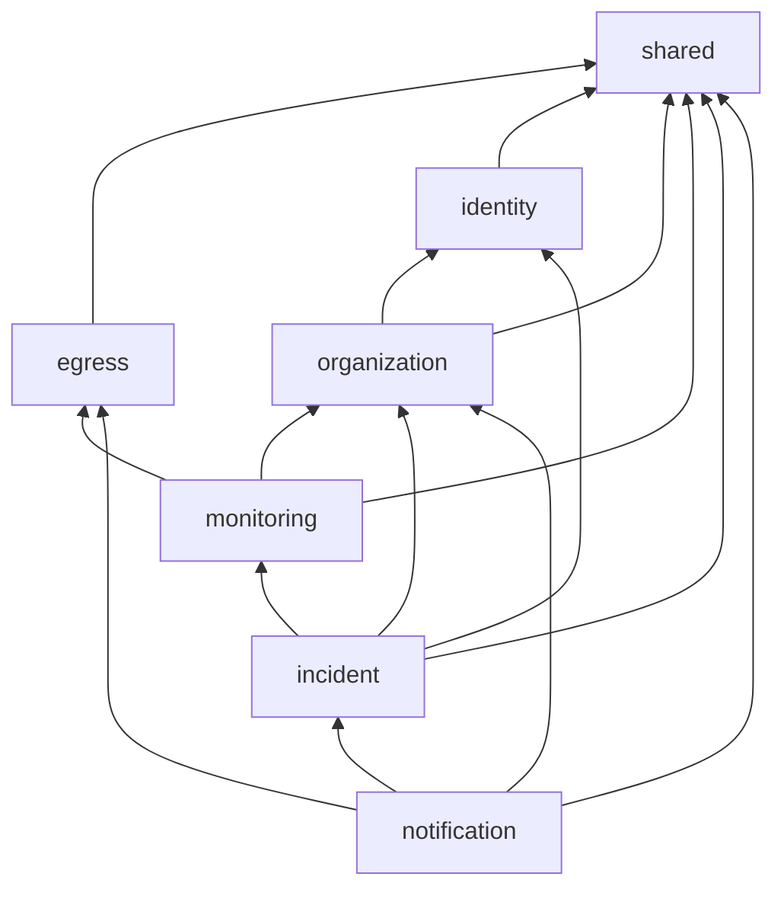

# Módulos

Estado: diseño inicial · Última revisión: 2026-10-02 · Decisiones: [ADR-001](../adr/ADR-001-modular-monolith.md), [ADR-003](../adr/ADR-003-spring-modulith.md)

## 1. Criterios para definir un módulo

Un paquete de primer nivel se convierte en módulo si cumple todo lo siguiente:

1. **Tiene lenguaje propio.** "Check", "umbral de fallos" e "intervalo" pertenecen a `monitoring`. "Acknowledge" y "resolución" pertenecen a `incident`.
2. **Es dueño de sus datos.** Solo ese módulo escribe sus tablas.
3. **Cambia por razones propias.** Una mejora en las notificaciones no debería tocar el motor de checks.
4. **Tiene sentido como candidato a servicio.** No hace falta que se extraiga nunca, pero sus límites no deberían impedirlo.

## 2. De la lista original a la propuesta

| Propuesta original | Decisión | Por qué |
|---|---|---|
| `auth` + `users` | **Unidos en `identity`** | La autenticación sin el usuario no tiene datos propios y el usuario sin la autenticación apenas tiene comportamiento. Separarlos crearía una dependencia circular (el login necesita al usuario; el alta necesita el hash de la contraseña) o un módulo vacío |
| `organization` + `project` | **Unidos en `organization`** | El proyecto es una unidad de agrupación dentro de la jerarquía de tenancy (organización → proyecto). Su única regla de negocio seria es la autorización, que ya vive en `organization`. Como módulo aparte solo añadiría una arista de dependencia y un CRUD. Se separará si el proyecto gana comportamiento propio, por ejemplo entornos o configuración por proyecto |
| `monitoring` | Se mantiene | Es el núcleo y el primer candidato a extracción |
| `incident` | Se mantiene | Tiene ciclo de vida, reglas y consumidores propios |
| `notification` | Se mantiene | Integra con sistemas externos, tiene reintentos y es candidato a servicio |
| `shared` | **Se mantiene, restringido** | Solo contiene infraestructura técnica transversal sin reglas de negocio (ver sección 8) |
| — | **Nuevo: `egress`** | La protección SSRF es código crítico que usan dos módulos: `monitoring` para los checks y `notification` para los webhooks. Tenerlo en un solo sitio significa probarlo una vez y auditarlo una vez. Dentro de `monitoring` obligaría a `notification` a depender del motor de checks |

Resultado: **siete módulos**: `shared`, `egress`, `identity`, `organization`, `monitoring`, `incident` y `notification`.

## 3. Responsabilidades

### `identity`

- **Es dueño de:** `users` y `refresh_tokens`.
- **Hace:** registro, login, emisión y validación de JWT, refresh token con rotación, logout, perfil del usuario actual, rate limiting de autenticación y la configuración de Spring Security (`SecurityFilterChain`).
- **API pública:** `UserDirectory` (buscar usuario por id o email, resumen de usuario).
- **Publica:** nada en V1.
- **Escucha:** nada.

### `organization`

- **Es dueño de:** `organizations`, `memberships` y `projects`.
- **Hace:** CRUD de organizaciones y proyectos, gestión de miembros y roles, invariante del último `OWNER` y **decisiones de autorización**.
- **API pública:** `AccessControl` (¿puede el usuario U ejercer el permiso P en la organización O o en el proyecto X?), `ProjectDirectory` (bloquear un proyecto no borrado mientras se le añade un monitor), los enums `Role` y `Permission`.
- **Publica:** `ProjectDeleted` y `OrganizationDeleted`.
- **Escucha:** nada.

### `monitoring`

- **Es dueño de:** `monitors`, `monitor_state` y `monitor_checks`.
- **Hace:** CRUD de monitores, pausa y reanudación, programación de checks, ejecución, evaluación del resultado, máquina de estados del monitor, historial, uptime y percentiles, y retención de checks.
- **API pública:** `MonitorDirectory` (resúmenes de monitores para otros módulos) y los eventos.
- **Publica:** `MonitorWentDown`, `MonitorRecovered`, `MonitorPaused` y `MonitorDeleted`.
- **Escucha:** `ProjectDeleted`.

### `incident`

- **Es dueño de:** `incidents` e `incident_timeline`.
- **Hace:** abre y resuelve incidentes a partir de los eventos del monitor, acknowledge, timeline y consultas.
- **Publica:** `IncidentOpened`, `IncidentAcknowledged` e `IncidentResolved`.
- **Escucha:** `MonitorWentDown`, `MonitorRecovered`, `MonitorPaused` y `MonitorDeleted`.
- **Usa:** `AccessControl` de `organization` y `UserDirectory` de `identity`.

### `notification`

- **Es dueño de:** `notification_channels` y `notification_deliveries`.
- **Hace:** CRUD de canales (email y webhook), creación de entregas a partir de eventos de incidentes, envío con reintentos y backoff, y firma HMAC de webhooks.
- **Publica:** nada en V1.
- **Escucha:** `IncidentOpened` e `IncidentResolved`.

### `egress`

- **Es dueño de:** nada persistente.
- **Hace:** valida URLs de destino (`TargetPolicy`), clasifica IP, resuelve DNS con filtrado y fijación de la IP (`GuardedDnsResolver`), construye clientes HTTP salientes endurecidos y valida redirects.
- **API pública:** `TargetPolicy` con `TargetKind` (OW-020), `HeaderPolicy` con `RequestHeader` y `HeaderViolation` (OW-022), `EgressHttpClients` con `EgressClientSettings`, y `BlockedTargetException` (OW-024).
- Detalle en [Protección SSRF](../security/ssrf-protection.md).

### `shared`

- **Es dueño de:** nada persistente.
- **Contiene:** excepciones base y su traducción a Problem Details, `RequestIdFilter`, DTOs de paginación, `CurrentUser`, el bean `Clock`, `SecretCipher` (AES-GCM), los advisory locks de PostgreSQL con el registro único de sus espacios (`AdvisoryLocks`, `LockSpace`) y el mantenimiento del registro de eventos (purga del archivo y gauge de pendientes), que sirve a todos los módulos con listeners asíncronos.

## 4. Reglas de dependencia



| Módulo | Puede depender de | No puede depender de |
|---|---|---|
| `shared` | — | ningún módulo |
| `egress` | `shared` | ningún módulo de negocio |
| `identity` | `shared` | `organization`, `monitoring`, `incident`, `notification` |
| `organization` | `identity`, `shared` | `monitoring`, `incident`, `notification` |
| `monitoring` | `organization`, `egress`, `shared` | `incident`, `notification`, `identity` |
| `incident` | `monitoring`, `organization`, `identity` (solo `UserDirectory`), `shared` | `notification` |
| `notification` | `incident`, `organization`, `egress`, `shared` | `monitoring`, `identity` |

Consecuencias que importan:

- **`monitoring` no conoce a `incident` ni a `notification`.** Anuncia lo que pasa con eventos. Eso evita el acoplamiento `MonitoringService → IncidentRepository` y deja a `monitoring` listo para extraerse.
- **`organization` no conoce a `monitoring`.** Cuando se borra un proyecto, publica `ProjectDeleted` y `monitoring` reacciona.
- **Nadie lee las tablas de otro módulo.** Si `incident` necesita el nombre de un monitor, lo recibe en el evento o lo pide a `MonitorDirectory`.
- **El usuario actual no exige depender de `identity`.** `CurrentUser` vive en `shared` y solo lee el `sub` del JWT del `SecurityContext`.
- **`incident` lee nombres de `identity`** con `UserDirectory`, para mostrar quién hizo cada cosa en el timeline de un incidente (OW-033, decisión de Ricardo del 2026-10-05). Solo lectura, como `organization`. Pasar por `organization` dejaría sin nombre a quien ya no es miembro, y el timeline es historial.

## 5. Estructura interna de un módulo

La regla es **separar solo lo que aporta**. No se aplica Clean ni Hexagonal Architecture de forma dogmática:

- No hay puertos y adaptadores para JPA. Las entidades JPA **son** el modelo de dominio, con cuidado: constructores que validan invariantes, sin setters públicos innecesarios y comportamiento dentro de la entidad. Duplicar cada entidad en un modelo "puro" más un mapeo a JPA cuesta mucho y en este proyecto no compra nada.
- Sí hay una interfaz donde el dominio habla con algo **externo e inestable**: el cliente HTTP de los checks (`HttpMonitorClient`). Esa frontera se justifica porque permite probar la lógica sin red y cambiar la implementación (ver [ADR-007](../adr/ADR-007-http-client-and-concurrency.md)).

Estructura de referencia:

```text
src/main/java/io/github/ricardoord/opswatch/
├── OpsWatchApplication.java
├── shared/                          (módulo abierto)
│   ├── error/        DomainException, NotFoundException, ConflictException, ProblemDetailsHandler
│   ├── web/          RequestIdFilter, PageResponse, PageQuery, CursorPage, CursorQuery
│   ├── security/     CurrentUser, CurrentUserArgumentResolver
│   ├── crypto/       SecretCipher (AES-256-GCM con key id)
│   ├── events/       EventPublicationPurgeJob, IncompleteEventPublicationsMonitor
│   ├── lock/         AdvisoryLocks, LockSpace (un número por espacio, nunca repetido)
│   └── time/         ClockConfiguration
├── egress/
│   ├── TargetPolicy.java, TargetKind.java ← API pública
│   ├── HeaderPolicy.java, RequestHeader.java, HeaderViolation.java ← API pública (capa 4)
│   ├── EgressHttpClients.java, EgressClientSettings.java ← API pública (cliente saliente)
│   ├── BlockedTargetException.java       ← API pública
│   └── internal/     TargetUrlParser, IpRangeClassifier, HostResolver, GuardedDnsResolver, RedirectValidator
├── identity/
│   ├── UserDirectory.java, UserSummary.java          ← API pública
│   ├── domain/       User, RefreshToken, UserRepository, RefreshTokenRepository
│   ├── application/  RegistrationService, AuthenticationService, RefreshTokenService
│   ├── security/     SecurityConfiguration, JwtConfiguration, AuthRateLimiter
│   └── web/          AuthController, MeController, DTOs
├── organization/
│   ├── AccessControl.java, Permission.java, Role.java  ← API pública
│   ├── ProjectDirectory.java, ProjectRef.java           ← API pública
│   ├── ProjectDeleted.java, OrganizationDeleted.java    ← eventos publicados
│   ├── domain/       Organization, Membership, Project, repositorios
│   ├── application/  OrganizationService, MembershipService, ProjectService, DefaultAccessControl
│   └── web/          OrganizationController, MemberController, ProjectController, DTOs
├── monitoring/
│   ├── MonitorWentDown.java, MonitorRecovered.java,
│   │   MonitorPaused.java, MonitorDeleted.java          ← eventos publicados
│   ├── FailureReason.java                               ← tipo de la firma de MonitorWentDown
│   ├── MonitorDirectory.java, MonitorSummary.java       ← API pública
│   ├── domain/       Monitor, MonitorState, MonitorStatus, MonitorSettings, MonitorSnapshot,
│   │                 CheckStatus, CheckOutcome, StateTransition, StateChange,
│   │                 repositorios (MonitorCheckRepository, con JDBC)
│   ├── application/  MonitorService, MonitorAccess, CheckResultRecorder, MonitorStatsQueries, CheckRetentionJob
│   ├── engine/       CheckDispatcher, CheckClaimer, ClaimedCheck, OverdueChecks, EngineMetrics, HttpMonitorClient,
│   │                 ProbeRequest, HttpObservation, CheckEvaluator, MonitoringEngineProperties
│   │   └── http/     ApacheHttpMonitorClient, Deadline, Redirects, Failures
│   └── web/          MonitorController, CheckController, DTOs
├── incident/
│   ├── IncidentOpened.java, IncidentAcknowledged.java,
│   │   IncidentResolved.java, Resolution.java           ← eventos publicados
│   ├── domain/       Incident, IncidentStatus, NewIncident, TimelineEntryType, repositorios
│   ├── application/  IncidentLifecycle, IncidentService, MonitorEventsListener, IncidentMetrics
│   └── web/          IncidentController, DTOs
└── notification/
    ├── domain/       NotificationChannel, NotificationDelivery, repositorios
    ├── application/  ChannelService, ChannelConfigs, ChannelCleanupListener, IncidentEventsListener
    ├── delivery/     DeliveryWorker, EmailSender, WebhookSender, WebhookSigner
    └── web/          ChannelController, DTOs
```

Convenciones:

| Subpaquete | Qué contiene | Regla |
|---|---|---|
| raíz del módulo | API pública: interfaces de consulta, eventos y tipos que aparecen en sus firmas | Lo único visible para otros módulos |
| `domain` | Entidades, value objects, enums, reglas puras y repositorios Spring Data | Sin dependencias de `web`. La lógica pura (evaluación de checks, transiciones) no depende de Spring |
| `application` | Casos de uso, transacciones, autorización y listeners de eventos | `@Transactional` vive aquí, nunca en controladores |
| `web` | Controladores REST, DTOs de request y response, mapeo | No expone entidades. No contiene lógica de negocio |
| técnicos (`engine`, `delivery`, `security`, `internal`) | Infraestructura específica del módulo | Solo cuando el módulo la necesita |

¿Por qué `web` y no `api`? Porque en Spring Modulith "API del módulo" significa los tipos que expone a otros módulos. Llamar `api` a los controladores confundiría las dos cosas.

## 6. Spring Modulith

### Declaración de dependencias permitidas

Cada módulo declara sus dependencias en `package-info.java`. Así la regla vive en el código y no solo en este documento:

```java
@ApplicationModule(
        displayName = "Monitoring",
        allowedDependencies = {"organization", "egress", "shared"})
package io.github.ricardoord.opswatch.monitoring;

import org.springframework.modulith.ApplicationModule;
```

`shared` se declara como módulo abierto para que sus subpaquetes sean visibles:

```java
@ApplicationModule(type = ApplicationModule.Type.OPEN)
package io.github.ricardoord.opswatch.shared;
```

### Verificación en cada build

```java
class ModularityTests {

    static final ApplicationModules modules = ApplicationModules.of(OpsWatchApplication.class);

    @Test
    void verifiesModularStructure() {
        // Falla si hay ciclos, accesos a tipos internos o dependencias no declaradas
        modules.verify();
    }

    @Test
    void writesDocumentation() {
        new Documenter(modules)
                .writeModulesAsPlantUml()
                .writeIndividualModulesAsPlantUml()
                .writeModuleCanvases();
    }
}
```

- `verify()` corre en cada PR. Una dependencia no declarada o un acceso a `monitoring.domain` desde `incident` rompen el build.
- La documentación generada (PlantUML y canvases) se publica como artefacto del pipeline. No se versiona en Git para que no quede desactualizada.

### Tests por módulo

`@ApplicationModuleTest` arranca solo el módulo bajo prueba. Las dependencias de otros módulos se sustituyen con `@MockitoBean`. La API `Scenario` prueba flujos de eventos:

```java
@ApplicationModuleTest
class IncidentModuleTests {

    @Test
    void opensIncidentWhenMonitorGoesDown(Scenario scenario) {
        var event = MonitorEvents.wentDown(monitorId, organizationId, projectId);

        scenario.publish(event)
                .andWaitForEventOfType(IncidentOpened.class)
                .matching(opened -> opened.monitorId().equals(monitorId))
                .toArriveAndVerify(opened ->
                        assertThat(incidents.findActiveByMonitorId(monitorId)).isPresent());
    }
}
```

### Registro de publicación de eventos

Los listeners asíncronos (`@ApplicationModuleListener`) usan el Event Publication Registry de Spring Modulith: cada publicación se guarda en la tabla `event_publication` dentro de la misma transacción que la produce y se marca como completada cuando el listener termina. Si la aplicación cae antes, la publicación queda pendiente y se reintenta. Detalle en [Eventos internos](events.md).

## 7. Comunicación entre módulos

| Necesidad | Mecanismo | Ejemplo |
|---|---|---|
| Consultar datos de otro módulo en el momento | Llamada síncrona a una interfaz pública | `incident` pide nombres de monitores a `MonitorDirectory`. `monitoring` pregunta a `AccessControl` |
| Reaccionar a algo que ocurrió en otro módulo | Evento | `MonitorWentDown` → `incident` abre un incidente |
| Mantener una invariante entre dos módulos en la misma transacción | Evento con listener síncrono | Estado del monitor ↔ incidente activo ([ADR-005](../adr/ADR-005-internal-events.md)) |
| Efecto lateral con I/O externo | Evento con listener asíncrono y registro persistente | Enviar un email cuando se abre un incidente |

Prohibido: repositorios de otro módulo, entidades de otro módulo en firmas públicas, SQL sobre tablas ajenas y joins JPA entre entidades de módulos distintos. Entre módulos, las relaciones se modelan por **id** (`UUID projectId`), no con `@ManyToOne`.

Las claves foráneas **a nivel de base de datos** entre tablas de módulos distintos sí existen en V1, por integridad. Están listadas en [Diseño de base de datos](../database/database-design.md#8-claves-foráneas-entre-módulos) porque se eliminarán si el módulo se extrae.

## 8. Qué entra en `shared` y qué no

Entra, si lo necesitan al menos dos módulos y no contiene reglas de negocio:

- el formato de error y las excepciones base;
- la paginación;
- el `Clock`;
- el cifrado simétrico de secretos;
- `CurrentUser`;
- el filtro de request id.

No entra:

- tipos de dominio (`MonitorStatus`, `Role`);
- utilidades "por si acaso";
- DTOs de un módulo concreto;
- cualquier cosa que solo use un módulo.

`shared` crece con cuidado. Si empieza a acumular lógica, es señal de que falta un módulo o de que algo está mal ubicado.

## 9. Qué cambiaría estos límites

| Señal | Posible cambio |
|---|---|
| Los proyectos ganan comportamiento propio (entornos, configuración, límites por proyecto) | Separar `project` de `organization` |
| Llegan las páginas de estado públicas (Fase 8) | Nuevo módulo `statuspage`, que depende de `monitoring` e `incident` |
| El cálculo de uptime y SLA se vuelve complejo (rollups, informes) | Nuevo módulo `analytics`, que escucha eventos de `monitoring` e `incident` |
| Se extrae Monitoring (Fase 10) | `MonitorDirectory` y los eventos pasan a ser contratos HTTP y de mensajería ([evolución](evolution.md)) |
| `verify()` falla a menudo por dependencias legítimas | Revisar si dos módulos deberían ser uno |
