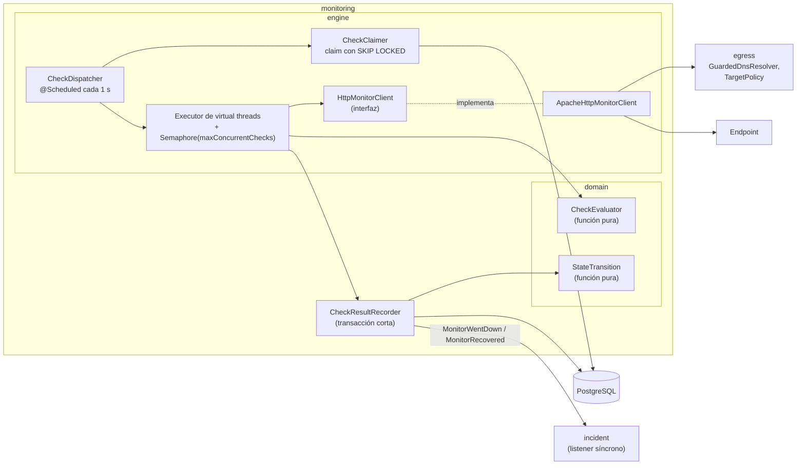
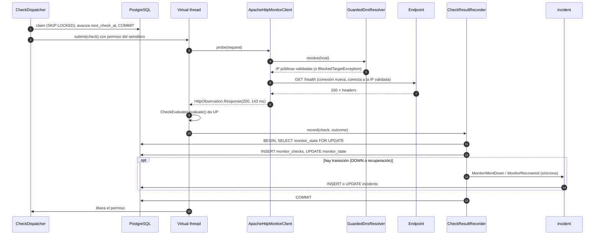

# Motor de monitoreo

Estado: diseño inicial · Última revisión: 2026-09-28 · Decisiones: [ADR-006](../adr/ADR-006-check-scheduling.md), [ADR-007](../adr/ADR-007-http-client-and-concurrency.md), [ADR-008](../adr/ADR-008-check-results-storage.md)

Es la pieza central de OpsWatch y la que decide si el producto es correcto. Este documento cubre la programación, la concurrencia, el cliente HTTP, la evaluación, la persistencia, la presión de carga y los modos de fallo.

## 1. Requisitos

### Funcionales

- Ejecutar cada monitor activo cada `intervalSeconds` (de 30 a 3600 s), con una desviación pequeña y medida.
- Hacer la petición HTTP configurada, medir la latencia y clasificar el resultado (`UP`, `DEGRADED` o `DOWN`, más la causa).
- Guardar cada resultado, actualizar el estado del monitor y disparar las transiciones (`MonitorWentDown` y `MonitorRecovered`).
- No ejecutar monitores pausados ni borrados.
- No permitir nunca que un check alcance destinos internos ([SSRF](../security/ssrf-protection.md)).

### No funcionales (objetivos iniciales, a validar con [benchmarks](../performance/benchmark-plan.md))

| Métrica | Objetivo V1 |
|---|---|
| Lag de scheduling p95 (1 000 monitores a 60 s, 2 vCPU) | < 2 s |
| Checks duplicados del mismo monitor en el mismo intervalo | 0, incluso con varias instancias |
| Conexiones a la base de datos retenidas durante una petición HTTP | 0 |
| Checks en vuelo por instancia | Limitado por configuración (200 por defecto) |
| Tiempo máximo de un check | `timeoutMs` más un margen pequeño, aunque el destino no coopere |

### Aritmética de carga

| Monitores | Intervalo | Checks/s | Checks/min | Concurrencia media necesaria* | Filas por día en `monitor_checks` |
|---|---|---|---|---|---|
| 100 | 60 s | 1,7 | 100 | < 1 | 144 000 |
| 1 000 | 60 s | 16,7 | 1 000 | ~5 | 1,44 M |
| 5 000 | 60 s | 83 | 5 000 | ~25 | 7,2 M |
| 10 000 | 60 s | 167 | 10 000 | ~50 | 14,4 M |
| 10 000 | 30 s | 333 | 20 000 | ~100 | 28,8 M |

\* Por la ley de Little, `L = λ × W`, con una latencia media supuesta de 300 ms. Los timeouts pesan mucho: si el 5 % de 167 checks/s se queda 10 s esperando, eso añade unos 83 checks en vuelo. Por eso el límite por defecto (200) tiene holgura.

## 2. Vista de componentes



## 3. Programación (scheduling)

### Alternativas evaluadas

| Alternativa | Ventajas | Desventajas |
|---|---|---|
| Una tarea en memoria por monitor (`TaskScheduler.scheduleAtFixedRate`) | Muy simple con una sola instancia | Estado en memoria: hay que resincronizar cada alta, baja o edición. No funciona con varias instancias sin locks. Al reiniciar se pierde la fase de cada monitor |
| Quartz con JobStore JDBC en clúster | Maduro, admite clúster | Esquema propio de 11 tablas, un job por monitor y demasiada ceremonia para "ejecuta esto cada N segundos" |
| ShedLock y un bucle único | Muy simple | Solo una instancia ejecuta a la vez, así que no escala horizontalmente |
| JobRunr | Buena interfaz, reintentos | Otra dependencia con su propio almacenamiento y panel. Sus reintentos no encajan con la semántica de los checks |
| **Polling de la base de datos con `FOR UPDATE SKIP LOCKED`** | Estado en PostgreSQL. Funciona con N instancias sin coordinación extra. La base de datos hace de cola. Fácil de observar con SQL | Una consulta por segundo y por instancia. Hay que diseñar bien el índice |
| Cola externa (Redis sorted sets, colas con retardo de RabbitMQ) | Muy escalable | Infraestructura nueva sin un problema medido que la justifique |

**Decisión:** polling con `SKIP LOCKED` ([ADR-006](../adr/ADR-006-check-scheduling.md)).

### Algoritmo de programación

1. Cada monitor activo tiene `monitor_state.next_check_at`. Si es nulo, no está programado.
2. Al crearlo o reanudarlo: `next_check_at = now + aleatorio[0, min(interval, 30 s))`. Este **jitter inicial** reparte la carga: sin él, 1 000 monitores creados de golpe con un script dispararían a la vez para siempre.
3. Cada segundo, el `CheckDispatcher` de cada instancia reclama los monitores vencidos:

```sql
WITH due AS (
    SELECT s.monitor_id, s.next_check_at AS scheduled_for
    FROM monitor_state s
    WHERE s.next_check_at <= :now
    ORDER BY s.next_check_at
    LIMIT :batch
    FOR UPDATE SKIP LOCKED
)
UPDATE monitor_state s
SET next_check_at = CASE
        WHEN due.scheduled_for + make_interval(secs => m.interval_seconds) > :now
            THEN due.scheduled_for + make_interval(secs => m.interval_seconds)
        ELSE :now + make_interval(secs => m.interval_seconds)
    END,
    updated_at = :now
FROM due
JOIN monitors m ON m.id = due.monitor_id
WHERE s.monitor_id = due.monitor_id
RETURNING s.monitor_id, due.scheduled_for;
```

4. En esa misma transacción corta se cargan las configuraciones de los monitores reclamados. Se hace commit y los checks se entregan al executor.

Propiedades:

- **Sin duplicados entre instancias.** `SKIP LOCKED` hace que dos instancias nunca reclamen la misma fila, y al reclamarla `next_check_at` avanza un intervalo completo.
- **Fixed-rate sin catch-up.** El siguiente check se programa desde el instante programado anterior (`scheduled_for + interval`), no desde que terminó, así que no hay deriva. Si el sistema va retrasado más de un intervalo, **no** se ejecutan los checks perdidos en ráfaga: se salta al siguiente. Recuperar checks del pasado no aporta información y agrava la sobrecarga.
- **Tolerante a caídas.** Si la instancia muere tras reclamar y antes de ejecutar, ese check se pierde y el monitor se ejecuta en el siguiente intervalo. No hay locks huérfanos que limpiar.
- **Índice.** `ix_monitor_state_due ON monitor_state (next_check_at) WHERE next_check_at IS NOT NULL`. La consulta solo toca filas vencidas.
- **Reloj.** `:now` sale del `Clock` de la aplicación, lo que permite tests deterministas. Las instancias deben tener el reloj sincronizado con NTP (en un solo host, comparten reloj).

### Pausa, reanudación, borrado y edición

| Acción | Efecto sobre `monitor_state` |
|---|---|
| Pausar | `status = PAUSED`, `next_check_at = NULL`, contadores a cero. Publica `MonitorPaused` |
| Reanudar | `status = PENDING`, `next_check_at = now + jitter`. Contadores a cero |
| Borrar | Igual que pausar, más `monitors.deleted_at`. Publica `MonitorDeleted` |
| Cambiar el intervalo | `next_check_at = min(next_check_at, now + nuevo intervalo)`. Si está pausado, sigue en `NULL` |
| Borrar el proyecto | `monitoring` recibe `ProjectDeleted` y borra sus monitores |

Todas bloquean la fila de `monitor_state` (`FOR UPDATE`) antes de escribir. Si hay un check en vuelo cuando se pausa, su resultado se guarda al volver, pero no cambia el estado: la transacción del resultado ve `PAUSED` y no aplica ninguna transición.

## 4. Modelo de concurrencia

### Alternativas evaluadas

| Alternativa | Ventajas | Desventajas |
|---|---|---|
| Pool fijo de hilos de plataforma (por ejemplo, 200) | Conocido, predecible | Cada hilo reserva su propia pila. Dimensionar el pool y la cola es delicado |
| **Virtual threads (un hilo por check) + `Semaphore`** | Código bloqueante simple y legible. Miles de checks en vuelo baratos. El semáforo da un límite explícito | Hay que vigilar el pinning (el JDK 24 y posteriores ya no fija un virtual thread por `synchronized`) y las llamadas nativas bloqueantes (DNS) |
| Reactivo (WebClient con Reactor Netty) | Máxima eficiencia en I/O | Introduce el modelo reactivo en la aplicación por un solo componente. Depuración y trazas más difíciles. No es necesario para los volúmenes previstos |

**Decisión:** virtual threads con un semáforo ([ADR-007](../adr/ADR-007-http-client-and-concurrency.md)).

### Dispatcher

```java
@Component
class CheckDispatcher {

    private final Semaphore permits;                 // maxConcurrentChecks, 200 por defecto
    private final ExecutorService executor = Executors.newVirtualThreadPerTaskExecutor();

    @Scheduled(fixedDelayString = "${opswatch.monitoring.engine.dispatch-interval}")
    void dispatch() {
        int free = permits.availablePermits();
        if (free == 0) {
            metrics.dispatcherSaturated();           // presión de carga: los vencidos esperan en la BD
            return;
        }
        List<ClaimedCheck> claimed = claimer.claim(Math.min(free, maxBatchSize));   // transacción corta
        for (ClaimedCheck check : claimed) {
            permits.acquireUninterruptibly();        // no bloquea: solo este hilo adquiere
            executor.submit(() -> {
                try {
                    runner.run(check);
                } finally {
                    permits.release();
                }
            });
        }
    }
}
```

- Solo **reclama tantos checks como permisos libres tenga**. Nunca saca de la base de datos trabajo que no pueda empezar ya.
- El `Semaphore` es el único límite de concurrencia del motor y se ve en la métrica `opswatch_monitor_checks_in_flight`.
- El número de hilos no hay que dimensionarlo: los virtual threads son baratos. Lo que se dimensiona es el semáforo.

### Límite por host de destino

Muchos monitores de organizaciones distintas pueden apuntar al mismo host. V1 no limita por host: la cuota por organización y el intervalo mínimo de 30 s acotan lo que puede hacer una sola cuenta. En la Fase 5 se añade un límite de concurrencia por host en el dispatcher (si no hay permiso para ese host, el check se aplaza unos segundos y cuenta en `opswatch_monitor_checks_deferred_total`) como defensa contra el uso de OpsWatch para amplificar tráfico ([threat model](../security/threat-model.md)).

## 5. `HttpMonitorClient`

La interfaz separa **observar** de **juzgar**. El cliente solo cuenta lo que pasó en la red. El dominio decide si eso es `UP`, `DEGRADED` o `DOWN`.

```java
/** Ejecuta una petición de comprobación. No decide si el monitor está UP o DOWN: solo observa. */
public interface HttpMonitorClient {

    HttpObservation probe(ProbeRequest request);
}

public record ProbeRequest(
        URI url,
        ProbeMethod method,              // GET o HEAD
        List<Header> headers,            // ya descifrados, validados al guardar
        Duration timeout,
        boolean followRedirects) {}

public sealed interface HttpObservation {

    /** Hubo respuesta HTTP. La latencia llega hasta los headers de la respuesta final. */
    record Response(int statusCode, Duration responseTime, int redirectsFollowed) implements HttpObservation {}

    /** No hubo respuesta utilizable. */
    record Failure(FailureReason reason, Duration elapsed, String detail) implements HttpObservation {}
}
```

La evaluación es una función pura, fácil de probar:

```java
public final class CheckEvaluator {

    public static CheckOutcome evaluate(MonitorExpectations expected, HttpObservation observation) {
        return switch (observation) {
            case HttpObservation.Failure f ->
                    CheckOutcome.down(f.reason(), null, null, f.detail());
            case HttpObservation.Response r when !expected.accepts(r.statusCode()) ->
                    CheckOutcome.down(FailureReason.UNEXPECTED_STATUS, r.statusCode(), r.responseTime(), null);
            case HttpObservation.Response r when expected.isDegraded(r.responseTime()) ->
                    CheckOutcome.degraded(r.statusCode(), r.responseTime());
            case HttpObservation.Response r ->
                    CheckOutcome.up(r.statusCode(), r.responseTime());
        };
    }
}
```

Ventajas de esta frontera:
- `CheckEvaluator` y `StateTransition` se prueban sin red, sin Spring y sin base de datos.
- El motor se prueba con un `HttpMonitorClient` falso que devuelve observaciones programadas.
- `ApacheHttpMonitorClient` se prueba aparte contra WireMock.
- Si algún día la implementación cambia (WebClient, otro cliente), el dominio no se entera.

## 6. Cliente HTTP

### RestClient frente a WebClient frente a clientes directos

| Opción | Evaluación |
|---|---|
| `RestClient` (Spring) | Buena API para consumir APIs. Para los checks no aporta nada sobre el cliente subyacente, que es donde están los controles que importan (DNS, redirects, reintentos). Se usará para llamadas entre servicios si llega la Etapa 3 |
| `WebClient` (Reactor Netty) | Descartado en V1: trae el stack reactivo por un solo componente. Se reconsidera si los virtual threads no alcanzan ([ADR-007](../adr/ADR-007-http-client-and-concurrency.md)) |
| `java.net.http.HttpClient` (JDK) | Sin dependencias, pero **no permite sustituir la resolución DNS**. Para fijar la IP habría que reescribir la URL con la IP y poner el header `Host` a mano, lo que rompe SNI y la verificación del certificado TLS |
| **Apache HttpClient 5 (API clásica)** | Permite inyectar un `DnsResolver` propio que valida las IP y **conecta exactamente a las IP validadas**, lo que corta el DNS rebinding. Controla cada timeout y permite desactivar redirects automáticos, reintentos, cookies y descompresión. Muy maduro |

**Decisión:** Apache HttpClient 5 con la API clásica (bloqueante), ejecutado en virtual threads.

### Configuración

| Aspecto | Configuración | Motivo |
|---|---|---|
| Resolución DNS | `GuardedDnsResolver` de `egress` | Filtra las IP bloqueadas y fija la IP de conexión ([SSRF](../security/ssrf-protection.md#capa-2-resolución-dns-con-fijación-de-ip)) |
| Proxy | Ninguno. **No** se usan las propiedades del sistema | Un proxy heredado del entorno saltaría el filtro de IP |
| Timeout de conexión | `timeoutMs` | |
| Timeout de lectura (socket) | `timeoutMs` | Cubre también el handshake TLS |
| Timeout de respuesta | `timeoutMs` | |
| **Deadline total** | `timeoutMs` más 200 ms. Una tarea programada llama a `cancel()` sobre la petición | Ningún check dura más que su timeout aunque el destino gotee bytes (slowloris) |
| Reintentos automáticos | **Desactivados** (`disableAutomaticRetries`) | HttpClient reintenta por defecto las peticiones idempotentes, lo que falsearía la latencia y los fallos |
| Redirects automáticos | **Desactivados**. Se siguen manualmente | Cada salto tiene que volver a validarse ([sección 7](#7-redirects)) |
| Reutilización de conexiones | **Desactivada**: conexión nueva por check | La latencia siempre incluye DNS, TCP y TLS, así que las mediciones son comparables. Además, cada check vuelve a validar el DNS. Con intervalos de 30 s o más, la reutilización casi nunca ocurriría. El costo (más handshakes TLS y más sockets en `TIME_WAIT`) se mide en los benchmarks |
| Cookies | Desactivadas | Un check no tiene sesión |
| Compresión | Desactivada: no se envía `Accept-Encoding` y no se descomprime | Evita bombas de descompresión y trabajo inútil |
| Límites de headers de respuesta | Línea máxima de 8 KiB y como mucho 100 headers | Un destino hostil no puede agotar la memoria con headers |
| Cuerpo de la respuesta | **No se lee.** Al recibir los headers se toma la latencia y se aborta la conexión | V1 no inspecciona el cuerpo. Cuando existan aserciones de contenido, se leerán como mucho 64 KiB |
| TLS | Truststore de la JVM, verificación de hostname, TLS 1.2 o superior | No existe la opción de "ignorar errores de TLS" en V1 |
| User-Agent | `OpsWatch-Monitor/<versión> (+<url pública de ayuda>)` | Buen ciudadano: el destino puede identificarnos y bloquearnos |
| Pool | `maxTotal = maxConcurrentChecks`, `maxPerRoute = maxConcurrentChecks` y un lease timeout de 1 s | El semáforo ya limita, así que el pool nunca hace esperar. Si lo hiciera, sería un fallo interno y no se atribuiría al destino |

### DNS

- La resolución usa el resolver del sistema a través del `GuardedDnsResolver`. Es **bloqueante y no se puede interrumpir**: si un servidor DNS tarda, el deadline total no puede cortar esa fase.
- Con virtual threads, el JDK compensa las llamadas nativas bloqueantes añadiendo hilos portadores, así que un DNS lento no congela el resto de los checks. Es un riesgo que hay que **medir**.
- Cache de la JVM: `networkaddress.cache.ttl=30` y `networkaddress.cache.negative.ttl=10`. Son los valores por defecto del JDK 25, así que la imagen no los fija (comprobado en OW-009). Si hubiera que cambiarlos: son *security properties*, y `-Dnetworkaddress.cache.ttl` no tiene efecto. Se cambian con un fichero pasado en `-Djava.security.properties=<fichero>` ([Docker](../devops/docker.md#dockerfile-multi-stage)).
- Si los benchmarks muestran que el DNS es un problema, la alternativa es un resolver propio con timeout, a través del SPI `InetAddressResolverProvider` (JEP 418) o de una librería DNS. Queda como decisión futura.

### Medición de la latencia

`response_time_ms` = tiempo desde el inicio de la petición hasta recibir los headers de la **respuesta final**, sumando los saltos de redirect. Incluye DNS, TCP y TLS, porque la conexión es nueva cada vez. No incluye descargar el cuerpo, que en V1 no se descarga. Se mide con `System.nanoTime()`, no con el reloj de pared.

## 7. Redirects

Con `followRedirects = true`:

1. Si la respuesta es `301`, `302`, `303`, `307` o `308` y trae `Location`, se resuelve la URL relativa contra la actual.
2. La nueva URL pasa `TargetPolicy` (esquema, forma del host y puerto). La IP se valida al conectar a través del `GuardedDnsResolver`, igual que en el primer salto.
3. `301`, `302` y `303` se siguen con `GET` (`HEAD` se mantiene como `HEAD`). `307` y `308` conservan el método.
4. **Los headers configurados solo se reenvían si el salto es al mismo origen** (esquema, host y puerto). A un origen distinto se quitan, para que un redirect no filtre un `Authorization` a otro host. Es lo mismo que hacen los navegadores y curl.
5. Como mucho 5 saltos. Si se supera el límite o se repite una URL, el resultado es `TOO_MANY_REDIRECTS`.
6. Un `Location` ausente o malformado da `PROTOCOL_ERROR`.

Con `followRedirects = false`, la respuesta `3xx` es la final y se evalúa contra el rango esperado. El usuario puede esperar un `301`.

## 8. Clasificación de fallos

| Excepción o condición | `FailureReason` |
|---|---|
| `BlockedTargetException` (lanzada por `GuardedDnsResolver` o `TargetPolicy`) | `TARGET_BLOCKED` |
| `UnknownHostException` | `DNS_FAILURE` |
| `ConnectTimeoutException`, `SocketTimeoutException`, cancelación por deadline | `TIMEOUT` |
| `HttpHostConnectException`, `ConnectException`, `NoRouteToHostException`, conexión reseteada | `CONNECTION_FAILED` |
| `SSLException` y subclases | `TLS_FAILURE` |
| Límite de redirects o bucle | `TOO_MANY_REDIRECTS` |
| `ProtocolException`, `NoHttpResponseException`, headers fuera de límite, `Location` inválido | `PROTOCOL_ERROR` |
| Otra `IOException` | `CONNECTION_FAILED` |
| `RuntimeException` (bug propio) | **No es un check.** Métrica `outcome="ERROR"`, log de error y el estado no cambia |

`error_detail` guarda un texto corto y genérico ("connection refused", "certificate expired"). Nunca guarda el cuerpo de la respuesta ni mensajes crudos de la excepción que puedan incluir datos internos.

## 9. Persistencia del resultado

```java
@Transactional
public void record(ClaimedCheck check, Instant startedAt, CheckOutcome outcome) {
    MonitorState state = states.lockById(check.monitorId());          // SELECT … FOR UPDATE
    checks.insert(MonitorCheck.of(check.monitorId(), startedAt, outcome));
    if (state.isPaused()) {
        return;                                                       // se guarda el check, sin transición
    }
    StateChange change = StateTransition.apply(state, outcome, check.thresholds(), startedAt);
    state.apply(change);
    change.event().ifPresent(events::publishEvent);                  // MonitorWentDown / MonitorRecovered
}
```

Reglas:

- **Ninguna transacción abierta durante la petición HTTP.** Hay dos transacciones cortas: reclamar y guardar. La petición HTTP ocurre entre ellas, sin conexión a la base de datos. Con 200 checks en vuelo y un pool de 10 conexiones, esto es lo que hace viable el diseño.
- `spring.jpa.open-in-view=false`.
- El listener de `incident` corre dentro de esta transacción ([eventos](events.md#síncrono-en-la-misma-transacción-monitoring--incident)).
- `monitor_checks` se inserta con JDBC directo (`JdbcClient`), no con JPA: es una inserción masiva, sin ciclo de vida de entidad, y así se evita el costo del contexto de persistencia.

## 10. Retry, circuit breaker y rate limiting

| Mecanismo | Decisión | Motivo |
|---|---|---|
| Reintento dentro del check | **No** | El `failureThreshold` ya absorbe los fallos transitorios. Reintentar dentro del check ocultaría fallos intermitentes y falsearía la latencia |
| Recheck rápido al primer fallo | Aplazado | Adelantar el siguiente check cuando un monitor `UP` falla acelera la detección. Se evaluará con datos de V1 |
| Circuit breaker hacia los destinos | **No** | El trabajo del motor es precisamente insistir contra servicios caídos. Un circuit breaker dejaría de observarlos |
| Circuit breaker hacia webhooks de notificación | No en V1 | El backoff con un número máximo de intentos por entrega basta |
| Rate limiting saliente | Cuotas por organización e intervalo mínimo en V1. Límite por host en la Fase 5 | Evita usar OpsWatch como amplificador de tráfico |

## 11. Presión de carga (backpressure) y colas

- **La cola es la base de datos.** Los monitores vencidos que no se reclamaron siguen en `monitor_state` con `next_check_at` en el pasado. No hay una cola en memoria que pueda crecer sin límite ni perderse al reiniciar.
- **Señal de sobrecarga:** el lag (`opswatch_monitor_check_lag_seconds`, instante de inicio menos instante programado) y el número de vencidos (`opswatch_monitor_checks_overdue`, monitores con `next_check_at < now - 5 s`, calculado cada 15 s).
- **Comportamiento con sobrecarga:** el dispatcher reclama solo lo que puede ejecutar. El lag crece de forma visible y los checks perdidos se saltan en lugar de acumularse (sin catch-up). El sistema se degrada con suavidad y no colapsa.
- Si el lag p95 supera el objetivo de forma sostenida, esa es la evidencia que activa las decisiones de escalado ([evolución](evolution.md)).

## 12. Cancelación y apagado

- Al recibir `SIGTERM`: el dispatcher deja de reclamar, se espera a los checks en vuelo hasta `timeoutMs` máximo más 5 s y los que queden se cancelan. Sus monitores se ejecutan en el siguiente intervalo.
- `server.shutdown=graceful` y `spring.lifecycle.timeout-per-shutdown-phase=35s`.
- El motor se puede desactivar por instancia con `opswatch.monitoring.engine.enabled=false` (instancias que solo sirven la API).

## 13. Flujo completo de un check



## 14. Métricas del motor

| Métrica (Prometheus) | Tipo | Etiquetas | Para qué |
|---|---|---|---|
| `opswatch_monitor_checks_total` | counter | `outcome` (`UP`, `DEGRADED`, `DOWN`, `ERROR`) y `reason` | Volumen y tasa de fallos. `opswatch_monitor_failures_total` de la especificación inicial equivale a `outcome="DOWN"` y no se duplica |
| `opswatch_monitor_check_duration_seconds` | histogram | `outcome` | Latencia observada de los destinos |
| `opswatch_monitor_check_lag_seconds` | histogram | — | **Señal principal de saturación** |
| `opswatch_monitor_checks_in_flight` | gauge | — | Uso del semáforo |
| `opswatch_monitor_checks_overdue` | gauge | — | Profundidad de la "cola" |
| `opswatch_scheduler_claim_duration_seconds` | histogram | — | Costo de la consulta de claim |
| `opswatch_scheduler_dispatcher_saturated_total` | counter | — | Veces que no había permisos libres |
| `opswatch_egress_blocked_total` | counter | `reason` | Intentos bloqueados por la política SSRF |

**Nunca** se etiqueta con `monitorId` ni `organizationId`: con miles de monitores, la cardinalidad haría inservible Prometheus. El detalle por monitor está en `monitor_checks`.

## 15. Modos de fallo

| Fallo | Efecto | Mitigación |
|---|---|---|
| Destino lento o que gotea bytes | El check ocupa un permiso hasta el deadline | Deadline total por check y límite del semáforo |
| Muchos destinos caídos con timeout largo | Checks en vuelo altos y lag creciente | Timeout máximo de 30 s, semáforo, métricas y alerta de lag |
| DNS lento | Checks bloqueados en la resolución | Medir. Resolver con timeout si hace falta |
| Base de datos caída | No se reclama y no se guarda | Los checks se detienen. La readiness de la aplicación falla. Al volver, el motor sigue sin catch-up |
| Falla la inserción del resultado | Se pierde un check | Métrica de errores y log. El siguiente check vuelve a evaluar el estado |
| Dos instancias con relojes distintos | Lag mal medido | NTP. En un solo host, el reloj es común |
| Bug en `incident` que lanza una excepción | Se revierten los resultados de checks con transición | Alerta sobre `outcome="ERROR"`. El check se registra de nuevo en el siguiente intervalo |
| Agotamiento de puertos efímeros (muchas conexiones nuevas) | Errores de conexión propios | Vigilar `TIME_WAIT` en los benchmarks ([plan](../performance/benchmark-plan.md)) |

## 16. Pruebas del motor

Detalle en la [estrategia de testing](../testing/testing-strategy.md). Lo mínimo:

- **Unitarias:** `CheckEvaluator` (todas las combinaciones de rango, umbral y fallo), `StateTransition` (la tabla completa del [modelo de dominio](domain-model.md#monitorstate)), cálculo de `next_check_at` y del jitter con `Clock` y `RandomGenerator` inyectados.
- **Integración con WireMock:** estados, retrasos (timeout), redirects (mismo origen y origen distinto, bucles, más de 5 saltos), headers enormes, TLS autofirmado y `Location` inválido.
- **SSRF:** resolver falso que devuelve IP privadas o que cambia de IP entre llamadas (rebinding), y redirect hacia `169.254.169.254`.
- **Concurrencia:** dos dispatchers contra el mismo PostgreSQL de Testcontainers reclamando a la vez: ningún monitor se ejecuta dos veces por intervalo.
- **Pausa con un check en vuelo:** el resultado se guarda y el estado sigue en `PAUSED`.
