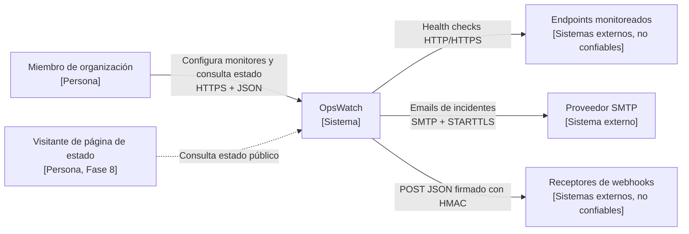
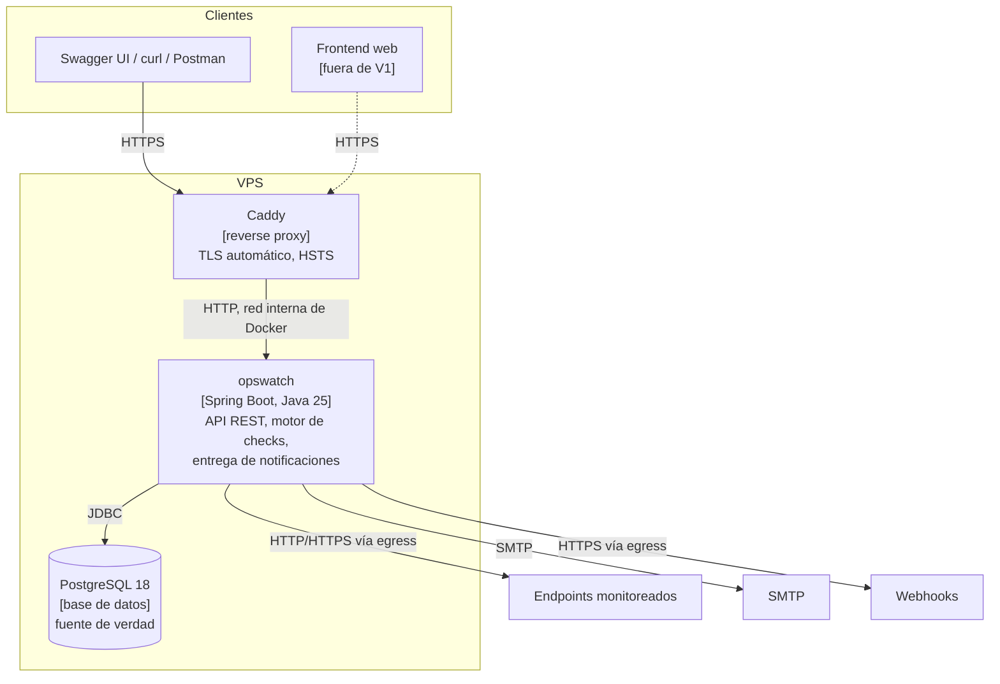
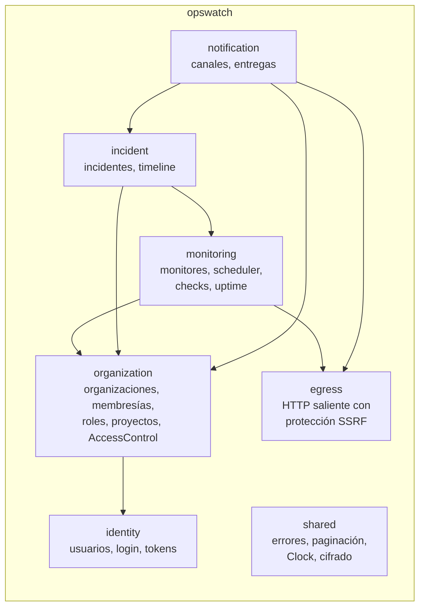
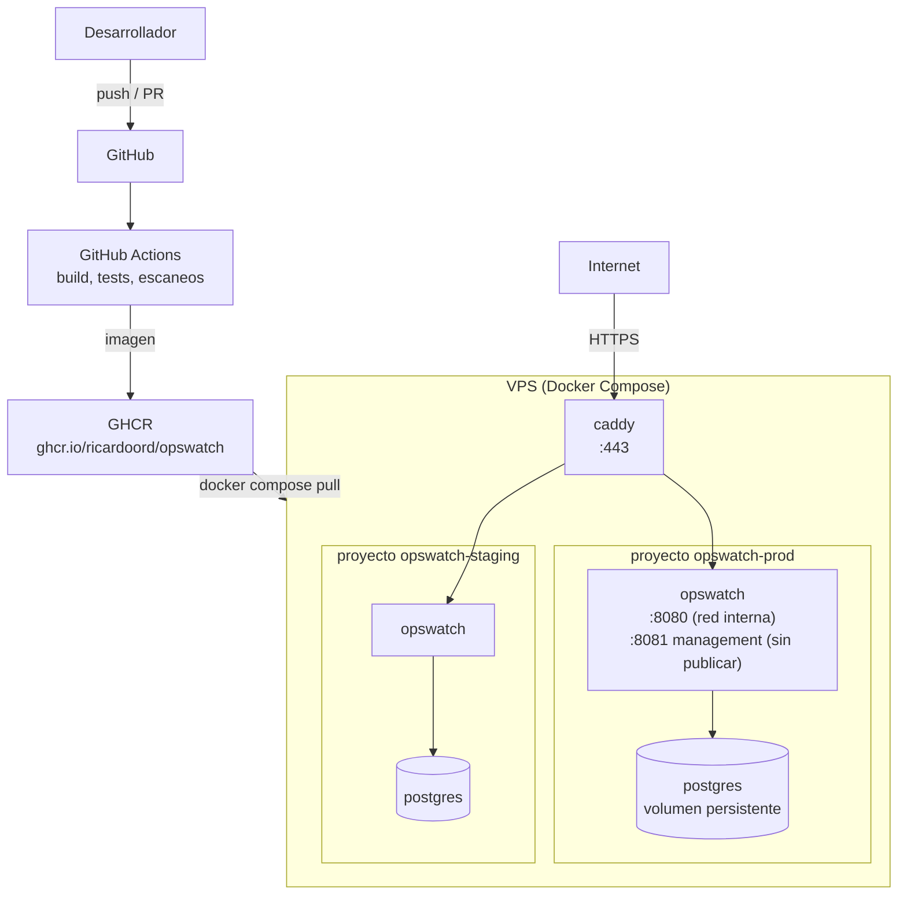

# Visión general de la arquitectura

Estado: diseño inicial · Última revisión: 2026-09-28

## 1. Propósito

OpsWatch vigila la disponibilidad de servicios HTTP/HTTPS para varias organizaciones. Por cada endpoint registrado ejecuta comprobaciones periódicas, guarda el resultado, deduce el estado del servicio, abre y cierra incidentes y notifica.

El proyecto tiene dos objetivos que conviven:

1. **Producto:** un monitor de disponibilidad correcto y seguro.
2. **Portafolio:** mostrar criterio de ingeniería backend. Eso incluye explicar por qué **no** se usa una tecnología cuando no hace falta.

## 2. Alcance de V1

Entra en V1 (fases 0 a 6):

- Cuentas de usuario con email y contraseña.
- Organizaciones con miembros y roles por organización.
- Proyectos dentro de organizaciones.
- Monitores HTTP/HTTPS con intervalo, timeout, método (`GET`, `HEAD`), rango de códigos esperado, umbral de latencia degradada, redirects y headers cifrados.
- Motor de checks con protección contra SSRF.
- Historial de checks, uptime (24 h, 7 d, 30 d) y percentiles de latencia.
- Incidentes automáticos: se abren y se resuelven según el estado del monitor, con acknowledge manual.
- Notificaciones por email y webhook firmado.
- Despliegue en un VPS con TLS y CI/CD.

No entra en V1: interfaz web propia (la API se usa desde Swagger UI o curl), tiempo real, páginas de estado públicas, ventanas de mantenimiento, checks desde varias regiones, SSO, claves de API y planes de pago. Todo eso aparece en el [roadmap](../roadmap/roadmap.md) o en las [decisiones abiertas](open-decisions.md).

## 3. Actores

| Actor | Descripción | Confianza |
|---|---|---|
| Miembro de una organización | Usuario autenticado con un rol en una o más organizaciones | Autenticado, pero puede ser malicioso respecto a **otras** organizaciones |
| Visitante anónimo | Consulta páginas de estado públicas (Fase 8) | Ninguna |
| Endpoint monitoreado | Servicio externo al que OpsWatch hace peticiones | **Ninguna**: puede responder lento, con cuerpos enormes o con redirects hostiles |
| Proveedor SMTP | Entrega emails de notificación | Tercero |
| Receptor de webhooks | URL configurada por el usuario que recibe notificaciones | Ninguna. Aplica la misma protección SSRF que a los checks |

## 4. Atributos de calidad

Van en orden de prioridad: **correctness > security > maintainability > simplicity > performance > novelty**.

| Atributo | Escenario medible |
|---|---|
| Correctitud | Si un monitor con `failure_threshold = 3` falla tres checks seguidos, existe **exactamente un** incidente abierto para él, aunque haya reintentos, reinicios o eventos duplicados |
| Seguridad | Ningún check ni webhook alcanza una IP privada, loopback, link-local o de metadata cloud. Ningún usuario lee ni modifica datos de una organización de la que no es miembro |
| Mantenibilidad | Una violación de límites entre módulos rompe el build. Una funcionalidad nueva de un módulo cambia sobre todo ese módulo |
| Simplicidad | V1 se despliega como **una aplicación y una base de datos** |
| Rendimiento (hipótesis a medir) | Con 1 000 monitores a 60 s, en 2 vCPU y 2 GB de RAM: lag de scheduling p95 < 2 s y latencia p95 de la API < 200 ms en lecturas |
| Costo | Operación de V1 por debajo de unos 10 USD al mes ([costos](../devops/costs.md)) |

Las cifras de rendimiento son **objetivos iniciales, no resultados**. El [plan de benchmarks](../performance/benchmark-plan.md) las valida o las corrige.

## 5. Restricciones

- Una sola persona desarrolla. Una arquitectura que exija operar muchos componentes cuesta más de lo que aporta.
- Todo el backend es Java y Spring Boot, incluidos los servicios futuros.
- El presupuesto es bajo: desarrollo local, open source y un VPS barato.
- El código es parte del portafolio, así que la legibilidad pesa más que las micro-optimizaciones.

## 6. Principios

1. **Start simple, measure, identify bottlenecks, evolve intentionally.** Ninguna pieza de infraestructura entra sin un problema medido que la justifique.
2. **Límites por dominio, no por capa técnica.** Los paquetes se organizan por módulo de negocio y las capas internas existen solo donde aportan.
3. **PostgreSQL es la fuente de verdad.** Caches, brokers y proyecciones futuras se derivan de ella.
4. **Seguro por defecto.** Todo endpoint exige autenticación salvo excepciones explícitas. Toda URL saliente pasa por `egress`. Todo acceso a un recurso comprueba la organización.
5. **Honestidad documental.** Lo planificado se distingue siempre de lo implementado.

## 7. Contexto del sistema (C4, nivel 1)

## 8. Contenedores de V1 (C4, nivel 2)

Un solo proceso cubre la API, el motor y las notificaciones. El motor se puede desactivar por configuración (`opswatch.monitoring.engine.enabled`), lo que permite separar más adelante instancias de API e instancias de motor **sin cambiar el código**. Ver [evolución](evolution.md#etapa-2b-separación-por-rol-sin-nuevo-servicio).

## 9. Componentes (C4, nivel 3)

El detalle de los módulos está en [modules.md](modules.md). Resumen:

Todos los módulos dependen de `shared`; esas flechas se omiten para que el diagrama se lea. Las flechas indican dependencia de código. Los eventos fluyen en la misma dirección: `incident` escucha eventos de `monitoring`, y `monitoring` no conoce a `incident`.

## 10. Despliegue de V1

- Caddy es la única puerta desde internet. PostgreSQL y el puerto de management no se publican.
- Staging y producción comparten máquina para mantener bajo el costo, con bases de datos separadas.
- El servidor no compila nada: descarga las imágenes que publica el pipeline. Detalle en [CI/CD](../devops/ci-cd.md).

## 11. Flujos principales

| Flujo | Dónde se describe |
|---|---|
| Registro, login, refresh y logout | [Arquitectura de seguridad](../security/security-architecture.md#flujo-de-autenticación) |
| Alta de monitor con validación SSRF | [Protección SSRF](../security/ssrf-protection.md#capa-1-validación-al-guardar) |
| Ejecución de un check | [Motor de monitoreo](monitoring-engine.md#13-flujo-completo-de-un-check) |
| Apertura y resolución de incidentes | [Ciclo de vida de incidentes](incident-lifecycle.md) |
| Entrega de notificaciones | [Eventos internos](events.md#7-flujo-de-eventos) |

## 12. Lo que V1 no hace a propósito

| No hace | Por qué |
|---|---|
| Microservicios | No hay evidencia de que un módulo necesite escalar ni desplegarse por separado ([ADR-001](../adr/ADR-001-modular-monolith.md)) |
| Redis | PostgreSQL cubre los locks (`SKIP LOCKED`). La cache y el rate limiting caben en memoria mientras haya una sola instancia ([ADR-009](../adr/ADR-009-redis.md)) |
| Broker de mensajes | Los eventos internos de Spring Modulith con registro persistente bastan dentro de un proceso ([ADR-010](../adr/ADR-010-event-broker.md)) |
| Kubernetes | Una máquina con Docker Compose basta para V1 ([decisiones abiertas](open-decisions.md)) |
| WebFlux | Los virtual threads dan la concurrencia que necesita el motor con código bloqueante más simple ([ADR-007](../adr/ADR-007-http-client-and-concurrency.md)) |
| Base de datos de series temporales | Una tabla con retención y un índice BRIN aguanta el volumen esperado de V1 ([ADR-008](../adr/ADR-008-check-results-storage.md)) |
