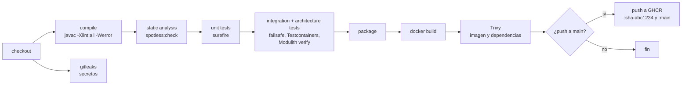
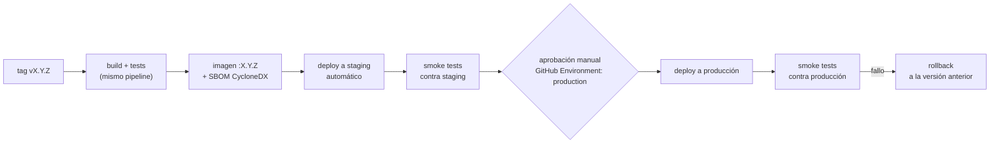

# CI/CD

Estado: diseño inicial · Última revisión: 2026-09-28

## Estrategia de ramas

**Trunk-based, versión ligera.** No se usa Git Flow: con una persona y despliegues frecuentes, las ramas `develop` y `release/*` solo añaden merges.

```text
main  ●───●───●───●───●───●──  (siempre desplegable, protegida)
       \     /  \       /
        ●───●    ●─────●       ramas cortas: feat/…, fix/…, docs/…, chore/…, refactor/…, test/…
```

| Regla | Detalle |
|---|---|
| `main` protegida | Sin push directo. Merge solo por PR con CI en verde |
| Ramas cortas | Duran de horas a pocos días. Se nombran por tipo y tema: `feat/monitor-crud`, `fix/refresh-reuse-race` |
| Commits | [Conventional Commits](https://www.conventionalcommits.org/): `feat(monitoring): add pause and resume endpoints` |
| Merge | **Squash**: un commit por PR en `main`, con el título del PR como mensaje |
| PR | Plantilla con qué, por qué, cómo se probó, impacto en seguridad y checklist de la [Definition of Done](../roadmap/definition-of-done.md) |
| Releases | Tag `vX.Y.Z` sobre `main` ([versionado](../development/versioning.md)) |
| Funcionalidad a medias | Si una fase no cabe en una rama corta, se integra en partes detrás de un feature flag de configuración (por ejemplo, `opswatch.monitoring.engine.enabled`) en lugar de mantener una rama larga |

Configuración de GitHub (Sprint 0): protección de `main` con los checks obligatorios `build` y `image`, sin force-push, historial lineal, squash merge como única opción y borrado automático de la rama tras el merge.

**Estado real (2026-09-28):** todo lo anterior está activo **salvo los checks obligatorios**, que se añaden en OW-010 cuando exista el workflow. Exigirlos antes bloquearía todos los PR, porque ningún check llegaría a ejecutarse. La protección se aplica también a los administradores y exige resolver las conversaciones del PR antes del merge.

## Pipeline de integración (Sprint 0)

Se dispara con cada `pull_request` y cada `push` a `main`.



| Etapa | Herramienta | Falla si |
|---|---|---|
| Compilación | `./mvnw -B compile` con `-Xlint:all -Werror` | Hay errores o warnings. Empezar sin warnings es barato, y mantenerlo también |
| Formato | Spotless (`spotless:check`) | El código no sigue el formato |
| Tests unitarios | Surefire (`*Test`) | Falla un test |
| Integración y arquitectura | Failsafe (`*IT`, `ModularityTests`) con Testcontainers | Falla un test o se viola un límite de módulo |
| Empaquetado | `spring-boot-maven-plugin` | — |
| Imagen | `docker/build-push-action` con cache de GitHub Actions | Falla el build |
| Vulnerabilidades | Trivy (imagen, que incluye las dependencias Java) | `CRITICAL` o `HIGH` con corrección disponible |
| Secretos | gitleaks | Aparece un secreto en el diff o el historial |

Boceto del workflow:

```yaml
# .github/workflows/ci.yml (boceto)
name: ci
on:
  pull_request:
  push:
    branches: [main]

permissions:
  contents: read

concurrency:
  group: ci-${{ github.ref }}
  cancel-in-progress: true

jobs:
  build:
    runs-on: ubuntu-latest
    timeout-minutes: 20
    steps:
      - uses: actions/checkout@<sha>          # todas las acciones fijadas por SHA
      - uses: actions/setup-java@<sha>
        with:
          distribution: temurin
          java-version: '25'
          cache: maven
      - run: ./mvnw -B spotless:check
      - run: ./mvnw -B verify
      - if: failure()
        uses: actions/upload-artifact@<sha>
        with:
          name: test-reports
          path: |
            target/surefire-reports
            target/failsafe-reports
      - uses: actions/upload-artifact@<sha>
        with:
          name: modulith-docs
          path: target/spring-modulith-docs

  secrets-scan:
    runs-on: ubuntu-latest
    steps:
      - uses: actions/checkout@<sha>
        with:
          fetch-depth: 0
      - uses: gitleaks/gitleaks-action@<sha>

  image:
    needs: build
    runs-on: ubuntu-latest
    permissions:
      contents: read
      packages: write                 # solo este job puede publicar en GHCR
    steps:
      - uses: actions/checkout@<sha>
      - uses: docker/setup-buildx-action@<sha>
      - if: github.event_name == 'push'
        uses: docker/login-action@<sha>
        with:
          registry: ghcr.io
          username: ${{ github.actor }}
          password: ${{ secrets.GITHUB_TOKEN }}
      - uses: docker/build-push-action@<sha>
        with:
          context: .
          load: true
          tags: opswatch:ci
          cache-from: type=gha
          cache-to: type=gha,mode=max
      - uses: aquasecurity/trivy-action@<sha>
        with:
          image-ref: opswatch:ci
          severity: CRITICAL,HIGH
          ignore-unfixed: true
          exit-code: '1'
      - if: github.event_name == 'push'
        run: |
          docker tag opswatch:ci ghcr.io/ricardoord/opswatch:sha-${GITHUB_SHA::7}
          docker tag opswatch:ci ghcr.io/ricardoord/opswatch:main
          docker push --all-tags ghcr.io/ricardoord/opswatch
```

Nota: el job `image` compila de nuevo dentro de Docker. Es aceptable para empezar. Si el tiempo total molesta, el jar del job `build` puede pasarse como artefacto y el Dockerfile tendría una variante que solo copia.

### Otros workflows

| Workflow | Disparador | Fase |
|---|---|---|
| Dependabot (Maven, Docker, GitHub Actions) | Semanal | 0 |
| CodeQL (Java) | PR y semanal | 5 |
| Comparación de OpenAPI con `main` | PR | 5 |
| Release (`release.yml`) | Tag `v*` | 6 |

## Pipeline de despliegue (Fase 6)



- **Despliegue:** por SSH con una clave dedicada y restringida, guardada como secreto del GitHub Environment. En el servidor: `docker compose pull && docker compose up -d` con la etiqueta de la versión.
- **Migraciones:** Flyway las aplica al arrancar la versión nueva. Por las reglas de [expand / contract](../database/migrations.md#cambios-compatibles-hacia-atrás-expand--contract), la versión anterior sigue funcionando con el esquema nuevo, así que **el rollback es redesplegar la etiqueta anterior**, sin tocar la base de datos.
- **Copia de seguridad antes de desplegar en producción:** `pg_dump` automático como paso del workflow.
- **Smoke tests:** `readiness` en `UP`, login con un usuario de pruebas, lectura de una organización y comparación de la versión en `/actuator/info`.
- **Disponibilidad durante el despliegue:** con una sola instancia hay unos segundos de corte mientras arranca la nueva. Es aceptable en V1. Un despliegue sin corte (dos instancias detrás de Caddy) es trabajo de la Fase 9, si hace falta.
- **Staging y producción en el mismo VPS**, con proyectos de Compose, bases de datos y subdominios separados, para mantener bajo el costo ([costos](costs.md)).

### Secretos del pipeline

| Secreto | Dónde | Quién lo usa |
|---|---|---|
| `GITHUB_TOKEN` | Automático, con permisos mínimos por job | Publicar en GHCR |
| Clave SSH de despliegue | GitHub Environments `staging` y `production` | Solo los jobs de despliegue |
| Host y usuario del servidor | Ídem | Ídem |
| Secretos de la aplicación (JWT, cifrado, base de datos) | **En el servidor**, no en GitHub | La aplicación, a través de Docker secrets |

Los secretos de la aplicación no pasan por el pipeline: el pipeline despliega imágenes y el servidor ya tiene sus secretos.
