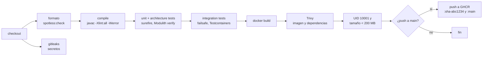
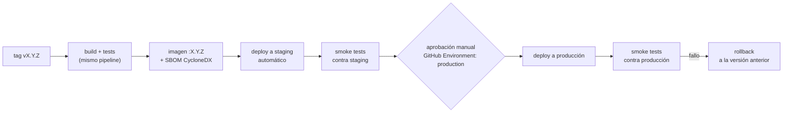

# CI/CD

Estado: integración implementada (OW-010); despliegue en diseño (Fase 6) · Última revisión: 2026-09-28

## Estrategia de ramas

**Trunk-based, versión ligera.** No se usa Git Flow: con una persona y despliegues frecuentes, las ramas `develop` y `release/*` solo añaden merges.

```text
main  ●───●───●───●───●───●──  (siempre desplegable, protegida)
       \     /  \       /
        ●───●    ●─────●       ramas cortas: feat/…, fix/…, docs/…, chore/…, refactor/…, test/…
```

| Regla | Detalle |
|---|---|
| `main` protegida | Sin push directo. Merge solo por PR con CI en verde |
| Ramas cortas | Duran de horas a pocos días. Se nombran por tipo y tema: `feat/monitor-crud`, `fix/refresh-reuse-race` |
| Commits | [Conventional Commits](https://www.conventionalcommits.org/): `feat(monitoring): add pause and resume endpoints` |
| Merge | **Squash**: un commit por PR en `main`, con el título del PR como mensaje |
| PR | Plantilla con qué, por qué, cómo se probó, impacto en seguridad y checklist de la [Definition of Done](../roadmap/definition-of-done.md) |
| Releases | Tag `vX.Y.Z` sobre `main` ([versionado](../development/versioning.md)) |
| Funcionalidad a medias | Si una fase no cabe en una rama corta, se integra en partes detrás de un feature flag de configuración (por ejemplo, `opswatch.monitoring.engine.enabled`) en lugar de mantener una rama larga |

Configuración de GitHub, activa desde OW-010 (2026-09-28):

- Protección de `main` con los checks obligatorios `build`, `secrets-scan` e `image`. Los tres están ligados a la app GitHub Actions y exigen la rama al día con `main` antes del merge.
- Sin force-push ni borrado, historial lineal y conversaciones del PR resueltas antes del merge. Todo se aplica también a los administradores.
- Squash merge como única opción y borrado automático de la rama tras el merge.
- Secret scanning, push protection, alertas de Dependabot y sus actualizaciones de seguridad.
- `dependabot.yml` vigila Maven, las imágenes del Dockerfile y de Compose, y GitHub Actions.

## Pipeline de integración (Sprint 0)

Se dispara con cada `pull_request` y cada `push` a `main`.



| Etapa | Herramienta | Falla si |
|---|---|---|
| Compilación | `./mvnw -B compile` con `-Xlint:all -Werror` | Hay errores o warnings. Empezar sin warnings es barato, y mantenerlo también |
| Formato | Spotless (`spotless:check`) | El código no sigue el formato |
| Tests unitarios y de arquitectura | Surefire (`*Test`, y `*Tests`: `ModularityTests` y `ArchitectureRulesTests`) | Falla un test o se viola un límite de módulo |
| Integración | Failsafe (`*IT`) con Testcontainers | Falla un test |
| Imagen | `docker/build-push-action` con cache de GitHub Actions | Falla el build |
| Vulnerabilidades | Trivy (imagen, que incluye las dependencias Java y los secretos en las capas) | `CRITICAL` o `HIGH` con corrección disponible |
| Usuario y tamaño | `docker run --entrypoint id` y `docker save \| gzip` | El UID no es 10001 o la imagen comprimida pesa 200 MB o más |
| Secretos | gitleaks | Aparece un secreto en el diff o el historial |

El workflow es [`.github/workflows/ci.yml`](../../.github/workflows/ci.yml) (OW-010). Tiene tres jobs, y cada uno es un check obligatorio de `main`:

| Job | Qué hace | Permisos |
|---|---|---|
| `build` | `spotless:check` primero, porque un fallo de formato no debe esperar a los tests. Después `./mvnw verify`: compilación sin warnings, unitarios, integración con Testcontainers y `verify()` de Modulith. Sube los informes de tests si falla, y la cobertura y la documentación de módulos siempre | `contents: read` |
| `secrets-scan` | gitleaks sobre los commits del PR o del push | `contents: read`, `pull-requests: read` (la acción lista los commits del PR) |
| `image` | Solo si `build` pasa. Construye la imagen con la cache de GitHub Actions y la pasa por Trivy. Comprueba el UID 10001 y el tamaño (menos de 200 MB comprimida). En los push a `main`, publica `ghcr.io/ricardoord/opswatch:sha-<7>` y `:main` | `contents: read`, `packages: write` (el único que puede publicar) |

Decisiones:

| Decisión | Motivo |
|---|---|
| Acciones fijadas por SHA, con la versión en un comentario | Una etiqueta se puede mover a otro commit, un SHA no (T-61). Dependabot actualiza SHA y comentario |
| `persist-credentials: false` en los checkouts | El token no queda en `.git/config`, al alcance de los pasos siguientes |
| Permisos por job, `contents: read` por defecto | Cada job tiene solo lo que usa |
| `cancel-in-progress` solo en los PR | En un PR, un push nuevo cancela la ejecución anterior. En `main` no se cancela: cada merge publica su imagen |
| Comentarios de gitleaks desactivados | Pedirían `pull-requests: write`. El resultado se ve en el check |
| Etiquetas OCI `source` y `revision` | Enlazan el paquete de GHCR con el repositorio y con el commit |
| Los jobs no tienen `name:` | El id del job es el nombre del check obligatorio. Cambiarlo rompería la protección de `main` |
| Checks ligados a la app GitHub Actions (`app_id` 15368) | Otra app o un token con permiso de estados no puede marcar un check como correcto |
| Rama al día antes del merge (`strict`) | Lo que se mergea es lo que se probó contra el `main` actual |

Validado con actionlint y con zizmor en modo pedantic. zizmor solo deja avisos informativos: jobs sin `name:`, a propósito, y permisos sin comentario.

**Tiempos** (OW-010, 2026-09-28, runners `ubuntu-latest`):

| | `build` | `secrets-scan` | `image` | Total (reloj) |
|---|---|---|---|---|
| Primera ejecución, sin caches | 1 min 36 s | 10 s | 3 min 19 s | ~5 min |
| Con las caches de Maven y de Docker | 39 s | 10 s | 57 s | 1 min 39 s |

**Casos de fallo comprobados** en el PR de prueba #58, cerrado sin mergear:

- `build` falla con un fichero mal formateado (`spotless:check`).
- `secrets-scan` falla con una clave privada falsa (regla `private-key`).
- El PR queda `BLOCKED`: no se puede mergear.

Push protection de GitHub **no** bloqueó el push de esa clave genérica: gitleaks es la barrera para los secretos sin un patrón de proveedor.

El job `image` compila de nuevo dentro de Docker. Con la cache tarda menos de un minuto, así que de momento no compensa pasar el jar del job `build` como artefacto.

### Otros workflows

| Workflow | Disparador | Fase |
|---|---|---|
| Dependabot (Maven, Docker, GitHub Actions) | Semanal | 0 |
| CodeQL (Java) | PR y semanal | 5 |
| Comparación de OpenAPI con `main` | PR | 5 |
| Release (`release.yml`) | Tag `v*` | 6 |

## Pipeline de despliegue (Fase 6)



- **Despliegue:** por SSH con una clave dedicada y restringida, guardada como secreto del GitHub Environment. En el servidor: `docker compose pull && docker compose up -d` con la etiqueta de la versión.
- **Migraciones:** Flyway las aplica al arrancar la versión nueva. Por las reglas de [expand / contract](../database/migrations.md#cambios-compatibles-hacia-atrás-expand--contract), la versión anterior sigue funcionando con el esquema nuevo, así que **el rollback es redesplegar la etiqueta anterior**, sin tocar la base de datos.
- **Copia de seguridad antes de desplegar en producción:** `pg_dump` automático como paso del workflow.
- **Smoke tests:** `readiness` en `UP`, login con un usuario de pruebas, lectura de una organización y comparación de la versión en `/actuator/info`.
- **Disponibilidad durante el despliegue:** con una sola instancia hay unos segundos de corte mientras arranca la nueva. Es aceptable en V1. Un despliegue sin corte (dos instancias detrás de Caddy) es trabajo de la Fase 9, si hace falta.
- **Staging y producción en el mismo VPS**, con proyectos de Compose, bases de datos y subdominios separados, para mantener bajo el costo ([costos](costs.md)).

### Secretos del pipeline

| Secreto | Dónde | Quién lo usa |
|---|---|---|
| `GITHUB_TOKEN` | Automático, con permisos mínimos por job | Publicar en GHCR |
| Clave SSH de despliegue | GitHub Environments `staging` y `production` | Solo los jobs de despliegue |
| Host y usuario del servidor | Ídem | Ídem |
| Secretos de la aplicación (JWT, cifrado, base de datos) | **En el servidor**, no en GitHub | La aplicación, a través de Docker secrets |

Los secretos de la aplicación no pasan por el pipeline: el pipeline despliega imágenes y el servidor ya tiene sus secretos.
