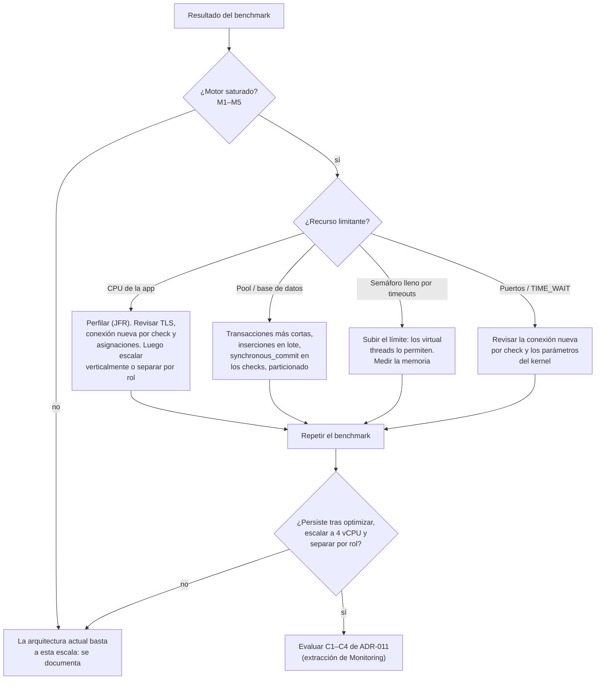

# Plan de benchmarks

Estado: diseño inicial · Última revisión: 2026-09-28 · Se ejecuta en la Fase 7 y antes de cada decisión de arquitectura condicionada

## Objetivo

Demostrar con datos **por qué** la arquitectura evoluciona, o por qué no lo hace. Cada benchmark responde a una pregunta concreta:

| Pregunta | Decisión que informa |
|---|---|
| ¿Cuántos monitores sostiene una instancia con el lag dentro del objetivo? | Etapa 2b (separar por rol) y Etapa 3 (extraer Monitoring) |
| ¿Qué recurso se agota primero: CPU, memoria, conexiones a la base de datos, E/S de disco, puertos? | Dónde optimizar antes de escalar |
| ¿Degrada el motor a la API cuando comparten proceso o base de datos? | Separación por rol o extracción ([criterios C1 a C4](../architecture/evolution.md#cómo-detectar-el-momento)) |
| ¿Aguanta PostgreSQL el ritmo de escritura de `monitor_checks`? | Inserciones en lote, particionado ([ADR-008](../adr/ADR-008-check-results-storage.md)) |
| ¿Alcanzan los virtual threads con un cliente bloqueante? | [ADR-007](../adr/ADR-007-http-client-and-concurrency.md) |
| ¿Cuánto tardan las estadísticas de uptime con 30 días de datos? | Rollups |

## Entorno

**Reproducible y documentado.** Cada resultado registra el hardware, las versiones y los límites.

- Máquina local con Docker Compose y el profile `benchmark`.
- **Límites fijos por contenedor:**

| Contenedor | CPU | Memoria |
|---|---|---|
| `opswatch` | 2 vCPU | 2 GB |
| `postgres` | 2 vCPU | 2 GB |
| `target-simulator` | 2 vCPU | 1 GB |
| `prometheus` y `grafana` | Sin límite relevante | — |

- El simulador **no** comparte los límites de CPU de la aplicación. Si la máquina no tiene núcleos suficientes para aislarlo, se ejecuta en otra máquina de la red local y se documenta.
- Nunca contra destinos reales de internet: sería abuso y los resultados no serían reproducibles.
- `opswatch.egress.allowed-private-cidrs` incluye la red de Docker del benchmark (perfil de benchmark, nunca `production`).
- PostgreSQL con `pg_stat_statements` activado para este entorno.

## Simulador de destinos

`tools/target-simulator` (Fase 7): una aplicación Java mínima con `com.sun.net.httpserver` y virtual threads. Sin Spring, para que su propio costo sea pequeño y predecible.

| Endpoint | Comportamiento |
|---|---|
| `/ok?latency=lognormal&median=80&p99=800` | `200` con latencia de una distribución lognormal |
| `/fixed?ms=150` | `200` con latencia fija |
| `/status?code=503` | Código dado |
| `/timeout` | Acepta la conexión y no responde nunca |
| `/drip?bytesPerSecond=1` | Envía headers byte a byte (goteo) |
| `/flaky?failRate=0.05` | Falla el porcentaje indicado de veces |
| `/redirect?hops=3` | Cadena de redirects |

Todo con TLS opcional (certificado de una CA propia de benchmark, añadida al truststore **solo** en ese perfil).

## Datos

Script SQL o Java (`tools/benchmark-seed`) que crea N monitores repartidos en organizaciones y proyectos ficticios, con:

- intervalo de 60 s (y de 30 s en los escenarios de estrés);
- URL mezcladas: 90 % `/ok` lognormal, 5 % `/flaky`, 3 % `/status?code=503`, 2 % `/timeout`, salvo que el escenario diga otra cosa;
- `next_check_at` repartido con jitter, igual que en producción.

Para medir las estadísticas de uptime: una variante que genera 30 días de `monitor_checks` históricos para M monitores, insertados en lote directamente en la base de datos.

## Escenarios

| ID | Monitores | Intervalo | Mezcla | Carga de API simultánea | Duración |
|---|---|---|---|---|---|
| B1 | 100 | 60 s | Normal | No | 15 min de calentamiento + 30 min |
| B2 | 1 000 | 60 s | Normal | No | Ídem |
| B3 | 5 000 | 60 s | Normal | No | Ídem |
| B4 | 10 000 | 60 s | Normal | No | Ídem |
| B5 | 10 000 | 30 s | Normal | No | Ídem (estrés) |
| B6 | 5 000 | 60 s | **20 % timeouts de 10 s** | No | Ídem (destinos degradados) |
| B7 | 1 000 y 5 000 | 60 s | Normal | **Sí**: k6, 20 usuarios virtuales en endpoints de lectura | Ídem (interferencia) |
| B8 | Solo API, sin motor | — | — | k6 igual que en B7 | 15 min (baseline de la API) |
| B9 | 1 000 con 30 días de histórico | — | — | k6 en `/stats?window=30d` | 10 min |
| B10 | 5 000, con dos instancias del motor | 60 s | Normal | No | Ídem (separación por rol y `SKIP LOCKED` a escala) |

Cada escenario se repite **3 veces**. Se informa la mediana de las tres ejecuciones y la dispersión.

## Métricas que se recogen

| Métrica | Fuente | Por qué |
|---|---|---|
| Checks/s y checks/min por `outcome` | `opswatch_monitor_checks_total` | Throughput real frente al teórico |
| Lag de scheduling p50, p95 y p99 | `opswatch_monitor_check_lag_seconds` | **Señal principal de saturación del motor** |
| Checks en vuelo frente al límite | `opswatch_monitor_checks_in_flight` | Saturación del semáforo |
| Vencidos | `opswatch_monitor_checks_overdue` | Profundidad de la "cola" |
| Duración de los checks p50, p95 y p99 | `opswatch_monitor_check_duration_seconds` | Validar que el simulador y el cliente se comportan según lo esperado |
| Tasa de timeouts y de errores | `checks_total{reason=…}` y `{outcome="ERROR"}` | Los timeouts deben corresponder a la mezcla. Los `ERROR` deben ser 0 |
| CPU y memoria (RSS, heap) de la aplicación | Micrometer (JVM, proceso) y `docker stats` | Recurso limitante |
| Hilos portadores y pinning | JFR (`jdk.VirtualThreadPinned`) en una ejecución de cada escenario | Validar el modelo de virtual threads |
| Conexiones de la base de datos: activas, pendientes, tiempo de adquisición | `hikaricp_*` | Contención del pool |
| CPU, E/S y WAL de PostgreSQL | `docker stats`, `pg_stat_statements`, `pg_stat_wal` | Límite de escritura |
| Tamaño de `monitor_checks` y del índice | `pg_total_relation_size` | Validar la estimación de 120 bytes por fila |
| Latencia de la API p50, p95 y p99 y errores | k6 | Interferencia (B7 frente a B8) |
| Sockets en `TIME_WAIT` y puertos efímeros | `ss -s` en el contenedor | Conexión nueva por check: riesgo de agotar puertos en B5 |

## Herramientas

| Herramienta | Uso | Motivo |
|---|---|---|
| **k6** | Carga de la API (B7, B8, B9) | Open source, scripts sencillos, modelo de llegadas abierto (`constant-arrival-rate`) que evita la *coordinated omission* |
| Prometheus + Grafana | Recogida y visualización | Ya forman parte de la Fase 7 |
| JFR y JDK Mission Control | Perfilado puntual (pinning, asignación, locks) | Incluidos en el JDK |
| `pg_stat_statements` | Consultas más caras | Incluido en PostgreSQL |
| Gatling | Alternativa a k6 con DSL en Java | Coherente con el stack. Se elige k6 por simplicidad. Se reconsidera si hacen falta escenarios complejos |

La carga del motor no necesita una herramienta externa: **la generan los propios monitores**.

## Procedimiento

1. Anotar el commit, las versiones (JDK, Spring Boot, PostgreSQL), el hardware y los límites.
2. Base de datos limpia más el seed del escenario.
3. Arrancar el stack y esperar a `readiness`.
4. Calentamiento: 15 min, para JIT, pools y el reparto del jitter.
5. Medición: 30 min en estado estable.
6. Exportar los paneles de Grafana y los resúmenes (percentiles) del periodo de medición.
7. Repetir 3 veces.
8. Registrar el resultado en `docs/performance/results/AAAA-MM-DD-<escenario>.md` con la plantilla de abajo.

### Plantilla de resultado

```markdown
# Resultado: B4 (10 000 monitores, 60 s): AAAA-MM-DD

- Commit: `abc1234` · JDK 25.0.x · Spring Boot 4.x.y · PostgreSQL 18.x
- Hardware: <CPU, RAM, disco> · Límites: app 2 vCPU/2 GB, pg 2 vCPU/2 GB

| Métrica | Esperado | Ejecución 1 | Ejecución 2 | Ejecución 3 | Mediana |
|---|---|---|---|---|---|
| Checks/s | 166,7 | | | | |
| Lag p95 | < 2 s | | | | |
| CPU de la app (media / p95) | | | | | |
| … | | | | | |

## Observaciones
## Cuello de botella identificado
## Decisión o siguiente paso
```

## Criterios de cuello de botella

Se considera que **el motor es un cuello de botella** en un escenario si se cumple cualquiera de estas condiciones durante al menos 15 min de medición:

| # | Condición | Umbral |
|---|---|---|
| M1 | Lag de scheduling p95 | > 2 s (objetivo V1) · > 5 s o > 10 % del intervalo (criterio de extracción C2) |
| M2 | Vencidos (`overdue`) creciendo de forma monótona | Pendiente positiva sostenida |
| M3 | Checks en vuelo en el límite del semáforo | ≥ 95 % del tiempo |
| M4 | CPU de la aplicación | > 80 % sostenido, con lag creciente |
| M5 | Errores internos (`outcome="ERROR"`) | > 0,1 % |

Se considera que **la base de datos es un cuello de botella** si:

| # | Condición | Umbral |
|---|---|---|
| D1 | Conexiones pendientes del pool | > 0 de forma sostenida |
| D2 | p95 de la inserción en `monitor_checks` o del claim | > 50 ms |
| D3 | CPU o E/S de PostgreSQL | > 80 % sostenido |

Se considera que hay **interferencia entre el motor y la API** (criterio C1 de extracción) si el p95 de la API en B7 es más de 2 veces el de B8 con la misma carga de API.

## Cómo se usan los resultados



## Errores que hay que evitar

- **Coordinated omission** en la carga de la API: usar tasas de llegada abiertas (k6 `constant-arrival-rate`), no bucles cerrados que esperan cada respuesta.
- Simulador y aplicación compitiendo por la misma CPU sin límites: el resultado mediría el simulador.
- Medir durante el calentamiento.
- Una sola ejecución.
- Comparar escenarios con versiones de código distintas sin anotarlo.
- Sacar conclusiones de la media: se informa de los percentiles.
