# Roadmap

Estado: diseño inicial · Última revisión: 2026-10-02

Sin fechas: es un proyecto personal y el ritmo es variable. El orden y los criterios de salida sí son firmes. Cada fase cumple la [Definition of Done global](definition-of-done.md) además de la suya.

## Foco actual

| | |
|---|---|
| **Ahora** | **v0.2.0 — Proyectos y monitores**, refinada el 2026-10-02 ([backlog](backlog.md#v020--proyectos-y-monitores)). OW-034 (registro de eventos) hecha; siguen OW-019 a OW-044 en el orden de abajo. Cada endpoint nuevo amplía la matriz de autorización |
| **Hecho** | v0.1.0 — Identity y organizaciones, publicada el 2026-09-29 (release #69). Sprint 0 cerrado el 2026-09-28 |
| **Orden** | OW-034 (registro de eventos) → OW-019 (proyectos) → OW-020 (`TargetPolicy`) → OW-021 (monitores) → OW-022 (headers cifrados) → OW-044 (pausa, borrado y limpieza por `ProjectDeleted`) |
| **Fuera de foco** | Todo lo de V2 a V5 (Redis, broker, microservicios, tiempo real). Vive en este roadmap y en los ADR propuestos, no en issues |

## Milestones

Cada fase de V1 es un milestone de GitHub. Los milestones `vX.Y.Z` terminan en una release, que se publica con el [proceso de release](../development/versioning.md#proceso-de-release). Las issues funcionales **no** exigen crear tags: una issue se cierra cuando su trabajo está hecho, y la release es un paso aparte al cerrar el milestone.

| Milestone | Fase | Objetivo | Se cierra cuando | Resultado demostrable |
|---|---|---|---|---|
| Sprint 0 — Fundaciones | 0 | Base estable sin funcionalidad de negocio | DoD de la Fase 0 y las issues OW-001 a OW-010 cerradas. Sin release: no hay nada que versionar | `docker compose up`, `401` con Problem Details, CI en verde |
| v0.1.0 — Identity y organizaciones | 1 | Autenticación y aislamiento entre organizaciones | Issues cerradas, criterios de aceptación de la Fase 1 comprobados, release publicada | Ana crea CharityLink, añade a Luis como `VIEWER` y un tercero recibe `404` |
| v0.2.0 — Proyectos y monitores | 2 | Configurar qué vigilar, con SSRF aplicado al guardar | Ídem, Fase 2 | El ejemplo de CharityLink creado por la API y las URL internas rechazadas |
| v0.3.0 — Motor de monitoreo | 3 | Checks reales, correctos y medibles | Ídem, Fase 3 | Un destino que cae pasa a `DOWN` tras 3 checks, con métricas en `/actuator/prometheus` |
| v0.4.0 — Incidentes y notificaciones | 4 | Incidentes y avisos fiables | Ídem, Fase 4 | Una caída de 10 min = un incidente, un email de apertura y uno de resolución |
| v0.5.0 — Endurecimiento de seguridad | 5 | Cerrar los riesgos aceptados de forma temporal | Ídem, Fase 5 | Registro sin enumeración, invitaciones y audit log |
| v1.0.0 — V1 desplegada | 6 | V1 pública y recuperable | Ídem, Fase 6 | URL pública con TLS, despliegue por tag y restauración probada |

Las fases 7 a 12 no tienen milestones todavía: se crean cuando la fase anterior se cierra y, en las condicionadas, solo si su disparador se cumple.

## Vista general

```mermaid
flowchart LR
    subgraph V1["V1: monolito modular"]
        P0["0 Fundaciones"] --> P1["1 Identity y<br/>organizaciones"] --> P2["2 Proyectos y<br/>monitores"] --> P3["3 Motor de<br/>monitoreo"] --> P4["4 Incidentes y<br/>notificaciones"] --> P5["5 Endurecimiento"] --> P6["6 Despliegue y CD<br/>1.0.0"]
    end
    subgraph V2["V2: medir y escalar"]
        P7["7 Observabilidad<br/>y benchmarks"] --> P8["8 Tiempo real y<br/>páginas de estado"] --> P9["9 Escalado por<br/>evidencia"]
    end
    subgraph Cond["V3–V5: condicionadas a datos"]
        P10["10 Extracción de<br/>Monitoring"] --> P11["11 Broker de<br/>eventos"] --> P12["12 Notifications<br/>y Analytics"]
    end
    P6 --> P7
    P9 -. "solo si C1–C4" .-> P10
```

### Cambios respecto a la secuencia propuesta

| Propuesta inicial | Cambio | Motivo |
|---|---|---|
| Fase 5 "Testing + Security Hardening" | Testing continuo desde la Fase 0. La Fase 5 es solo **endurecimiento** | Dejar los tests para el final produce código difícil de probar. Cada fase entrega sus tests |
| Fase 6 "Docker + CI/CD" | Docker y CI en la **Fase 0**. La Fase 6 es el **despliegue** y el CD | Sin CI desde el primer commit, `main` no está verde de forma verificable |
| Fase 7 "Observability" | Métricas del motor en la **Fase 3**. La Fase 7 añade Prometheus, Grafana, trazas y **benchmarks base** | Las decisiones de las Fases 9 y 10 necesitan datos, y los datos necesitan métricas desde que existe el motor |
| Fase 8 "Redis / Async" | Fase 8 = tiempo real y páginas de estado (funcionalidad). Fase 9 = escalado por evidencia (Redis, rollups, particionado **si** hacen falta) | Redis no es una fase, es una respuesta a un problema medido |
| Fases 9–11 | Se renumeran de 10 a 12 y pasan a estar **condicionadas** | La extracción solo ocurre si los benchmarks la justifican |

## Fase 0: Fundaciones (Sprint 0)

- **Objetivo:** una base estable sobre la que construir sin rehacer nada. Sin funcionalidades de negocio.
- **Funcionalidades:** ninguna visible. Esqueleto que arranca, responde a `health` y rechaza todo lo demás con `401`.
- **Tareas:** ver [Sprint 0](sprint-0.md).
- **Dependencias:** esta documentación.
- **Definition of Done:**
  - `./mvnw verify` en verde en local y en CI.
  - `docker compose --profile app up` levanta la aplicación y PostgreSQL con healthchecks en verde.
  - `ApplicationModules.verify()` pasa con los siete módulos vacíos declarados.
  - La protección de `main` está activa.
- **Criterios de aceptación:**
  - `GET /actuator/health/readiness` (puerto 8081) da `UP` con la base de datos conectada.
  - `GET /api/v1/cualquier-cosa` sin token da `401` con Problem Details.
  - Un error forzado devuelve `application/problem+json` con `requestId`.
  - Un PR con código mal formateado o un secreto de prueba es rechazado por CI.
- **Tests:** arranque del contexto con Testcontainers, `ModularityTests`, test de Problem Details, test de `RequestIdFilter`, test de las salvaguardas de producción.
- **Riesgos:** sobreinvertir en la infraestructura antes de tener funcionalidad. Mitigación: el alcance cerrado del Sprint 0.
- **Documentación:** README (sección de cómo ejecutarlo, que pasa de "objetivo" a real), ADR 001 a 008 revisados con las versiones exactas fijadas.

## Fase 1: Identity y organizaciones → 0.1.0

- **Objetivo:** usuarios que se autentican y organizaciones con roles, con el aislamiento multi-tenant probado desde el primer endpoint.
- **Funcionalidades:** registro, login, refresh con rotación, logout, `GET/PATCH /api/v1/me`, cambio de contraseña, CRUD de organizaciones, gestión de miembros y roles.
- **Tareas:** OW-012 a OW-018 y OW-045 del [backlog](backlog.md).
- **Dependencias:** Fase 0.
- **Definition of Done:** todos los endpoints de autenticación, organizaciones y miembros del [catálogo](../api/endpoints-v1.md) implementados y documentados en OpenAPI; matriz RBAC en código y en tests; rate limiting de autenticación activo.
- **Criterios de aceptación:**
  - Ana crea *CharityLink* y queda como `OWNER`. Añade a Luis como `VIEWER`. Luis puede leer la organización, pero no renombrarla (`403`).
  - Un tercero sin membresía recibe `404` al pedir *CharityLink* por id.
  - No es posible dejar una organización sin `OWNER`, ni siquiera con peticiones concurrentes.
  - Reutilizar un refresh token ya rotado revoca la sesión entera.
  - Con 11 intentos de login por minuto desde una IP, el undécimo da `429`.
- **Tests:** unitarios de la matriz RBAC y de la lógica de refresh; integración de los repositorios y el índice de email; API con la matriz de endpoints por rol; seguridad del JWT (alterado, `none`, caducado); concurrencia del último `OWNER`; redacción de logs de login.
- **Riesgos:** complejidad del refresh token (carreras al rotar). Mitigación: `FOR UPDATE` sobre el token y test concurrente.
- **Documentación:** endpoints y matriz reales, ADR-004 actualizado si cambió algo durante la implementación.

## Fase 2: Proyectos y monitores → 0.2.0

- **Objetivo:** configurar qué vigilar, con la política SSRF aplicada desde el alta.
- **Funcionalidades:** CRUD de proyectos; CRUD de monitores con pausa y reanudación; cuotas; headers cifrados con `SecretCipher`; `TargetPolicy` (capa 1 de SSRF); Event Publication Registry, que necesita el primer listener asíncrono (`ProjectDeleted` → `monitoring`).
- **Tareas:** OW-019 a OW-022, OW-034 y OW-044.
- **Dependencias:** Fase 1 (`AccessControl`).
- **Definition of Done:** endpoints de proyectos y monitores del catálogo; `monitor_state` creado con cada monitor (todavía sin motor); borrar un proyecto borra sus monitores por evento.
- **Criterios de aceptación:**
  - Un `MEMBER` crea el monitor `GET https://api.example.com/health` cada 60 s. Un `VIEWER` no puede (`403`).
  - Las URL de la tabla de [casos SSRF](../security/ssrf-protection.md#5-casos-de-prueba-obligatorios) que se deciden al guardar se rechazan con `422 target-not-allowed`.
  - Los valores de los headers no aparecen en ninguna respuesta ni en los logs, y en la base de datos están cifrados.
  - El monitor 51 de una organización da `422 quota-exceeded`.
- **Tests:** `TargetPolicy` y `IpRangeClassifier` (tabla completa), `SecretCipher`, API e IDOR de proyectos y monitores, evento `ProjectDeleted` con `@ApplicationModuleTest`.
- **Riesgos:** validación de URL incompleta. Mitigación: tabla de casos como test y revisión específica del threat model.
- **Documentación:** modelo de dominio y catálogo actualizados.

## Fase 3: Motor de monitoreo → 0.3.0

- **Objetivo:** ejecutar los checks de forma correcta, segura y medible.
- **Funcionalidades:** scheduler con `SKIP LOCKED`; dispatcher con virtual threads y semáforo; `ApacheHttpMonitorClient` con `GuardedDnsResolver`; evaluación; máquina de estados; historial de checks con cursor; estadísticas (uptime y percentiles); retención; métricas del motor.
- **Tareas:** OW-024 a OW-030.
- **Dependencias:** Fase 2.
- **Definition of Done:** el motor funciona con varias instancias sin duplicados; todas las métricas de la Fase 3 de [observabilidad](../devops/observability.md#métricas-propias) están expuestas; el job de retención está activo.
- **Criterios de aceptación:**
  - Un monitor contra un destino sano registra un check `UP` por intervalo, con lag < 2 s.
  - Un destino que tarda más que `timeoutMs` produce `DOWN/TIMEOUT` en `timeoutMs` más un margen pequeño.
  - Un redirect hacia `169.254.169.254` produce `DOWN/TARGET_BLOCKED`.
  - Tras 3 fallos consecutivos, el monitor pasa a `DOWN`. Tras 2 éxitos, a `UP`.
  - Dos instancias contra la misma base de datos no ejecutan dos veces el mismo check en un intervalo.
  - `GET /api/v1/monitors/{id}/stats?window=24h` devuelve el uptime y los percentiles correctos sobre datos conocidos.
- **Tests:** unitarios de `StateTransition` y `CheckEvaluator`; WireMock (timeouts, redirects, TLS, límites); rebinding con resolver falso; concurrencia del claim; retención; pausa con check en vuelo.
- **Riesgos:** agotamiento de conexiones, pinning, DNS lento. Mitigación: sin transacciones durante el HTTP, JFR en las pruebas y métricas.
- **Documentación:** documento del motor actualizado con los valores reales; primer resultado informal de carga (100 y 1 000 monitores) en `docs/performance/results/`.

## Fase 4: Incidentes y notificaciones → 0.4.0

- **Objetivo:** convertir las transiciones del monitor en incidentes y avisos fiables.
- **Funcionalidades:** apertura y resolución automática; acknowledge con nota; timeline; listados; canales email y webhook; entregas con reintentos; firma HMAC; endpoint de prueba de canales; Mailpit en local.
- **Tareas:** OW-032, OW-033, OW-035, OW-036 y OW-043.
- **Dependencias:** Fase 3.
- **Definition of Done:** la invariante "un incidente activo por monitor" está garantizada y probada; las notificaciones sobreviven a un reinicio entre el commit y el envío.
- **Criterios de aceptación:**
  - Una caída de 10 minutos genera **un** incidente, **un** email de apertura y **uno** de resolución.
  - Pausar un monitor caído resuelve su incidente con `MONITOR_PAUSED`.
  - Con el SMTP caído, las entregas se reintentan con backoff y acaban en `SENT` al volver, o en `FAILED` tras 6 intentos.
  - Un receptor de webhooks puede verificar la firma con el secreto mostrado al crear el canal.
  - Si la aplicación se mata tras abrir el incidente y antes de crear las entregas, al reiniciar se crean igualmente, una sola vez.
- **Tests:** módulo `incident` con `Scenario`; idempotencia ante eventos duplicados; worker de entregas; reinicio con publicaciones pendientes; concurrencia del acknowledge con la recuperación; firma HMAC; SSRF de webhooks.
- **Riesgos:** duplicados o pérdidas de notificaciones. Mitigación: outbox del registro, clave única de entregas y tests de reinicio.
- **Documentación:** eventos y ciclo de vida actualizados; guía para verificar la firma de los webhooks.

## Fase 5: Endurecimiento → 0.5.0

- **Objetivo:** cerrar los riesgos aceptados de forma temporal y revisar la seguridad completa antes de publicar.
- **Funcionalidades:** verificación de email, reset de contraseña, invitaciones (sustituyen al alta directa por email), lista de contraseñas comunes, audit log, rate limiting general de la API, límite de concurrencia por host de destino, CodeQL, escaneo con ZAP, revisión del threat model.
- **Tareas:** OW-037 a OW-042 (se detallan al cerrar la Fase 4).
- **Dependencias:** Fase 4 (email).
- **Definition of Done:** todos los riesgos de "hasta la Fase 5" del [threat model](../security/threat-model.md#7-riesgos-aceptados-de-forma-explícita) están cerrados o re-aceptados con una razón escrita. CodeQL sin alertas altas abiertas.
- **Criterios de aceptación:** el registro no revela si un email existe; una invitación caducada no sirve; los cambios de rol aparecen en el audit log; ZAP baseline sin hallazgos altos.
- **Tests:** los de cada funcionalidad nueva, más la regresión completa de seguridad.
- **Riesgos:** el alcance se alarga ("un control más"). Mitigación: la lista cerrada de esta fase; lo demás va al backlog.
- **Documentación:** threat model revisado, arquitectura de seguridad actualizada.

## Fase 6: Despliegue y CD → **1.0.0 (V1)**

- **Objetivo:** V1 pública, desplegada y recuperable.
- **Funcionalidades:** VPS con Caddy y TLS; staging y producción; workflow de release (staging automático, producción con aprobación); copias de seguridad cifradas; firewall de salida (capa 6 de SSRF); monitor externo del propio OpsWatch; SBOM.
- **Dependencias:** Fase 5. Decisión del proveedor de hosting ([decisiones abiertas](../architecture/open-decisions.md)).
- **Definition of Done:** despliegue reproducible con un tag; rollback probado; **restauración de una copia de seguridad probada**; runbook de operación en `docs/devops/`.
- **Criterios de aceptación:**
  - Un tag `v1.0.0` termina en producción sin pasos manuales salvo la aprobación.
  - Redesplegar `v0.9.x` (rollback) funciona con el esquema de `v1.0.0`.
  - Desde el contenedor de la aplicación no se alcanza `169.254.169.254`, aunque se salte la aplicación (se prueba con `wget` desde dentro).
  - `https://…` con una calificación A en un test de TLS público.
- **Tests:** E2E smoke contra staging y producción en cada despliegue.
- **Riesgos:** configuración de producción distinta de la probada. Mitigación: staging casi idéntico y salvaguardas de arranque.
- **Documentación:** runbook, README con la URL de la demo, nota del proyecto en el vault.

## Fase 7: Observabilidad y benchmarks base (V2)

- **Objetivo:** ver el sistema y **medir sus límites** para tomar las decisiones siguientes con datos.
- **Funcionalidades:** Prometheus y Grafana (profile `observability`), dashboards y alertas; trazas con OpenTelemetry (muestreo bajo); simulador de destinos; seed de benchmarks; escenarios B1 a B10.
- **Dependencias:** V1.
- **Definition of Done:** los resultados de B1 a B10 están en `docs/performance/results/` con la plantilla; hay conclusiones escritas sobre los cuellos de botella; ADR-007 y ADR-008 se revisan con datos.
- **Criterios de aceptación:** se sabe cuántos monitores soporta una instancia de 2 vCPU con el lag p95 < 2 s, qué recurso se agota primero y si hay interferencia con la API.
- **Tests:** los benchmarks mismos. Tests de las reglas de alerta con datos sintéticos si la herramienta lo permite.
- **Riesgos:** resultados no reproducibles. Mitigación: límites fijos, 3 repeticiones y todo anotado.
- **Documentación:** resultados, dashboards exportados como JSON en el repositorio y la sección de métricas de `project-story.md` rellenada con datos reales.

## Fase 8: Tiempo real y páginas de estado (V2)

- **Objetivo:** las funcionalidades visibles que faltan para un producto de monitoreo completo.
- **Funcionalidades:** stream de eventos de estado e incidentes por organización o proyecto ([ADR-013](../adr/ADR-013-realtime-transport.md)); páginas de estado públicas (`StatusPage`, `StatusPageComponent`); ventanas de mantenimiento; frontend mínimo si se decide ([decisiones abiertas](../architecture/open-decisions.md)).
- **Dependencias:** Fase 7 (para medir el costo del tiempo real).
- **Definition of Done:** un usuario ve el cambio de estado de un monitor sin recargar; una página de estado pública no filtra nada privado (test).
- **Criterios de aceptación:** latencia desde la transición hasta la notificación en el cliente < 2 s; la página de estado carga sin autenticación con cache y rate limit.
- **Riesgos:** fan-out con varias instancias (motiva Redis o `LISTEN/NOTIFY`); fuga de datos por los endpoints públicos.
- **Documentación:** ADR-013 decidido, autorización pública documentada, threat model de la Fase 8.

## Fase 9: Escalado por evidencia (V2)

- **Objetivo:** resolver **solo** los cuellos de botella que la Fase 7 midió.
- **Posibles trabajos**, cada uno solo con su disparador ([evolución](../architecture/evolution.md#etapa-2-async-cache-y-observabilidad-v2)):
  - separación por rol (API y worker);
  - inserciones de checks en lote;
  - rollups por hora;
  - particionado de `monitor_checks`;
  - cache de autorización (Caffeine o Redis);
  - Redis para rate limiting, fan-out o cache, si se acepta ADR-009;
  - despliegue sin corte con dos instancias.
- **Definition of Done:** cada trabajo tiene su benchmark antes y después, con la mejora cuantificada.
- **Criterio de salida:** los objetivos de V2 se cumplen a la escala objetivo, o hay datos que muestran que hace falta la Etapa 3 (criterios C1 a C4).
- **Riesgos:** optimizar sin necesidad. Mitigación: nada sin un benchmark que lo pida.

## Fase 10: Extracción de Monitoring (V3), condicionada

- **Condición de entrada:** los criterios C1 a C4 de [ADR-011](../adr/ADR-011-monitoring-extraction.md), demostrados con benchmarks tras la Fase 9. **Si no se cumplen, la fase se cierra documentando el porqué.**
- **Objetivo:** Monitoring como servicio Spring Boot independiente, sin perder correctitud.
- **Tareas:** el plan de 7 pasos de la [evolución](../architecture/evolution.md#pasos-de-la-extracción-strangler).
- **Definition of Done:** el canary por shards llega al 100 %; no hay incidentes duplicados ni perdidos (comparado con el periodo anterior); el rollback está probado; hay trazas distribuidas.
- **Criterios de aceptación:** el criterio que motivó la extracción mejora de forma medible (por ejemplo, el p95 de la API vuelve a su baseline con el motor a carga objetivo).
- **Riesgos:** la consistencia al pasar a asíncrono y el costo operativo. Ver la tabla de riesgos de la evolución.

## Fase 11: Broker de eventos (V4), condicionada

- **Condición de entrada:** los disparadores de la [Etapa 4](../architecture/evolution.md#etapa-4-dirigida-por-eventos).
- **Objetivo:** sustituir la comunicación por outbox y POST con un broker, con la elección de [ADR-010](../adr/ADR-010-event-broker.md) basada en datos.
- **Definition of Done:** los eventos se publican desde el outbox al broker; los consumidores son idempotentes; hay una cola o topic de errores; los contratos están versionados y tienen tests de contrato.

## Fase 12: Servicios de Notifications y Analytics (V5), condicionada

- **Condición de entrada:** [ADR-012](../adr/ADR-012-notifications-analytics-extraction.md).
- **Objetivo:** servicios Spring Boot adicionales consumidores de eventos.
- **Definition of Done:** igual que la Fase 10, para cada servicio.
