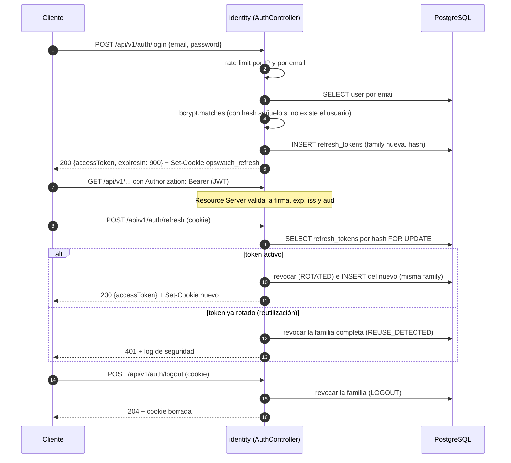

# Arquitectura de seguridad

Estado: diseño inicial · Última revisión: 2026-09-29 · Decisión: [ADR-004](../adr/ADR-004-security-strategy.md)

Documentos relacionados: [Modelo de autorización](authorization-model.md) · [Threat model](threat-model.md) · [Protección SSRF](ssrf-protection.md)

## 1. Principios

1. **Denegar por defecto.** Todo endpoint exige autenticación salvo una lista explícita. Toda acción sobre un recurso exige un permiso explícito.
2. **El servidor decide el tenant.** La organización de un recurso se obtiene del propio recurso en la base de datos, nunca de un dato que envía el cliente.
3. **Nada saliente sin pasar por `egress`.** Ninguna petición HTTP a una URL de usuario sale de otro sitio.
4. **Secretos fuera del código y de la imagen.** Se inyectan en tiempo de ejecución.
5. **Mínimo dato sensible.** Lo que no se guarda no se filtra. Lo que hay que guardar se cifra o se hashea.
6. **Usar los mecanismos estándar de Spring Security** en lugar de filtros escritos a mano.

## 2. Autenticación

### Resumen

| Elemento | Decisión |
|---|---|
| Credencial primaria | Email y contraseña |
| Access token | JWT firmado con **RS256**, válido **15 minutos**. Viaja en `Authorization: Bearer` |
| Validación del JWT | Spring Security OAuth2 Resource Server (`JwtDecoder` con la clave pública). No hay filtro JWT propio |
| Emisión del JWT | `JwtEncoder` (Nimbus) de Spring Security, con la clave privada inyectada como secreto |
| Refresh token | **Opaco**: 32 bytes aleatorios (`SecureRandom`) en Base64URL. Se guarda **hasheado** (SHA-256). Rota en cada uso y detecta reutilización |
| Transporte del refresh token | Cookie `opswatch_refresh`: `HttpOnly`, `Secure`, `SameSite=Strict`, `Path=/api/v1/auth` |
| Vida del refresh token | 14 días por token y 30 días como máximo por familia (desde el login) |
| Hash de contraseñas | bcrypt, coste 12, a través de `DelegatingPasswordEncoder` (prefijo `{bcrypt}`) |

### Contenido del JWT

```json
{
  "iss": "https://opswatch.<dominio>",
  "aud": "opswatch-api",
  "sub": "0192b3c4-…",
  "iat": 1790000000,
  "exp": 1790000900,
  "jti": "0192b3c5-…"
}
```

**No lleva roles ni organizaciones.** Los permisos se evalúan en cada petición contra la tabla `memberships`. Consecuencias:

- Quitar a alguien de una organización o cambiar su rol tiene efecto **inmediato**, no al caducar el token.
- El token es pequeño y no depende del número de organizaciones del usuario.
- Costo: una consulta indexada por petición autorizada. Si los benchmarks la señalan, se cachea ([ADR-009](../adr/ADR-009-redis.md)).

**Validaciones del JWT:** firma, `exp` y `nbf` (con 30 s de tolerancia de reloj), `iss` y `aud`. El algoritmo está fijado a RS256: no se acepta `none` ni HS256.

**Por qué asimétrico (RS256) y no HS256:** con una clave compartida, cualquier servicio capaz de validar tokens también podría emitirlos. Con un par de claves, solo Core firma, y cualquier servicio futuro valida con la clave pública (JWKS). Es una preparación barata para la [Etapa 3](../architecture/evolution.md).

**Rotación de la clave de firma:** el header lleva `kid`. Durante una rotación, el decoder acepta la clave anterior y la nueva hasta que caducan todos los tokens firmados con la anterior (15 minutos).

### Flujo de autenticación



### Dónde guarda el cliente cada token

- **Access token: en memoria** (una variable de la aplicación cliente). Nunca en `localStorage`, donde cualquier XSS lo leería.
- **Refresh token: cookie `HttpOnly`**, que JavaScript no puede leer.
- Al recargar la página, el cliente llama a `/api/v1/auth/refresh` para obtener un access token nuevo.

**Requisito de despliegue:** el frontend y la API tienen que ser del **mismo sitio** (mismo dominio registrable, o mismo origen detrás del reverse proxy) para que la cookie `SameSite=Strict` funcione. Un frontend en un dominio ajeno no recibiría la cookie.

**Alternativa conocida:** la recomendación actual para aplicaciones en el navegador (el patrón BFF, *Backend for Frontend*) mantiene todos los tokens en el servidor y da al navegador solo una cookie de sesión. Se valorará al introducir un gateway en la Etapa 3. El diseño de V1 es un término medio razonable: el access token es de vida corta y está en memoria, y el refresh token está en una cookie `HttpOnly` y rota ([ADR-004](../adr/ADR-004-security-strategy.md)).

### OAuth2: qué se usa y qué no

- **Se usa** el soporte de *Resource Server* de Spring Security para validar los JWT. Es la parte estándar de OAuth2 que aplica.
- **No** se implementa un *Authorization Server* OAuth2 propio (flujos `authorization_code`, clientes registrados). Con un único cliente propio no hace falta.
- **Login social (GitHub, Google)** con Spring Security OAuth2 Login: después de V1, si aporta ([decisiones abiertas](../architecture/open-decisions.md)).
- **IdP externo** (Keycloak, Auth0): evaluado en ADR-004 y descartado para V1 por costo operativo y porque oculta justo lo que el proyecto quiere mostrar.

### Contraseñas

- bcrypt con coste 12. Se revisa si el login p95 supera los 300 ms en el hardware de producción.
- Longitud de **12 caracteres a 72 bytes UTF-8**. El máximo es un límite de bcrypt: por encima se truncaría o se rechazaría según la versión. Se valida antes de hashear.
- Sin reglas de composición (mayúsculas obligatorias y demás) ni caducidad forzada, en línea con NIST SP 800-63B.
- A partir de la Fase 5, rechazo de contraseñas comunes con una lista local (las 10 000 más frecuentes), sin llamadas a servicios externos.
- `DelegatingPasswordEncoder` permite migrar a Argon2id más adelante: los hashes nuevos se generan con el algoritmo nuevo y los viejos se actualizan en el siguiente login.
- Por qué bcrypt y no Argon2id: Argon2id es la primera opción de OWASP, pero en Spring Security necesita BouncyCastle como dependencia extra. bcrypt con coste 12 sigue siendo aceptable y no añade dependencias. Es un compromiso consciente y reversible.

### Protección del login

| Amenaza | Control |
|---|---|
| Fuerza bruta contra una cuenta | Límite de 5 intentos por minuto por email |
| Credential stuffing desde una IP | Límite de 10 intentos por minuto por IP |
| Enumeración de usuarios por el mensaje | El mismo `401 invalid-credentials` para un email inexistente y para una contraseña errónea |
| Enumeración por tiempo de respuesta | Si el email no existe, se compara contra un hash bcrypt señuelo para igualar el tiempo |
| Enumeración en el registro | V1 responde `409` si el email ya existe, con rate limit (5 registros por hora por IP). **Riesgo aceptado** hasta la Fase 5, cuando el registro pase a verificación por email con respuesta uniforme |
| Bloqueo de cuenta como denegación de servicio | No se bloquean cuentas: se limita la tasa. Un atacante no puede dejar fuera a la víctima |
| Robo del refresh token | Rotación, detección de reutilización (revoca la familia), `HttpOnly` y `Secure` |

## 3. Autorización

El detalle está en [Modelo de autorización](authorization-model.md). En resumen:

- Roles por **membresía** (`OWNER`, `ADMIN`, `MEMBER`, `VIEWER`), traducidos a **permisos**. Nunca roles globales.
- Cada caso de uso llama a `AccessControl.require(userId, organizationId, permission)` después de cargar el recurso y obtener su organización en el servidor.
- Quien no es miembro recibe `404` (no revela que el recurso existe). Un miembro sin permiso recibe `403`.

## 4. Secretos

| Secreto | Dónde vive en producción | Rotación |
|---|---|---|
| Clave privada JWT (RSA) | Fichero montado como Docker secret (`/run/secrets/jwt_private_key`) | Con `kid`, sin cortar sesiones (sección 2) |
| Clave de cifrado de datos (AES-256) | Docker secret | Versionada: cada texto cifrado lleva el `keyId`. Hay un job de recifrado |
| Contraseña de PostgreSQL | Docker secret | Manual, con reinicio coordinado |
| Credenciales SMTP | Docker secret | Manual |

- Spring los lee con `spring.config.import=optional:configtree:/run/secrets/`. Cada fichero se convierte en una propiedad.
- **Nunca** en `application.yml`, en la imagen, en `ARG` o `ENV` del Dockerfile, ni en Git.
- En local, un `.env` (ignorado por Git) a partir de `.env.example`.
- En producción futura con varios hosts: un gestor de secretos ([decisiones abiertas](../architecture/open-decisions.md)).
- Detalle de perfiles y fuentes en [Entornos](../devops/environments.md).

### Cifrado de datos sensibles en la base de datos

Se cifran con **AES-256-GCM** (`SecretCipher` en `shared`):

- los headers de los monitores (pueden llevar `Authorization`, API keys);
- la configuración de los canales de notificación (URL del webhook con token, secreto de firma, destinatarios).

Formato: `keyId (1 byte) ‖ nonce (12 bytes) ‖ ciphertext ‖ tag (16 bytes)`. El nonce es aleatorio por cifrado. Se usa como dato asociado (AAD) el id de la entidad, para que un texto cifrado no se pueda copiar de una fila a otra.

Las contraseñas no se cifran: se **hashean**. Los refresh tokens tampoco: se **hashean** con SHA-256. En los dos casos no hace falta recuperar el valor original.

## 5. Transporte

- **HTTPS obligatorio** en staging y producción. Caddy termina TLS con certificados de Let's Encrypt renovados automáticamente.
- **HSTS** (`max-age=31536000; includeSubDomains`) una vez comprobado que todo el dominio sirve HTTPS.
- Entre Caddy y la aplicación hay HTTP dentro de la red interna de Docker, en el mismo host. Con servicios en varios hosts, se reevalúa (mTLS entre servicios).
- La aplicación confía en `X-Forwarded-*` **solo** si viene de Caddy (`server.forward-headers-strategy=framework` y proxies de confianza restringidos a la red interna). Si no, cualquiera podría falsear su IP y saltarse el rate limiting.

## 6. Navegador: CORS, CSRF, XSS y cabeceras

### CORS

- Lista explícita de orígenes (`opswatch.security.cors.allowed-origins`). **Nunca `*`** con credenciales.
- En producción, si el frontend se sirve desde el mismo origen que la API, la lista queda vacía y CORS no se usa.
- Métodos permitidos: `GET`, `POST`, `PATCH`, `DELETE`. Headers permitidos: `Authorization`, `Content-Type`, `If-Match` y `X-Request-Id`. Headers expuestos: `ETag`, `Location`, `X-Request-Id` y `Retry-After`.

### CSRF

- Los endpoints autenticados con `Authorization: Bearer` **no son vulnerables a CSRF**: el navegador no añade ese header por su cuenta. La protección CSRF de Spring Security se desactiva para ellos.
- Los únicos endpoints que dependen de una cookie son `/api/v1/auth/refresh` y `/api/v1/auth/logout`. Se protegen con tres capas:
  1. `SameSite=Strict`: el navegador no envía la cookie en peticiones desde otro sitio;
  2. comprobación del header `Origin` contra la lista de orígenes permitidos;
  3. solo aceptan `POST` con `Content-Type: application/json`, lo que exige un preflight CORS para cualquier origen ajeno.

### XSS

- La API solo devuelve JSON (`Content-Type: application/json`), así que no hay HTML generado en el servidor en V1.
- Los textos de usuario (nombres de organizaciones, proyectos y monitores, notas) se guardan **tal cual**, validando longitud y caracteres de control, y se **escapan al mostrarlos**. La defensa correcta contra XSS es codificar según el contexto de salida, no "sanear" la entrada: un sanitizador que borra `<` rompe nombres legítimos y no protege contextos como atributos o URLs.
- Las plantillas de email escapan HTML. Las páginas de estado (Fase 8) tendrán su propia CSP.

### Cabeceras de seguridad (respuestas de la API)

| Cabecera | Valor |
|---|---|
| `Content-Security-Policy` | `default-src 'none'; frame-ancestors 'none'`. Swagger UI y `/v3/api-docs` van por una cadena de seguridad propia sin esta CSP; en producción springdoc está desactivado |
| `X-Content-Type-Options` | `nosniff` |
| `X-Frame-Options` | `DENY` |
| `Referrer-Policy` | `no-referrer` |
| `Cache-Control` | `no-store` en respuestas autenticadas |
| `Strict-Transport-Security` | Desde Caddy (sección 5) |

## 7. Validación de entrada, inyección y mass assignment

- **Bean Validation** en los DTOs de request (forma: longitudes, formatos, rangos) y **reglas de dominio** en las entidades y los servicios (negocio: cuotas, invariantes). Son capas distintas y no se sustituyen.
- **Propiedades desconocidas → `400`.** Jackson se configura para fallar ante propiedades que no existen en el DTO. Un cliente que envía `"role": "OWNER"` o `"organizationId"` donde no toca recibe un error en lugar de un comportamiento silencioso.
- **Mass assignment:** cada operación tiene su DTO de request con solo los campos editables. Las entidades nunca se deserializan desde el JSON.
- **SQL injection:** solo consultas parametrizadas (Spring Data, `JdbcClient` con parámetros nombrados). Nunca se concatena SQL. La ordenación (`sort`) se valida contra una **lista blanca** de campos por endpoint antes de llegar a Spring Data.
- **Header injection:** los nombres y valores de headers de monitores rechazan `CR` y `LF`, y los nombres se validan con la gramática de *token* de HTTP.
- **Enumeraciones:** los valores inválidos dan `400` con la lista de valores válidos.

## 8. Rate limiting

| Endpoint | Límite | Clave |
|---|---|---|
| `POST /api/v1/auth/login` | 10/min y 5/min | IP y email |
| `POST /api/v1/auth/register` | 5/hora | IP |
| `POST /api/v1/auth/refresh` | 30/min | IP |
| `POST /api/v1/me/password` | 5 cada 15 min | usuario |
| Resto de la API autenticada | 300/min (Fase 5) | usuario |
| `POST /api/v1/notification-channels/{id}/test` | 5/min | canal |

- Implementación en V1: **Bucket4j en memoria** (una instancia). Respuesta `429` con `Retry-After`.
- Con varias instancias, los límites en memoria se multiplican por el número de instancias. Ese es uno de los disparadores de Redis ([ADR-009](../adr/ADR-009-redis.md)), o de Bucket4j sobre PostgreSQL como alternativa sin infraestructura nueva.

## 9. Logs y datos sensibles

**Nunca se registra:**
- contraseñas, hashes, access tokens, refresh tokens ni cookies;
- valores de headers de monitores;
- la configuración de canales (URL de webhooks, secretos);
- cuerpos de peticiones de autenticación;
- la **query string** de las URL de monitores, que a veces lleva API keys: se registra `esquema://host/ruta`.

**Sí se registran como eventos de seguridad** (`event.category=security`): login fallido (sin la contraseña), reutilización de refresh token, `403` de autorización, `TARGET_BLOCKED` y cambios de rol.

La redacción se aplica en el código: los DTOs sensibles tienen un `toString()` que oculta sus campos y hay un test que lo comprueba. No se confía en filtros de log genéricos. Detalle en [Observabilidad](../devops/observability.md).

## 10. Contenedores

Detalle en [Docker](../devops/docker.md):

- Usuario no root (UID 10001). Los ficheros de la aplicación son de root y de solo lectura para ese usuario.
- `read_only: true`, `tmpfs` para `/tmp`, `cap_drop: [ALL]` y `no-new-privileges`.
- Imágenes base fijadas por digest y actualizadas con Dependabot.
- PostgreSQL y el puerto de management (8081) no se publican fuera del host. Por eso `/actuator/**` está permitido en Spring Security: el control está en la red y en la exposición mínima (`health` e `info`, más `prometheus` en la Fase 3), y un endpoint no expuesto responde `404` en lugar de `401`.
- Escaneo de la imagen con Trivy en CI.

## 11. Cadena de suministro y secretos en Git

| Control | Herramienta | Fase |
|---|---|---|
| Actualización de dependencias y alertas | Dependabot (Maven, Docker, GitHub Actions) | 0 |
| Escaneo de vulnerabilidades en la imagen y las dependencias | Trivy en el pipeline. Falla con `CRITICAL` o `HIGH` que tengan corrección disponible | 0 |
| Secretos en el código | gitleaks en el pipeline más la *push protection* de GitHub | 0 |
| Acciones de GitHub fijadas por SHA | Revisión y Dependabot | 0 |
| Análisis estático de seguridad | CodeQL | 5 |
| SBOM | Plugin CycloneDX para Maven, adjunto a cada release | 6 |
| `.gitignore` con `.env`, `secrets/` y `*.pem` | — | 0 |

## 12. Manejo de errores

- Los errores se devuelven como Problem Details (RFC 9457) **sin stack traces ni mensajes internos**. Un `500` devuelve un texto genérico más el `requestId`, y el detalle queda solo en el log.
- Los mensajes de error de la base de datos (nombres de restricciones, SQL) no llegan al cliente: se traducen a códigos de dominio.

## 13. Salvaguardas de arranque en producción

Con el perfil `production`, la aplicación **se niega a arrancar** si detecta:

- la lista de redes privadas permitidas en `egress` no vacía (`opswatch.egress.allowed-private-cidrs`);
- CORS con `*`;
- claves de desarrollo o ausentes (JWT o cifrado);
- `spring.jpa.hibernate.ddl-auto` distinto de `validate` o `none`;
- Swagger UI activado sin autenticación, salvo que se haya permitido de forma explícita.

Es un `ApplicationListener<ApplicationReadyEvent>`, o un validador de `@ConfigurationProperties`, con tests.

## 14. Pruebas de seguridad

Detalle en la [estrategia de testing](../testing/testing-strategy.md#pruebas-de-seguridad):

- matriz de autorización generada (cada endpoint × cada rol × miembro o no miembro);
- tests de IDOR entre dos organizaciones;
- tests del JWT (firma alterada, `alg: none`, caducado, `aud` o `iss` incorrectos);
- rotación y reutilización de refresh tokens;
- la tabla completa de casos de SSRF;
- redacción de logs;
- en la Fase 5, un escaneo baseline con OWASP ZAP contra staging.
