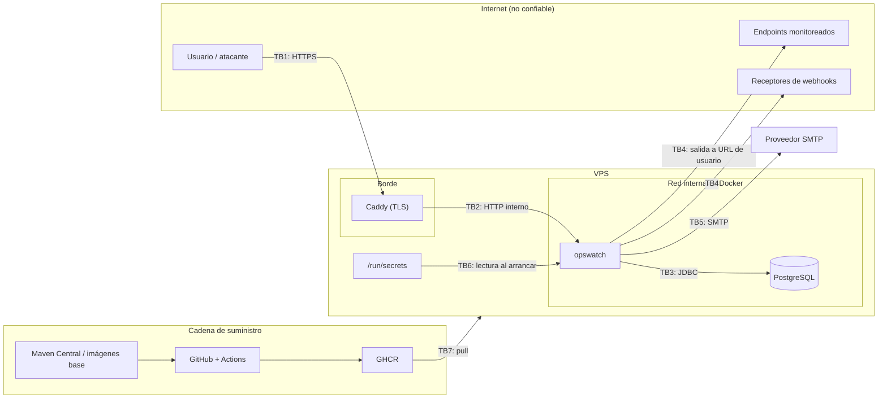

# Threat model

Estado: diseño inicial · Última revisión: 2026-09-28 · Método: STRIDE por elemento sobre un diagrama de flujo de datos

Se revisa al cerrar cada fase y cada vez que aparece una interacción externa nueva (un canal de notificación, un servicio extraído, un endpoint público).

## 1. Alcance

V1: la aplicación `opswatch`, PostgreSQL, el reverse proxy, las peticiones salientes (checks, webhooks, SMTP), el pipeline de CI/CD y el host de despliegue. El frontend queda fuera porque no existe en V1.

## 2. Activos

| Activo | Por qué importa |
|---|---|
| A1. Credenciales de usuario (hashes) y refresh tokens | Toma de cuentas |
| A2. Clave de firma JWT | Quien la tenga emite tokens de cualquier usuario |
| A3. Clave de cifrado de datos | Da acceso a los headers de monitores y a los secretos de webhooks de todos los tenants |
| A4. Headers secretos de los monitores | Credenciales de APIs de **terceros**: la brecha saldría del propio sistema |
| A5. Datos de cada organización (monitores, URL internas del cliente, incidentes) | Confidencialidad entre tenants |
| A6. Red interna e infraestructura (metadata cloud, PostgreSQL, management) | Pivote a toda la infraestructura |
| A7. Disponibilidad del servicio | Un monitor que no monitorea es peor que no tener ninguno: da falsa tranquilidad |
| A8. Reputación e IP del servidor | Si se usa para atacar a terceros, la IP acaba en listas negras y el proveedor suspende la cuenta |
| A9. Pipeline e imagen publicada | Un compromiso de la cadena de suministro llega a producción |

## 3. Actores de amenaza

| Actor | Capacidad |
|---|---|
| Anónimo en internet | Llama a los endpoints públicos (auth y, en la Fase 8, las páginas de estado) |
| Usuario registrado malicioso | Tiene cuenta propia y su propia organización. Controla URLs, headers y el DNS de sus dominios |
| Miembro con privilegios limitados | `VIEWER` o `MEMBER` que intenta escalar dentro de su organización |
| Endpoint monitoreado hostil | Controla las respuestas: tiempos, headers, redirects, TLS |
| Receptor de webhooks hostil | Ídem para las notificaciones |
| Atacante con un token robado | Tiene un access token o un refresh token de otra persona |
| Atacante de la cadena de suministro | Una dependencia o una acción de GitHub comprometida |
| Persona con acceso al host o a las copias de seguridad | Lee el disco o los volúmenes |

## 4. Diagrama de flujo de datos y fronteras de confianza

| Frontera | Cruce |
|---|---|
| TB1 | Internet → reverse proxy |
| TB2 | Reverse proxy → aplicación |
| TB3 | Aplicación → base de datos |
| TB4 | **Aplicación → destinos arbitrarios (salida dirigida por el usuario)** |
| TB5 | Aplicación → proveedor de email |
| TB6 | Secretos → aplicación |
| TB7 | Cadena de suministro → producción |

## 5. STRIDE por elemento

Leyenda de fase: el número indica en qué fase se implementa el control. **Residual** es el riesgo que queda una vez aplicado.

### 5.1 Autenticación y sesión (`identity`, TB1)

| ID | STRIDE | Amenaza | Control | Fase | Residual |
|---|---|---|---|---|---|
| T-01 | S | Fuerza bruta o credential stuffing | Rate limit por IP y por email, bcrypt con coste 12, sin bloqueo de cuentas | 1 | Bajo |
| T-02 | S | Robo del access token (XSS en el cliente, logs) | TTL de 15 min, token en memoria, nunca en logs | 1 | Medio: válido hasta que caduca |
| T-03 | S | Robo del refresh token | `HttpOnly`, `Secure`, `SameSite=Strict`, rotación, detección de reutilización | 1 | Bajo |
| T-04 | T | Falsificación de un JWT (`alg: none`, confusión de algoritmo) | Algoritmo fijado a RS256, validación de `iss` y `aud` con el Resource Server estándar | 1 | Bajo |
| T-05 | I | Enumeración de usuarios en el login | Respuesta y tiempo uniformes (hash señuelo) | 1 | Bajo |
| T-06 | I | Enumeración de usuarios en el registro y al añadir miembros | Rate limit. **Aceptado** hasta que la Fase 5 introduzca la verificación de email y las invitaciones | 1 → 5 | Medio → Bajo |
| T-07 | R | Un usuario niega haber cambiado roles o borrado monitores | Timeline de incidentes; audit log en la Fase 5 | 5 | Medio hasta la Fase 5 |
| T-08 | E | Filtración de la clave de firma JWT | Docker secret, permisos 0400, fuera de la imagen, rotación con `kid` | 0–1 | Bajo |
| T-09 | S | CSRF sobre refresh y logout | `SameSite=Strict`, comprobación de `Origin`, solo JSON | 1 | Bajo |

### 5.2 Datos de los tenants (API REST, TB1–TB3)

| ID | STRIDE | Amenaza | Control | Fase | Residual |
|---|---|---|---|---|---|
| T-10 | I | IDOR: leer el monitor, el incidente o el canal de otra organización por id | Tenant resuelto desde el recurso, `404` a quien no es miembro, tests de IDOR por endpoint | 1–2 | Bajo |
| T-11 | E | Un `VIEWER` edita o un `ADMIN` se asigna `OWNER` | Matriz RBAC en código y tests de la matriz completa | 1 | Bajo |
| T-12 | T | Mass assignment (`organizationId`, `role`, `enabled` en DTOs que no los aceptan) | DTOs por operación y propiedades desconocidas → `400` | 1 | Bajo |
| T-13 | T | SQL injection (filtros, `sort`) | Consultas parametrizadas y lista blanca de ordenación | 1 | Bajo |
| T-14 | I | Lectura de los secretos de los headers a través de la API | Valores de solo escritura, enmascarados siempre | 2 | Bajo |
| T-15 | D | Un usuario agota recursos (miles de monitores o proyectos) | Cuotas por organización y por usuario | 2 | Bajo |
| T-16 | E | Condición de carrera que deja una organización sin `OWNER` o con un rol inconsistente | `FOR UPDATE` sobre la organización y `@Version` | 1 | Bajo |
| T-17 | I | Mensajes de error que filtran información interna | Problem Details genéricos y detalle solo en el log | 0 | Bajo |

### 5.3 Motor de checks y salida (TB4)

| ID | STRIDE | Amenaza | Control | Fase | Residual |
|---|---|---|---|---|---|
| T-20 | E / I | **SSRF** hacia la red interna, la metadata o localhost | Las 8 capas de [ssrf-protection.md](ssrf-protection.md) | 2–3 | Bajo |
| T-21 | E | DNS rebinding | `GuardedDnsResolver` con IP fijada | 3 | Bajo |
| T-22 | E | Redirect hacia un destino interno | Revalidación por salto | 3 | Bajo |
| T-23 | D | Un destino hostil agota los hilos o la memoria (goteo lento, headers enormes, compresión) | Deadline total, límites de headers, sin cuerpo, sin descompresión, semáforo | 3 | Bajo |
| T-24 | D | Muchos destinos lentos a la vez saturan el motor | Semáforo, lag medido, sin catch-up, degradación suave | 3 | Medio: degrada la frecuencia de los checks de todos |
| T-25 | I | Escaneo de puertos de hosts **públicos** con el motor | Lista restringida de puertos, cuotas, intervalo mínimo | 2 | Medio |
| T-26 | D (a terceros) | OpsWatch como amplificador contra una víctima | Cuotas, intervalo mínimo, rate limit del registro; límite por host en la Fase 5; User-Agent identificable | 2 → 5 | Medio → Bajo |
| T-27 | I | Credenciales de los headers reenviadas a otro host por un redirect | Headers solo al mismo origen | 3 | Bajo |
| T-28 | T | Un destino devuelve datos que se guardan y se muestran (inyección almacenada) | No se guarda el cuerpo. `error_detail` es un texto propio, no el de la respuesta | 3 | Bajo |

### 5.4 Notificaciones (TB4, TB5)

| ID | STRIDE | Amenaza | Control | Fase | Residual |
|---|---|---|---|---|---|
| T-30 | E | SSRF a través de la URL de un webhook | Misma política de `egress` y solo `https` | 4 | Bajo |
| T-31 | S | Un tercero envía notificaciones falsas al receptor haciéndose pasar por OpsWatch | Firma HMAC con marca de tiempo | 4 | Bajo |
| T-32 | I | Lectura de la URL o del secreto de un webhook | Cifrado en reposo, enmascarado en la API | 4 | Bajo |
| T-33 | D | Un receptor lento bloquea las entregas | Timeout de 5 s, worker con backoff, límite de intentos | 4 | Bajo |
| T-34 | T | Inyección en las plantillas de email (nombres con HTML) | Escapado en las plantillas | 4 | Bajo |
| T-35 | D (a terceros) | Uso de OpsWatch para enviar spam a destinatarios arbitrarios | Límite de destinatarios por canal y de canales por organización, rate limit del endpoint de prueba; verificación de destinatarios en la Fase 5 | 4 → 5 | Medio → Bajo |

### 5.5 Base de datos y datos en reposo (TB3)

| ID | STRIDE | Amenaza | Control | Fase | Residual |
|---|---|---|---|---|---|
| T-40 | I | Acceso directo a PostgreSQL desde internet | Sin puerto publicado, solo red interna | 0 | Bajo |
| T-41 | I | Copias de seguridad o volúmenes expuestos | Secretos de terceros cifrados con la clave fuera de la base de datos, copias cifradas | 6 | Medio |
| T-42 | T | Un usuario de base de datos con privilegios excesivos | Usuario de la aplicación sin privilegios de superusuario. Las migraciones con un usuario propietario del esquema | 6 | Bajo |

### 5.6 Configuración, secretos y host (TB6)

| ID | STRIDE | Amenaza | Control | Fase | Residual |
|---|---|---|---|---|---|
| T-50 | I | Secretos en Git | gitleaks, push protection, `.gitignore` | 0 | Bajo |
| T-51 | I | Secretos en la imagen Docker (`ARG`, `ENV`, capas) | Solo en tiempo de ejecución, revisión del Dockerfile, Trivy | 0 | Bajo |
| T-52 | E | Escape o abuso del contenedor | No root, `cap_drop: ALL`, `no-new-privileges`, sistema de ficheros de solo lectura | 0 | Bajo |
| T-53 | E | Exposición del puerto de management | Puerto 8081 sin publicar, solo `health` e `info` expuestos | 0 | Bajo |
| T-54 | T | Configuración de pruebas activada en producción (`allowed-private-cidrs`) | Salvaguarda de arranque | 3 | Bajo |

### 5.7 Cadena de suministro (TB7)

| ID | STRIDE | Amenaza | Control | Fase | Residual |
|---|---|---|---|---|---|
| T-60 | T | Dependencia vulnerable | Dependabot y Trivy con la build fallando ante `CRITICAL` o `HIGH` corregibles | 0 | Medio (vulnerabilidades sin corrección) |
| T-61 | T | Acción de GitHub comprometida | Acciones fijadas por SHA y permisos mínimos del `GITHUB_TOKEN` | 0 | Bajo |
| T-62 | T | Imagen base comprometida o alterada | Digest fijado, imágenes oficiales, Trivy | 0 | Bajo |
| T-63 | E | Filtración de los secretos de despliegue en el pipeline | GitHub Environments con aprobación manual para producción, secretos solo en el job de despliegue | 6 | Bajo |

## 6. Casos de abuso de producto

| Caso | Mitigación |
|---|---|
| Crear cuentas en masa para multiplicar las cuotas | Rate limit del registro por IP. Verificación de email (Fase 5). Si hace falta, límites globales por IP de origen |
| Monitorizar una víctima desde muchas cuentas | Límite por host de destino (Fase 5) y alerta de concentración |
| Usar los webhooks para spam contra un endpoint de un tercero | Solo se disparan por incidentes: frecuencia baja por diseño. Endpoint de prueba con rate limit |
| Usar el endpoint de prueba de canales para enviar emails arbitrarios | 5 por minuto por canal, destinatarios limitados, contenido fijo |

## 7. Riesgos aceptados de forma explícita

| Riesgo | Por qué se acepta | Hasta cuándo |
|---|---|---|
| Enumeración de emails en el registro y al añadir miembros | Evitarla exige verificación de email e invitaciones | Fase 5 |
| Access token válido hasta 15 min después de un logout | Es inherente a los JWT sin estado. El TTL corto lo acota | Permanente, salvo que se introduzca una lista de revocación |
| Sin audit log | Alcance de V1 | Fase 5 |
| Rate limiting en memoria | Hay una sola instancia | Hasta que haya varias ([ADR-009](../adr/ADR-009-redis.md)) |
| Sin MFA | Alcance de V1 | Sin fecha ([decisiones abiertas](../architecture/open-decisions.md)) |

## 8. Revisión

| Momento | Qué se revisa |
|---|---|
| Fin de cada fase | Que los controles de esa fase existen y tienen tests. Se actualiza la columna "Fase" |
| Fase 5 | Revisión completa, escaneo con ZAP y CodeQL |
| Fase 8 | Endpoints públicos anónimos (páginas de estado) |
| Fase 10 | Fronteras nuevas entre servicios (autenticación entre servicios, red de Monitoring) |
